# Elastic SOC Detection

## Overview
This project delivers a full SOC lab built with VirtualBox and the Elastic Stack to simulate realistic security monitoring, detection, investigation, and response workflows. The environment integrates **Windows and Linux endpoints, Elastic SIEM, Fleet, Sysmon, Microsoft Defender, Elastic Defend EDR, Mythic C2, Kali Linux and osTicket** to demonstrate how security telemetry flows from endpoint collection through detection, investigation, response and incident tracking.
The project covers **SOC architecture, SIEM deployment, endpoint telemetry collection, authentication monitoring, brute-force detection, adversary simulation, C2 detection, threat investigation, EDR validation and SIEM-to-ticketing automation**, providing a practical demonstration of end-to-end SOC operations.

# PART 1 – SOC Architecture Diagram

## Objective
Designed a SOC architecture blueprint to visualize how security telemetry, monitoring systems and response workflows connect across a controlled lab environment.

## Skills
SOC Architecture Design | Network Segmentation | Security Workflow Visualization | Technical Documentation

## Tools
- draw.io — used to create a logical SOC network diagram showing internal systems, endpoint connections, telemetry flow and security workflow integrations.

## Steps

Created a SOC architecture diagram showing the complete monitoring environment, including Elastic/Kibana, Fleet Server, Windows and Linux endpoints, osTicket ticketing, Mythic C2 simulation, analyst access and attacker infrastructure.

The design included:
- Segmented private lab network `192.168.10.0/24` with NAT and Host-only connectivity
- Windows and Linux agent-based log collection feeding Elastic/Kibana
- Alert-to-ticket workflow through osTicket
- Attack simulation flow through Mythic C2

## Challenges & Troubleshooting
The main challenge was designing the lab network to represent an enterprise SOC environment while maintaining safe isolation between internal systems and external connectivity. The architecture was adjusted using VirtualBox NAT and host-only networking to allow internet access, analyst access and controlled communication between lab components.

## Summary
- Mapped endpoint telemetry, SIEM, ticketing, and attack simulation workflows
- Designed a segmented on-prem architecture for realistic, isolated SOC operations
- Created a reusable architecture reference guiding Elastic, endpoint, detection, and response integration

## Operational Impact:
Provides a clear architecture reference for understanding component connectivity, telemetry flow and SOC workflow relationships.

---

# PART 2 – Elasticsearch Deployment

## Objective
Deploy the core ELK Stack components to establish centralized security telemetry collection, storage and analysis for a SOC monitoring environment.

## Skills
- SIEM Architecture | Log Ingestion & Processing | ELK Stack Administration | Log Analysis

## Tools
- Elasticsearch — used as the central storage and indexing platform for collected security events.
- Logstash — used for log processing, filtering, and data transformation before storage.
- Kibana — used for searching, visualization, dashboards, and security investigations.
- Elastic Agent — used to collect endpoint telemetry from Windows and Linux systems.

## Steps

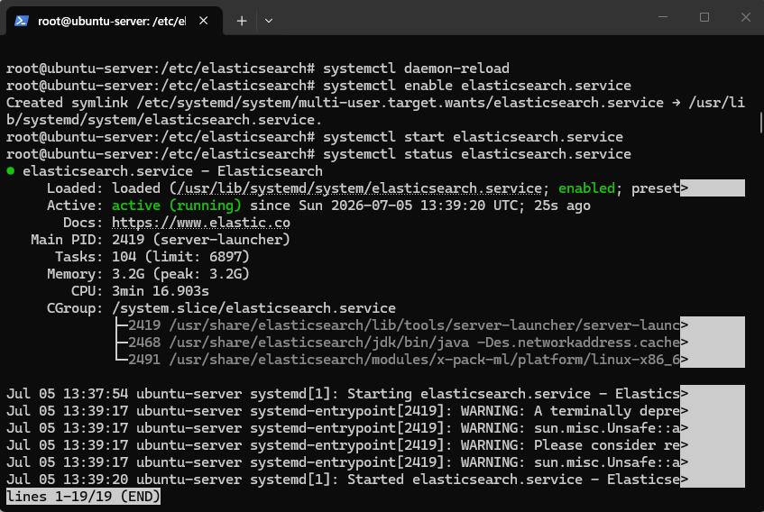

Configured the ELK Stack data pipeline to understand how security events move from monitored endpoints into the SIEM platform.

Key implementations:
- Deployed Elasticsearch for centralized log storage and indexing.
- Configured Logstash concepts for processing and filtering security events.
- Used Kibana for log searching, dashboards, and investigation workflows.
- Selected Elastic Agent as the endpoint telemetry collector for the detection lab.

## Summary

**Investigation Findings** Centralized endpoint telemetry collection, processing and analysis through ELK.

**Decision** Selected Elastic Agent for centralized endpoint management and Elastic security integration.

**Outcome** Established the foundation for detection, alerting, and incident investigation.

## Operational Impact:
Provides centralized telemetry visibility and analysis through the ELK Stack, supporting security monitoring and investigation.

---

# PART 3 – Kibana Setup

## Objective
Deploy Kibana as the security visualization interface for Elasticsearch, enabling SOC analysts to search, monitor, and investigate collected security data.

## Skills
- Kibana Administration | Linux Administration | Network & Firewall Configuration

## Tools
- Kibana — used as the web interface for searching, visualizing, and analyzing Elasticsearch data.
- Ubuntu Server — used to host the on-prem Kibana service.
- UFW Firewall — configured to allow Kibana browser access.
- SSH — used for remote server administration and configuration.

## Steps

### Ref 1: Kibana Service Status Active (Running)
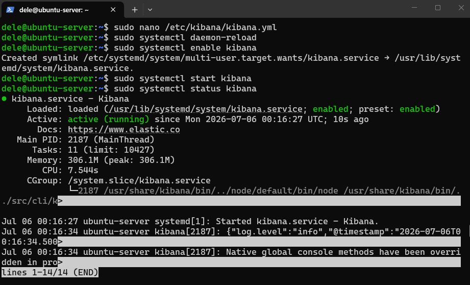

Installed and configured Kibana on Ubuntu Server, then verified the service was running and accessible through the browser.

### Ref 2: Elasticsearch-Kibana Secure Connection
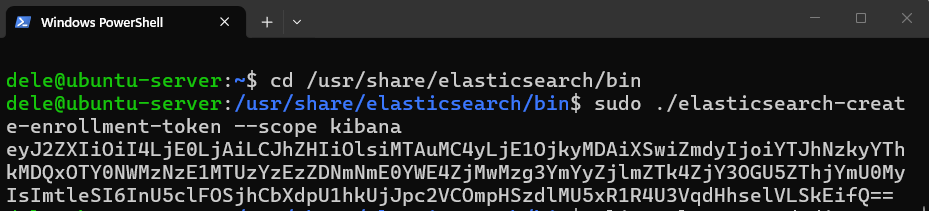

Generated the Kibana enrollment token, completed Elasticsearch-Kibana pairing, configured firewall access, and validated successful authentication.

Key configurations:
- Configured Kibana to listen on port 5601.
- Allowed Kibana access through Ubuntu firewall.
- Completed browser verification using enrollment token and verification code.

### Ref 3: Kibana Dashboard Access
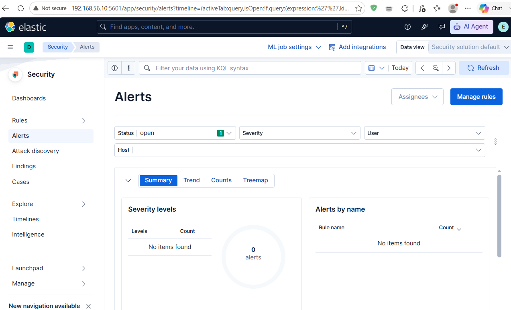

Validated successful Kibana deployment by accessing the dashboard and confirming the platform was ready for security monitoring workflows.

## Challenges & Troubleshooting
No major deployment issues during this phase. The installation followed the on-prem adaptation process.

## Summary

**Investigation Findings** Kibana connected successfully to Elasticsearch and provided the interface for security monitoring and investigation.

**Decision Made** Used Kibana as the Elastic Stack analysis layer for centralized visualization, searching, and investigation.

**Outcome** Configured Kibana to support log visibility, dashboards, and detection workflows.

## Operational Impact:
Provides a centralized Kibana interface for security event analysis and investigation.

---

# PART 4 – Windows Server Target Machine

## Objective
Deploy a controlled Windows Server endpoint to generate security telemetry and support SOC detection, investigation, and attack simulation workflows.

## Skills
- Windows Server administration | Virtual machine deployment | Network segmentation

## Tools
- VirtualBox — used to host and isolate the Windows Server VM within the on-prem lab environment.
- Windows Server 2022 — used as the monitored endpoint for future security event generation.
- Windows Firewall — used to control local endpoint access.

## Steps

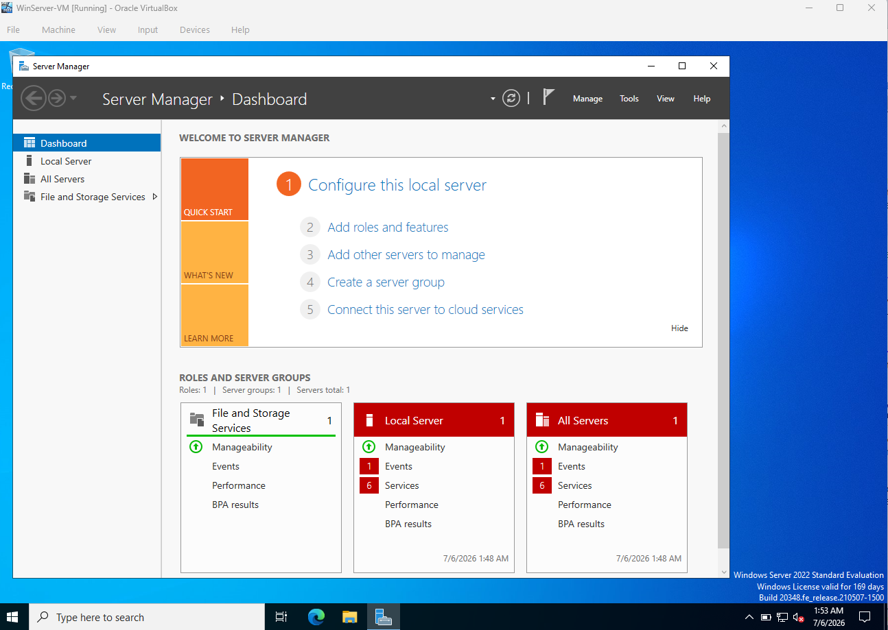

Deployed a Windows Server 2022 VM in VirtualBox and configured it as a controlled SOC target endpoint.

Key implementations:
- Created and configured Windows Server 2022 VM with initial hostname setup
- Applied NAT and Host-Only networking for controlled lab communication
- Enabled RDP for remote administration within the private network
- Prepared the endpoint for upcoming Elastic Agent deployment and log collection

## Summary

**Investigation Findings:** On-prem network segmentation is achieved through virtualization controls such as VirtualBox NAT and Host-Only networking. This provides controlled communication between lab components while limiting unnecessary exposure.

**Decision Made:** Kept Windows Server isolated from the ELK stack unless intentionally placed on the same internal network. Maintained Windows Firewall default configuration and relied on VirtualBox networking for lab isolation.

**Outcome:** Windows Server successfully deployed as an isolated target VM, ready for telemetry generation, attack simulation, and Elastic log ingestion.

## Operational Impact:
Provides SOC teams with a controlled endpoint environment to validate detection rules, investigate activity, and improve monitoring capabilities.

---

# PART 5 – Fleet Server for Centralized Agent Management.

## Objective
Deploy centralized Elastic agent management to enable consistent security telemetry collection from monitored endpoints.

## Skills
- Elastic Fleet Administration | Endpoint Enrollment & Troubleshooting | TLS & Network Troubleshooting | Telemetry Validation

## Tools
- Elastic Stack 9.4.3 — SIEM platform for centralized security monitoring and log analysis.
- Fleet Server — Managed Elastic Agent enrollment and endpoint communication.
- Elastic Agent — Collected Windows security telemetry from monitored endpoints.
- Kibana — Configured Fleet policies and validated incoming security events.
- Ubuntu Server / Windows Server — Hosted and monitored the on-prem security lab environment.

## Steps

### Fleet Server Deployment
- Deployed Fleet Server on Ubuntu ELK instance using HTTPS at:
`https://192.168.56.10:8220`
- Generated Fleet Server policy and enrollment token from Kibana Fleet management.
- Installed Elastic Agent Fleet Server and verified successful connection in Kibana.

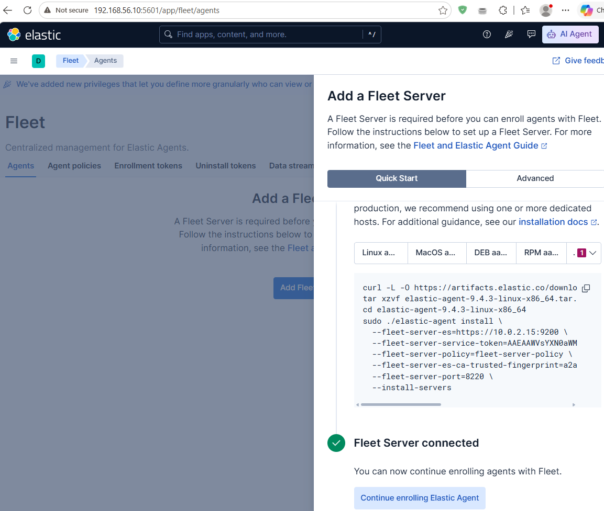

Fleet Server successfully connected and became available for centralized endpoint management.

### Windows Elastic Agent Enrollment
- Created Windows agent policy (`DFIR-Windows-policy`) in Fleet.
- Installed Elastic Agent on Windows Server using the Fleet enrollment command.
- Verified communication between Windows Server and Fleet Server.

~~~powershell
.\elastic-agent.exe install --url=<Fleet-Server-URL> --enrollment-token=<token> --insecure
~~~

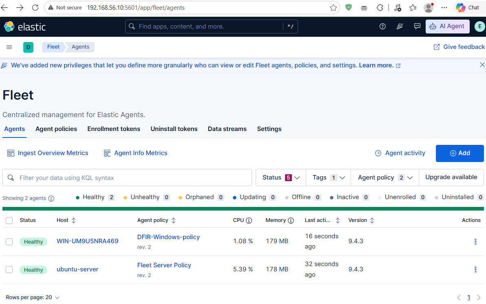

## Challenges & Troubleshooting
Fleet Server and Windows Agent enrollment failed due to incorrect package architecture and TLS certificate trust validation errors.  
The issues were resolved by deploying the correct x86_64 package and using `--insecure` to bypass self-signed certificate validation in the lab environment.

## Summary

**Investigation Findings:** Verified Fleet Server connectivity, endpoint enrollment status, and successful Windows security event ingestion in Kibana Discover.

**Decision Made:** Used Elastic Fleet for centralized agent management and applied the lab-based TLS workaround to complete endpoint enrollment.

**Outcome:** Successfully enrolled Windows Server into Fleet and confirmed security telemetry collection through Windows Event ID 4672.

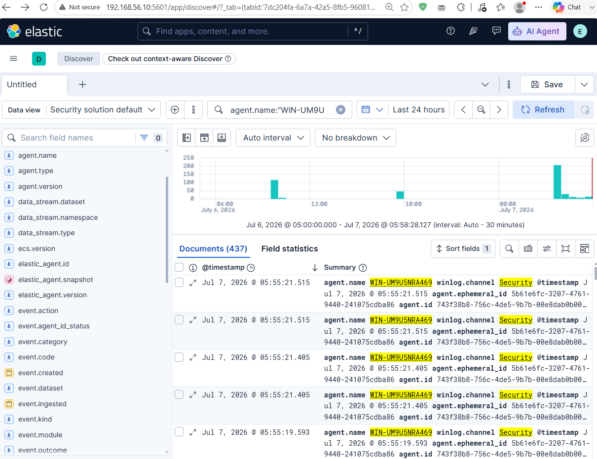

### Operational Impact:
Provides centralized management and visibility of enrolled endpoints, supporting consistent security telemetry collection.

---

# PART 6 – Sysmon Installation & Event Monitoring

## Objective
Deploy and configure Sysmon on the Windows Server endpoint to improve security visibility through detailed endpoint telemetry for detection and investigation.

## Skills
- Windows Event Analysis | Sysmon Deployment & Configuration | Security Telemetry Validation | Threat Detection 

## Tools
- Sysmon — used to collect detailed Windows endpoint activity and security telemetry.
- Microsoft Sysinternals — used as the official source for Sysmon installation.
- Olaf Sysmon Configuration — used to apply a security-focused event monitoring configuration.
- PowerShell — used for installation and verification.
- Windows Event Viewer — used to validate generated Sysmon events.
- GitHub — used to obtain the Sysmon configuration file.

## Steps

### 1. Sysmon Configuration Preparation
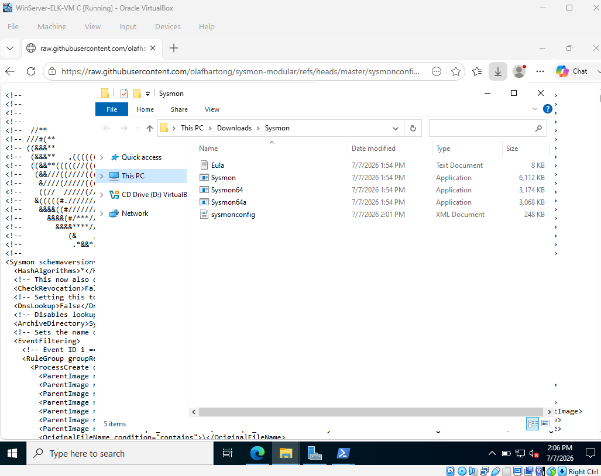

Downloaded Sysmon from Microsoft Sysinternals and configured Olaf’s Sysmon XML configuration file for endpoint monitoring.

### 2. Sysmon Directory Validation
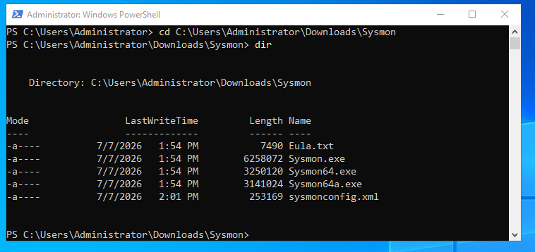

Verified the Sysmon installation directory contained the required executable and configuration file before deployment.

### 3. Sysmon Deployment
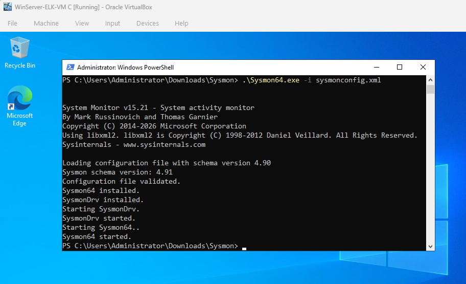

Installed Sysmon using the configured XML file and accepted the license agreement to enable endpoint telemetry collection.

### 4. Service Verification
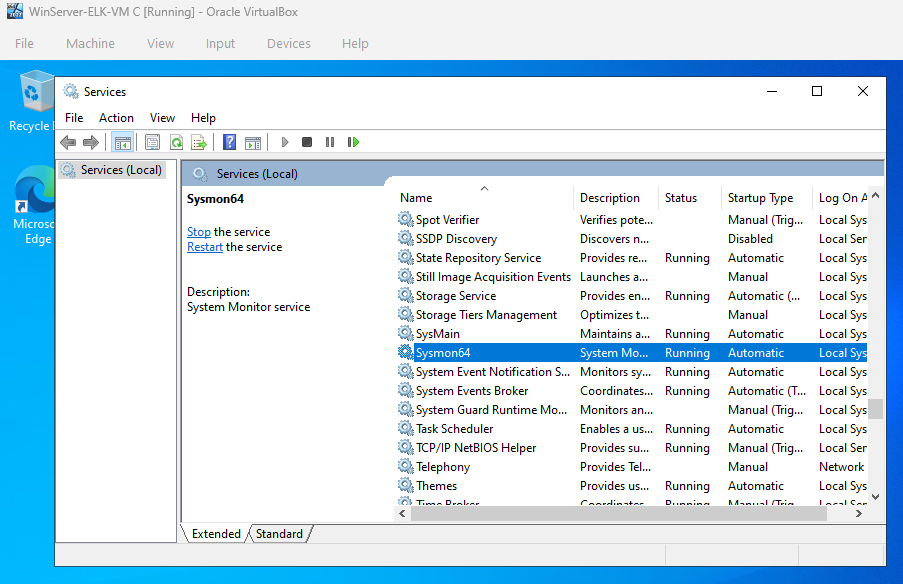

Confirmed the Sysmon64 service was installed successfully and running on the Windows Server endpoint.

### 5. Event Generation Validation
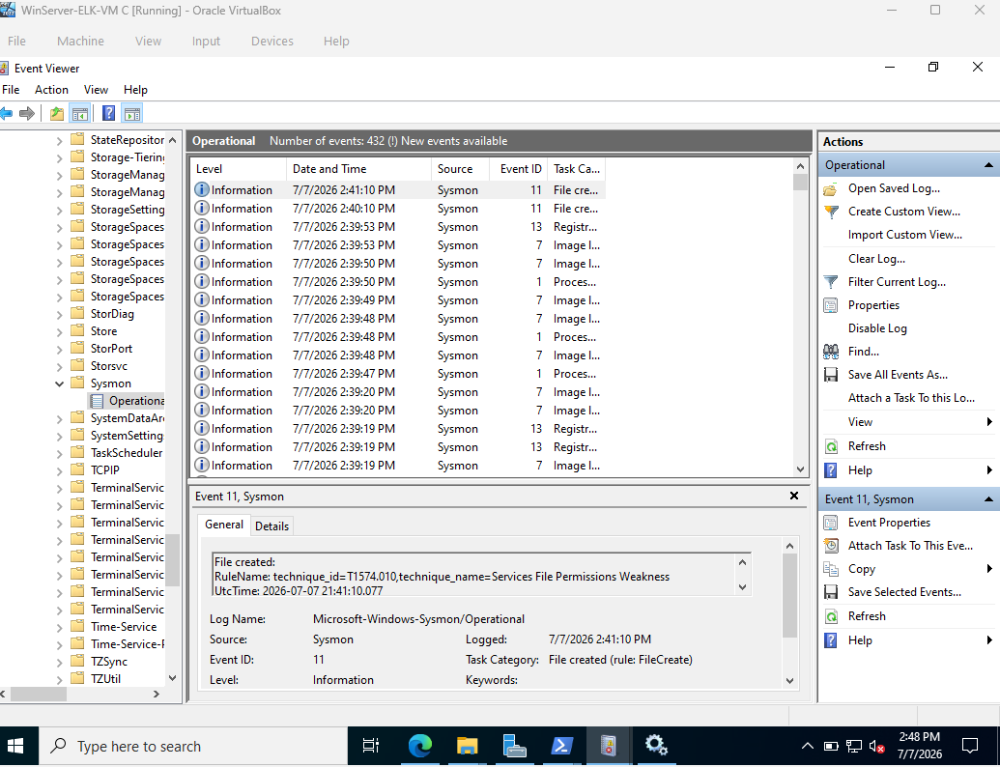

Validated Sysmon telemetry generation through Windows Event Viewer and confirmed Event ID 11 visibility for file creation activity.

## Summary

**Investigation Findings:** Sysmon was successfully deployed and generated endpoint telemetry, with Event ID 11 confirming visibility into file creation and overwrite activity.

**Decision Made:** Sysmon telemetry was added as an endpoint data source to provide deeper visibility for Elastic Stack monitoring and detection workflows.

**Outcome:** Windows Server was successfully configured to generate Sysmon security events, preparing the endpoint for ELK ingestion and future detection engineering activities.

## Operational Impact
Provides enhanced endpoint visibility for investigating file activity and supporting detection development.

---

# PART 7 – Sysmon & Microsoft Defender Log Ingestion

## Objective
Configure Elastic Agent to collect Sysmon and Microsoft Defender event logs from Windows Server into Elasticsearch for security monitoring and investigation.

## Skills
- Elastic Agent integration configuration | Windows Event Log collection | Sysmon telemetry analysis | Microsoft Defender event monitoring | Log source validation

## Tools
- Elastic / Kibana — used to configure integrations, manage policies, and verify ingested security events.
- Elastic Agent — used to collect Windows endpoint telemetry.
- Sysmon — used as an endpoint telemetry source for detailed system activity.
- Microsoft Defender — used as an endpoint security event source.
- Windows Event Viewer — used to identify event channels and validate generated events.
- Fleet — used to monitor Elastic Agent health and deployment status.

## Steps

### Step 1: Configure Sysmon Windows Event Log Integration

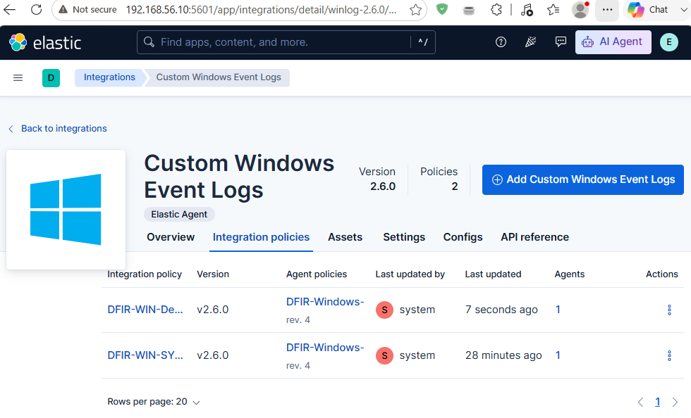

Created a Custom Windows Event Log integration and added the Sysmon Operational channel to the existing Windows Agent Policy.

Implementation:
- Created the `DFIR-Win-Sysmon` integration targeting the Sysmon Operational log channel
- Added, saved, and deployed the integration within the Windows Agent Policy

### Step 2: Configure Microsoft Defender Event Log Integration

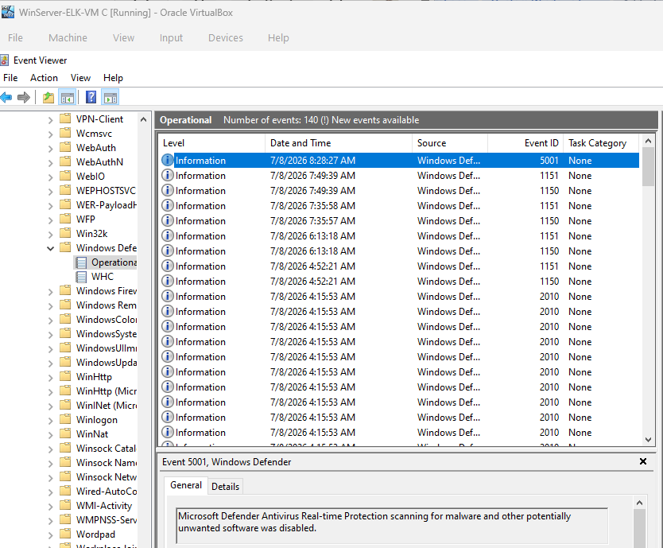

Configured Microsoft Defender event collection and validated security event generation.

Implementation:
- Created the `DFIR-Win-Defender` integration targeting the Windows Defender Operational log channel for `Event IDs` 1116, 1117 and 5001
- Verified log collection by disabling real-time protection to trigger Event ID 5001

### Step 3: Deploy Event Filtering

Added Sysmon and Microsoft Defender integrations to the Windows Agent Policy and configured targeted Event ID collection.

Configured Event IDs: 1116 | 1117 | 5001

Result:
Sysmon and Microsoft Defender logs were successfully configured for ingestion into Elasticsearch.

### Step 4: Verify Event Log Ingestion

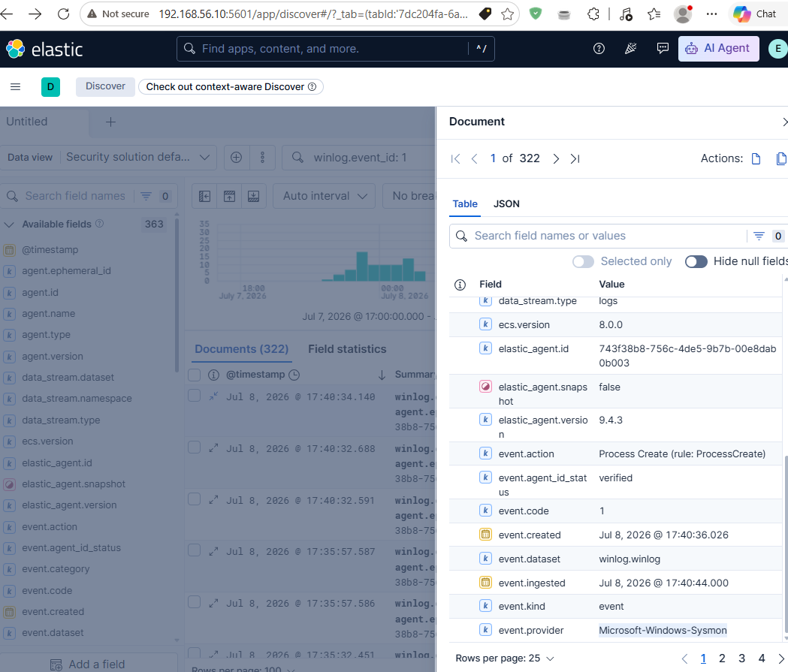

Validated successful telemetry ingestion through Kibana Discover.

Verification:
- Confirmed Sysmon events using `winlog.event_id: 1`.
- Confirmed Microsoft Defender events using `winlog.event_id: 50001`.
- Verified correct event sources using the `event.provider` field.
- Confirmed Elastic Agent health through Fleet.

## Challenges & Troubleshooting
During validation, logs were not immediately visible until the correct `winlog.event_id` field and dataset were identified in Kibana Discover. The issue was resolved by verifying Elastic Agent health, adjusting the search query, and refreshing event discovery.

## Summary

**Investigation Findings:** Elastic Agent successfully collected Sysmon and Microsoft Defender telemetry, with event IDs and providers confirming correct security log ingestion.

**Decision Made:** Implemented targeted Windows Event Log collection to capture security-relevant events while reducing unnecessary log volume.

**Outcome:** Sysmon and Microsoft Defender telemetry are now available in Elasticsearch for security monitoring, detection engineering, and threat investigation workflows.

## Impact:
Improves SOC visibility by centralizing endpoint security telemetry, enabling faster detection and investigation of suspicious activity.

---

# PART 8 – SSH Authentication Log Analysis

## Objective
Configure an Ubuntu SSH server endpoint and analyze authentication logs to identify suspicious login activity before centralized SIEM ingestion.

## Skills
-  SSH Server Administration | Linux Authentication Log Analysis | Brute-Force Activity Identification

## Tools
- Ubuntu Server — used as the SSH endpoint generating authentication telemetry.
- SSH — used for remote server access and administration.
- PowerShell — used to connect from the Windows host.

## Steps

### 1. SSH Server Setup
Configured the Ubuntu Server VM as an SSH endpoint within the on-prem lab environment and verified remote access from the Windows host.

Implementation:
- Verified Ubuntu Server VM availability and SSH connectivity
- Updated system repositories and installed package updates

### 2. Authentication Log Review
Reviewed Linux authentication logs to understand SSH login activity.

Implementation:
- Navigated to `/var/log` and reviewed `auth.log`
- Verified SSH authentication activity generated by the SSH service

### 3. Authentication Log Filtering
Applied Linux command-line filtering to identify failed authentication attempts.

Implementation:
- Used `grep` with case-insensitive matching to locate failed login events.
- Filtered authentication attempts targeting specific user accounts.

### 4. Authentication Log Analysis

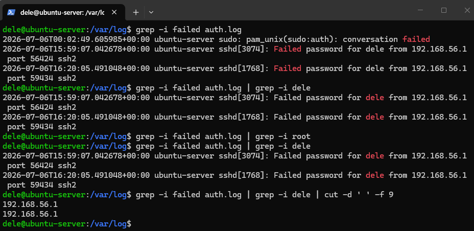

Extracted source IP information from failed SSH authentication events for security analysis.

Implementation:
- Used `cut` to separate log fields.
- Identified source IP addresses associated with failed login attempts.
- Observed activity patterns consistent with brute-force authentication attempts.

## Summary

**Investigation Findings:** Failed SSH authentication attempts were identified from `auth.log`, and source IP addresses were extracted for further security analysis.

**Decision Made:** Prepared the SSH server for Elastic Agent deployment to centralize authentication telemetry and enable investigation through Kibana.

**Outcome:** Successfully analyzed Ubuntu SSH authentication logs and established the endpoint as a future log source for the ELK detection pipeline.

## Operational Impact:
Enables identification of suspicious SSH authentication activity and potential brute-force attempts.

---

# PART 9 — Linux SSH Server Elastic Agent Deployment

## Objective
Deploy Elastic Agent on a Linux SSH server to collect authentication telemetry and enable centralized security monitoring and investigation through Elastic.

## Skills
- Elastic Fleet Management | Linux Log Monitoring | SIEM Data Investigation | Endpoint Telemetry Validation

## Tools
- Fleet — used for centralized Elastic Agent enrollment and management.
- Kibana — used to manage Fleet policies, monitor agents, and investigate ingested events.
- Elastic Agent — used to collect Linux endpoint telemetry.
- Ubuntu Server — used as the SSH endpoint generating authentication logs.
- SSH — remote server administration

## Steps

### Step 1: Create Linux Agent Policy
Created a dedicated Linux agent policy in Elastic Fleet to manage telemetry collection from the Ubuntu SSH server.

### Step 2: Deploy Elastic Agent
Enrolled the Ubuntu SSH server into Fleet using Elastic Agent and configured it to collect Linux authentication logs from `/var/log/auth.log`.

### Step 3: Resolve Fleet Enrollment Issue
During enrollment, Elastic Agent failed because the lab used a self-signed certificate.  
The issue was resolved by adding the `--insecure` option during installation, allowing successful agent enrollment.

### Step 4: Verify Agent Telemetry
Verified the Linux endpoint appeared as healthy in Fleet and confirmed incoming telemetry through Elastic Discover.

### Step 5: Investigate SSH Authentication Events
Analyzed failed SSH authentication events from `/var/log/auth.log` and confirmed the events were searchable in Elastic Discover.

Added the `message` field as a table column to improve event visibility during investigation.

## Step 3: Troubleshoot Fleet Server Enrollment Issue
During setup, the Fleet Server host was accidentally enrolled into the Linux endpoint policy, causing a policy mismatch and breaking the Fleet Server configuration.

Resolution:
- Investigated Fleet status, agent logs, and port availability.
- Restored the Ubuntu server using the correct Fleet Server policy.
- Verified Fleet Server health and kept the SSH server as a separate Linux endpoint.

## Summary

**Investigation Findings:** Linux SSH authentication failures were successfully collected through Elastic Agent and investigated in Elastic Discover using authentication event fields and source IP correlation.

**Decision Made:** Kept Fleet Server and Linux endpoint agents separated using dedicated policies to maintain proper Elastic architecture and avoid management conflicts.

**Outcome:** Ubuntu SSH server successfully enrolled as an Elastic Agent endpoint, validating Linux authentication monitoring through the Elastic detection pipeline.

## Impact
Enables SOC teams to monitor Linux authentication activity centrally and investigate suspicious login attempts more efficiently.

---

# PART 10 – SSH Brute Force Detection Alert & Dashboard

## Objective
Developed an SSH brute force detection workflow in Elastic to identify repeated failed authentication attempts and improve visibility into unauthorized access activity.

## Skills
- Elastic SIEM Detection Engineering | SSH Authentication Analysis | KQL Query Filtering | Alert Rule Creation | Dashboard Visualization

## Tools
- Elastic Security (custom detection rules and investigation)
- Kibana Discover (log analysis using KQL)
- Kibana Maps (attack source visualization)
- Ubuntu SSH Server (authentication log source)

## Steps

### SSH Authentication Analysis
Reviewed SSH authentication logs in Kibana Discover, filtered failed login events, and analyzed usernames and source IP addresses involved in authentication attempts.

### SSH Brute Force Detection Rule
Created a threshold-based Elastic detection rule using KQL to alert when multiple failed SSH authentication attempts occurred within a defined time window.

### Attack Source Dashboard
Built a Kibana dashboard with an SSH authentication map and supporting visualizations to monitor failed login activity and attack sources.

## Challenges & Troubleshooting
The on-prem lab collected source IP addresses but did not automatically populate GeoIP location fields because GeoIP enrichment was unavailable. The workflow was adjusted to investigate attacks using available source IP telemetry while maintaining detection and alerting capabilities.

## Summary

**Investigation Findings:** Multiple failed SSH authentication attempts were successfully identified, including the targeted accounts and originating source IP addresses.

**Decision Made:** Used threshold-based detection with source IP analysis because it provided reliable brute force detection without requiring GeoIP enrichment.

**Outcome:** Successfully implemented an end-to-end SSH brute force monitoring workflow covering log analysis, alerting, and dashboard visualization.

## Operational Impact
Provides analysts with faster detection of SSH brute-force attacks, supporting quicker investigation of unauthorized access attempts.

---

# PART 11 – Windows Authentication Log Analysis & Brute Force Detection

## Objective
Implement Windows authentication monitoring and RDP brute-force detection in Elastic to identify unauthorized access attempts and improve endpoint security visibility.

## Skills
- Windows Event Log Analysis | Authentication Monitoring | SIEM Detection Engineering | Threat Detection & Investigation | Incident Response Workflow

## Tools
- Elastic Security — Detection rules and alert investigation
- Kibana Discover — Windows authentication log analysis
- Windows Server — Authentication event source
- Kali Linux — Controlled RDP attack simulation

## Steps

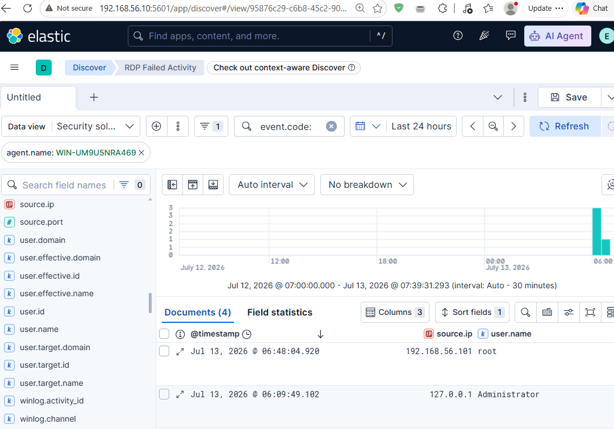

### Windows Authentication Log Analysis
Analyzed Windows Security events in Kibana Discover and identified failed authentication activity using Event ID 4625, including affected usernames and source IP addresses.

### RDP Brute Force Detection Rule
Created an Elastic Security threshold detection rule using `event.code: 4625` and grouped events by `user.name` and `source.ip` to identify repeated failed remote authentication attempts.

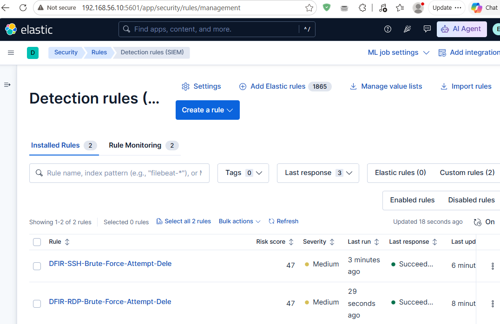

### Detection Validation
Generated controlled RDP authentication failures from Kali Linux and verified that Elastic generated alerts with investigation details such as username, source IP, and threshold activity.

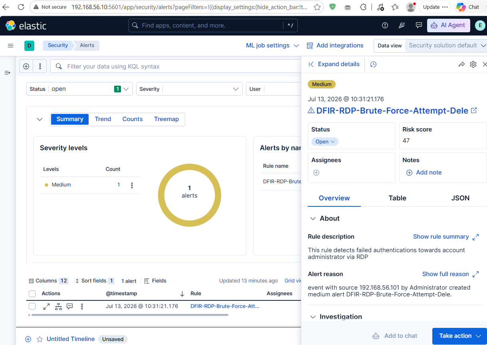

## Challenges & Troubleshooting
Initial Discover-based threshold alerts provided limited investigation context and did not automatically include key fields needed for analysis. Resolved this by creating Security Detection Rules with grouped fields (`user.name` and `source.ip`) to provide richer SOC investigation data.

## Summary

**Investigation Findings:** Detected repeated Windows failed authentication attempts and validated RDP brute-force activity using Event ID 4625, source IP addresses, and targeted user accounts.

**Decision Made:** Implemented Elastic Security Detection Rules instead of relying only on Discover alerts because they provide better alert context and match a SOC investigation workflow.

**Outcome:** Successfully deployed and validated Windows RDP brute-force detection alongside the existing SSH brute-force detection workflow.

## Operational Impact
Improves analyst response time by automatically identifying suspicious authentication patterns and providing the investigation details required for faster triage.

---

# PART 12 – RDP Authentication Activity Map & Dashboard

## Objective
Create Kibana authentication dashboards to improve visibility into Windows Server RDP activity and support faster investigation of remote access attempts.

## Skills
- SIEM Dashboard Development | Windows Authentication Log Analysis | RDP Detection Querying | Security Event Investigation

## Tools
- Elastic Security — Detection monitoring and authentication event analysis
- Kibana Discover — Windows event searching and saved queries
- Kibana Maps — Geographic authentication visualization
- Windows Server — RDP authentication event source

## Steps

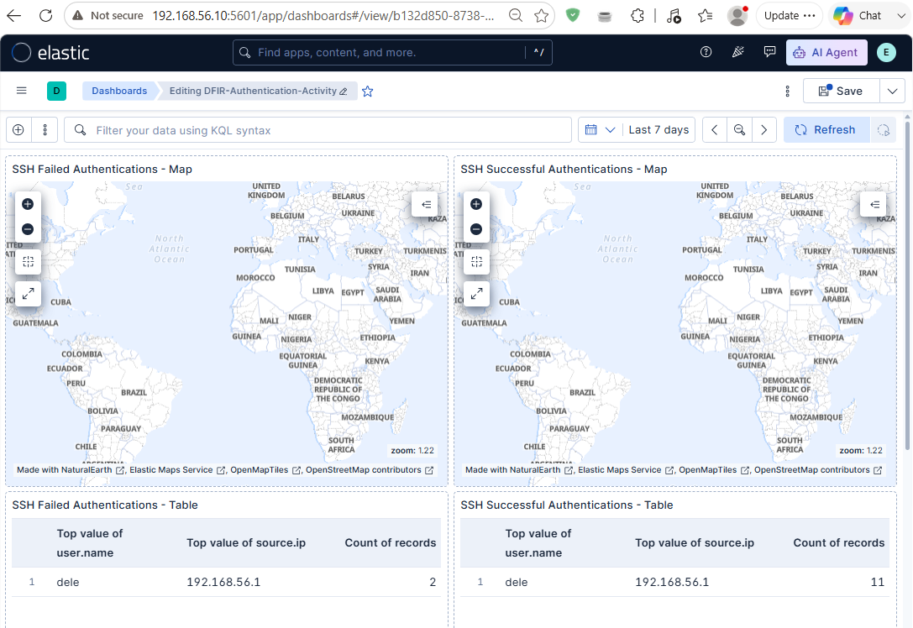

### RDP Authentication Map Creation
Created Kibana Maps visualizations for RDP authentication tracking using failed `event.code: 4625` and successful `event.code: 4624` Windows Security events filtered by Logon Type 10 (RemoteInteractive) and Type 7 (Unlock).

Configured map layers and added authentication activity views to the monitoring dashboard.

### Authentication Table Development
Enhanced the dashboard with table visualizations displaying key investigation fields:

Added dashboard tables displaying Username, Source IP, and Authentication counts across SSH and RDP success and failure metrics.

## Challenges & Troubleshooting
- The on-prem VirtualBox environment used private IP addresses, preventing automatic GeoIP enrichment for geographic mapping. Authentication analysis continued using available telemetry such as source IP addresses and user accounts. In production environments, solutions such as IP2Location can provide additional geographic context for external authentication attempts.

- SSH authentication maps were not linked to their saved Discover sessions, making the Query/Edit option unavailable for connecting each authentications table to table accordingly, unlike the RDP maps. 
I verified each detection query, generated authentication events, saved the Discover sessions, rebuilt the maps using those saved sessions, and duplicated the working visualizations to preserve the correct query bindings across all SSH and RDP dashboards.

## Summary

**Investigation Findings:** Windows Security events provided visibility into RDP authentication activity, allowing identification of failed and successful remote access attempts using Event IDs 4625 and 4624.

**Decision Made:** Used Kibana Maps and Table visualizations to centralize authentication telemetry because dashboards provide faster investigation context than reviewing individual events.

**Outcome:** Successfully created SSH and RDP authentication monitoring dashboards containing map and table views for remote access investigation.

## SOC Impact
Provides analysts with centralized authentication visibility, reducing manual log review time and improving triage of suspicious remote access activity.

---

# PART 13 – Attack Diagram Creation

## Objective
Create an attack lifecycle diagram to visualize the planned attack path, improve security workflow documentation, and guide detection testing activities.

## Skills
- Threat Modeling | Attack Lifecycle Mapping | Security Workflow Documentation | Detection Engineering Planning

## Tools
- draw.io — Attack diagram creation and security workflow visualization

## Steps

### Attack Infrastructure Mapping
Created an attack diagram showing the lab components involved in the attack simulation:

- Mythic C2 Server | Windows Server Target | SSH Server | Kali Linux Attacker | External Communication Infrastructure

### Attack Lifecycle Planning

Mapped the attack workflow across multiple phases:

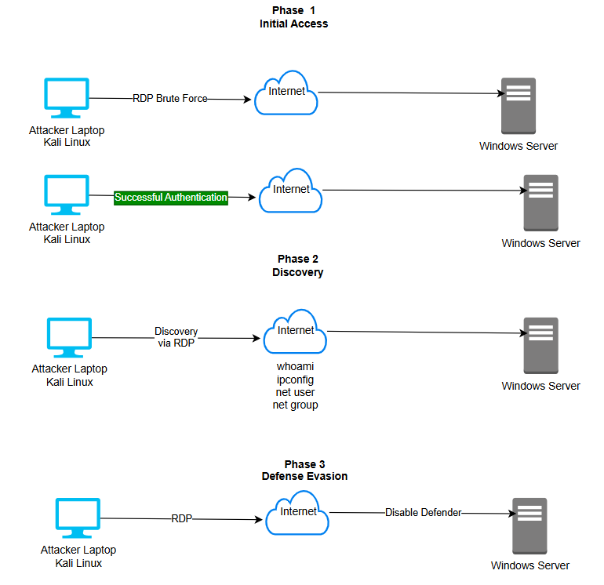

**Phase 1: Initial Access**
- Simulated RDP brute force activity against the Windows Server.

**Phase 2: Discovery**
- Planned post-access discovery activities:
  - whoami | ipconfig | net user | net group

**Phase 3: Defense Evasion**
- Planned endpoint security evasion activities after successful access.

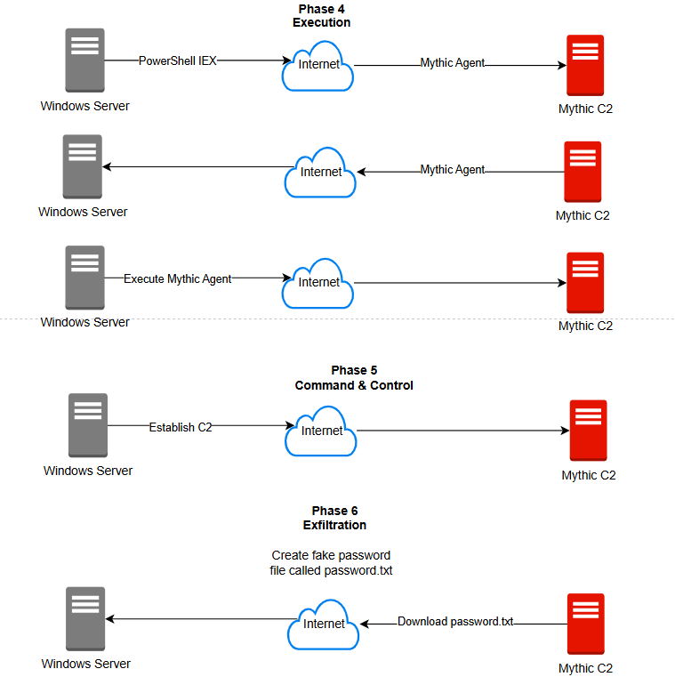

**Phase 4: Execution**
- Planned Mythic agent execution on the compromised Windows Server.

**Phase 5: Command and Control**
- Established the planned communication path between the compromised endpoint and Mythic C2 server.

**Phase 6: Exfiltration**
- Simulated file collection activity using a test `passwords.txt` file to observe generated security telemetry.

## Challenges & Troubleshooting
No major implementation issues were encountered during diagram creation. The main focus was accurately representing the attack flow and ensuring each phase aligned with the planned detection and investigation workflow.

## Summary

**Investigation Findings:** Attack diagrams provide a structured view of attacker behavior and help identify telemetry sources available during each attack phase.

**Decision Made:** Used a phased attack lifecycle model to connect offensive activities with expected SOC monitoring and detection opportunities.

**Outcome:** Created an attack roadmap covering initial access, discovery, execution, C2 communication, and simulated exfiltration activities.

## SOC Impact
Improves detection planning by helping security teams understand attacker movement and identify monitoring opportunities before real incidents occur.

---

# PART 14 – Mythic C2 Setup

## Objective
Deploy an on-prem Mythic C2 server to simulate adversary activity and understand C2 infrastructure used in security testing.

## Skills
- C2 Infrastructure Deployment | Docker Container Management | Linux Administration | Adversary Emulation | VM Network Management

## Tools
- VirtualBox — On-prem lab virtualization environment
- Ubuntu Server — Hosted the Mythic C2 infrastructure
- Kali Linux — Used for adversary simulation activities
- Mythic C2 Framework — Command and Control platform deployment
- Docker / Docker Compose — Container deployment and service management

## Steps

- Prepared a dedicated Ubuntu VM for Mythic C2.
- Installed Mythic dependencies and deployed Mythic using Docker.
- Started Mythic services and accessed the Web UI through the Host-Only network.
- Verified Mythic containers, SSL access, and dashboard availability.

## Challenges & Troubleshooting

- During infrastructure expansion, multiple Ubuntu VMs introduced Host-Only IP management issues. DHCP reassigned IP addresses between cloned VMs, causing SSH connectivity problems and making VM identification unreliable.

- Investigated adapter configurations and discovered that dynamic IP allocation could create conflicts as more systems were added to the lab.

- Resolved the issue by assigning static Host-Only IP addresses to each VM, ensuring predictable identification and reliable communication across the environment.

- Mythic deployment initially failed because Docker permissions and the Docker daemon were not properly configured.

- Added the user to the Docker group, restarted Docker services, and rebuilt Mythic successfully.

## Summary

- **Investigation Findings:** DHCP-based Host-Only networking becomes unreliable as lab infrastructure grows.
- **Decision Made:** Adopt static IP addressing for lab VMs to maintain predictable communication and easier troubleshooting.
- **Outcome:** Successfully deployed a functional Mythic C2 server in an isolated on-prem lab environment.

## Impact
Built a repeatable adversary simulation environment that supports security testing, detection engineering, and blue team investigation workflows.

---

# PART 15 - Mythic C2 Attack Simulation & Detection Preparation

## Objective

The objective of this phase was to execute an end-to-end attack workflow by simulating initial access, post-compromise activity, Mythic C2 deployment, payload execution, C2 communication, and controlled data exfiltration within an on-prem SOC lab environment.

The phase generated realistic attacker telemetry to support future SIEM detection engineering and investigation workflows.

## Skills
- Attack Simulation & Adversary Emulation | RDP Brute-Force Testing | Mythic C2 & Apollo Agent Deployment | Command & Control (C2) Validation | Windows Security Telemetry Generation | Endpoint Activity Investigation | Detection Engineering Preparation

## Tools
- Kali Linux: Attacker workstation for RDP brute force simulation
- Crowbar: RDP credential attack testing
- Windows Server 2022: Target endpoint generating security telemetry
- Mythic C2: Command and Control platform
- Apollo Agent: Windows C2 payload
- Python HTTP Server: Payload hosting and transfer
- PowerShell: Payload download and execution
- Elastic Stack: Future detection and monitoring platform

# Steps

## 1. Initial Access - RDP Brute Force Simulation

Prepared a custom wordlist from rockyou.txt and used Crowbar to test RDP authentication against the Windows Server.

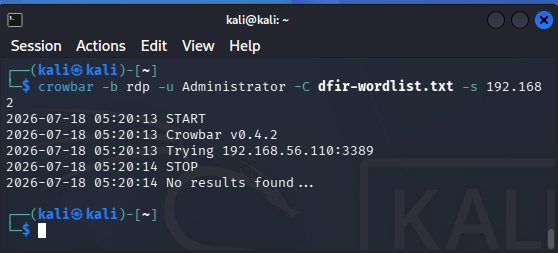

Crowbar testing reached the RDP service but did not return a successful credential discovery result. Manual RDP authentication was used after validating the Administrator credentials and confirming access to the Windows Server.

## 2. Discovery & Defense Evasion
Executed post-compromise discovery and defense evasion activities on the Windows Server:
- User and network enumeration
- Local account inspection
- Microsoft Defender configuration modifications

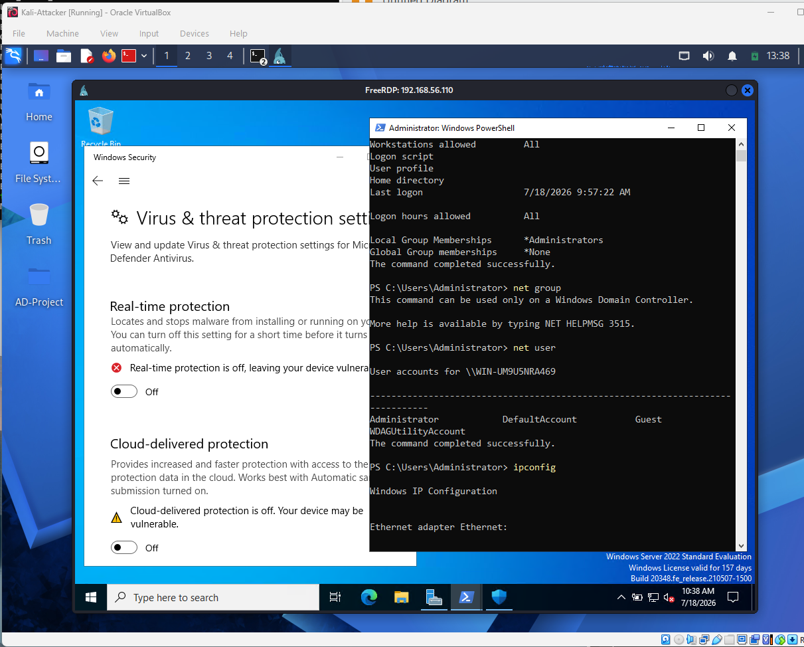

## Step 3: Mythic Apollo C2 Deployment

Deployed the Mythic Apollo agent and HTTP C2 profile:

- Generated a Windows executable payload `Dele-ELK-Mythic.exe` using the WinExe output format and HTTP callback profile
- Hosted the payload via a Python HTTP server and downloaded it to the target Windows Server using PowerShell

Hosted the payload using a Python HTTP server and downloaded it to the Windows Server using PowerShell.

## 4. Payload Execution & C2 Communication
Executed the Apollo payload on the Windows Server and verified successful callback communication with Mythic.

Validation included:
- Confirmed active Apollo callback and host identification
- Monitored user context, process ID (PID) and C2 communication status

## 5. Apollo Agent Interaction
Used Mythic Active Callback to execute Apollo commands against the Windows Server.

Executed: whoami | ifconfig

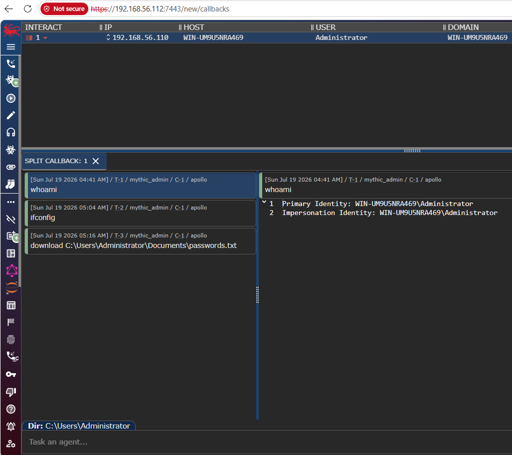

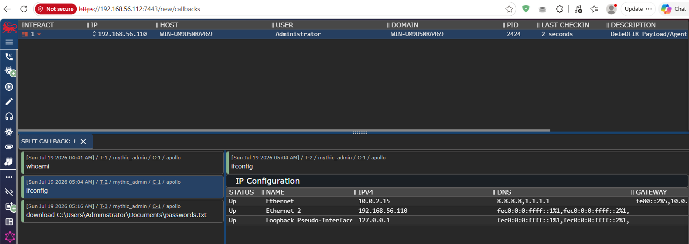

## 6. Controlled Exfiltration Simulation
Used Apollo download functionality to retrieve a controlled test file:
C:\Users\Administrator\Documents\passwords.txt

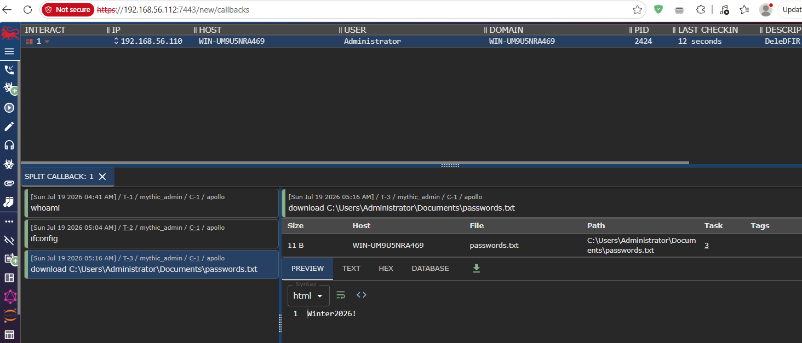

The successful retrieval confirmed post-compromise file collection capability.

# Challenges & Troubleshooting

## Crowbar RDP Authentication Failure
A major challenge was that Crowbar successfully connected to the Windows Server RDP service but failed to return valid credentials, despite manual RDP authentication working successfully.

Troubleshooting performed:
- Verified Administrator account availability.
- Confirmed RDP was enabled.
- Verified local WORKGROUP authentication.
- Tested multiple username formats:
  - Administrator
  - WIN-UM9U5NRA469\Administrator
- Confirmed the password existed in the custom wordlist.
- Compared the lab configuration against the instructor's cloud-based environment.

Finding:
The issue was not caused by incorrect credentials or network connectivity. The authentication behavior was specific to the on-prem VirtualBox Windows Server environment.

Resolution:
The environment remains capable of generating the required RDP authentication telemetry for detection engineering and SIEM investigation. Continued the workflow using manual RDP authentication while documenting the Crowbar behavior as an environment-specific troubleshooting finding.

# Summary

## Investigation Findings:
The attack simulation successfully generated telemetry across multiple attack stages, including RDP access, discovery activity, Apollo execution, C2 communication, and controlled data exfiltration.

## Outcome:
Successfully deployed Mythic Apollo, established a C2 session, executed commands remotely, and performed controlled file collection from the Windows endpoint.

## Impact:
This phase provides realistic attacker telemetry that can be used by SOC teams to develop, test, and improve detection rules for endpoint execution, C2 activity, and post-compromise behavior.

---

## PART 16 - Mythic C2 Detection Rule & Suspicious Activity Dashboard

### Objective
Develop detection and monitoring capabilities for Mythic C2 activity by creating Elastic detection rules and security dashboards using Sysmon and Windows Defender telemetry.

### Skills
- SIEM Detection Engineering & Alert Tuning | Sysmon Telemetry Analysis | MITRE ATT&CK Mapping | Security Dashboard Development | Incident Investigation Workflow

### Tools
- Elastic/Kibana: Used for log investigation, detection rule creation, and security dashboards.
- Sysmon: Used for process, network, image loading, and file activity telemetry.
- Mythic C2 Framework: Used to generate adversary simulation activity for detection validation.
- VirusTotal: Used for hash-based OSINT investigation and malware reputation checking.

### Steps

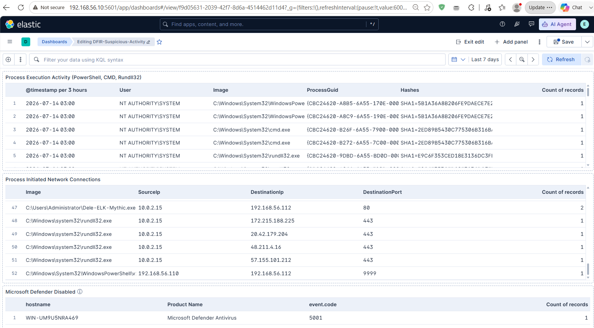

Step 1: Mythic C2 Detection Rule Creation

Analyzed Sysmon telemetry (Event IDs 11, 7, and 3) in Elastic Discover to build the `DFIR-Mythic-C2-Agent-Detected` rule:

* **Detection Logic**: Targeted payload file paths, image names, target filenames, and process correlation attributes
* **Configuration**: Critical severity, 5-minute schedule, and 5-minute look-back window

Step 2: Suspicious Activity Dashboard Development

Created a security monitoring dashboard tracking key telemetry indicators:

* **Process Execution**: Sysmon Event ID 1 (PowerShell, Command Prompt, Rundll32)
* **Network Connections**: Sysmon Event ID 3 (Outbound process connections)
* **Defense Evasion**: Windows Defender Event ID 5001 (Real-time protection disabled)

### Challenges & Troubleshooting
During Mythic C2 detection development, Sysmon Event ID 1 Process Create telemetry for the generated Mythic payload was not visible in Elastic, while other telemetry such as Event ID 3, Event ID 7, and Event ID 11 was successfully collected. Investigation confirmed the issue was not caused by Elastic ingestion failure, and detection development continued using available telemetry through event correlation.

Further validation confirmed Event ID 1 was functioning for general process activity within the environment. The Mythic detection rule was therefore built using available file, image loading, and network telemetry, while Event ID 1 was used separately for suspicious process monitoring through the dashboard.

### Summary

**Investigation Findings:**  
Mythic C2 activity generated multiple security-relevant telemetry sources, including file creation, image loading, and network communication events that could be correlated for detection.

**Decision Made:**  
Detection logic was adapted based on available telemetry instead of depending on missing payload-specific Process Create events.

**Outcome:**  
Successfully created a Mythic C2 detection rule and suspicious activity dashboard providing visibility into process execution, outbound network communication, and Defender security events.

### Operational Impact
Provides repeatable detection logic and dashboards for investigating suspicious execution and C2 communication activity.

---

# PART 17 — osTicket Ticketing System Deployment

## Objective
Deploy an on-prem osTicket ticketing platform to support future SOC alert-to-ticket automation workflows.

## Skills
- Application Deployment | Web Server Configuration | Database Management | Access Control | Incident Ticketing Workflow Design | SOC Workflow Automation Preparation

## Tools
- VirtualBox — On-prem lab hosting
- Windows Server 2022 — osTicket server
- XAMPP — Apache, MariaDB, PHP stack
- osTicket — Ticket management platform
- phpMyAdmin — Database management

## Steps

### XAMPP & osTicket Deployment

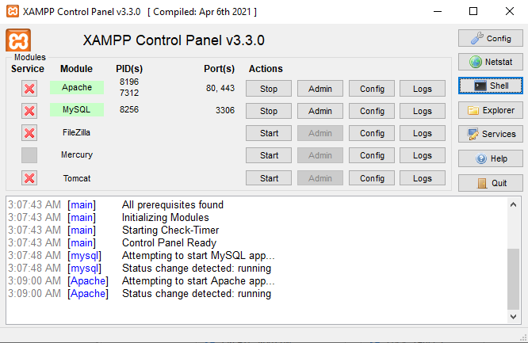

Configured XAMPP services and deployed osTicket within the Windows Server VM.

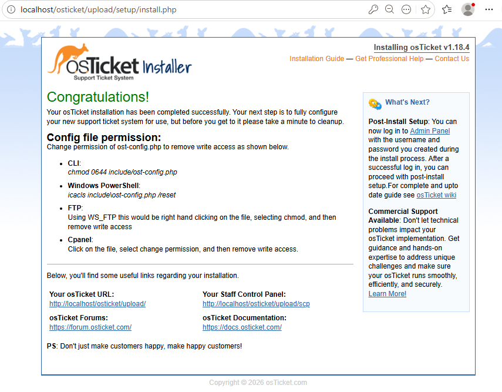

Completed osTicket installation and configured database connectivity.

### Access Validation

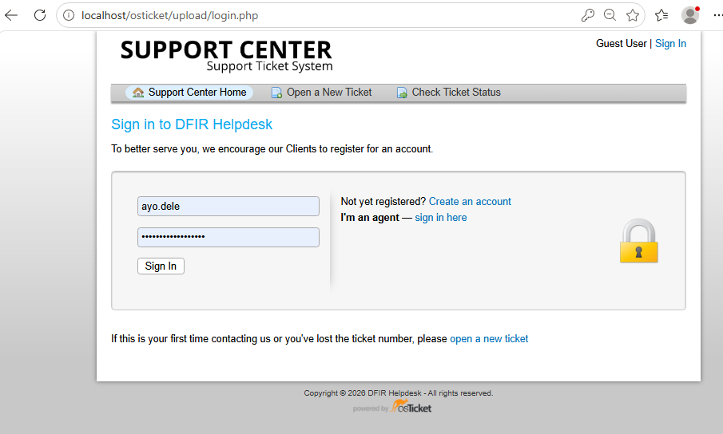

Validated client portal access.

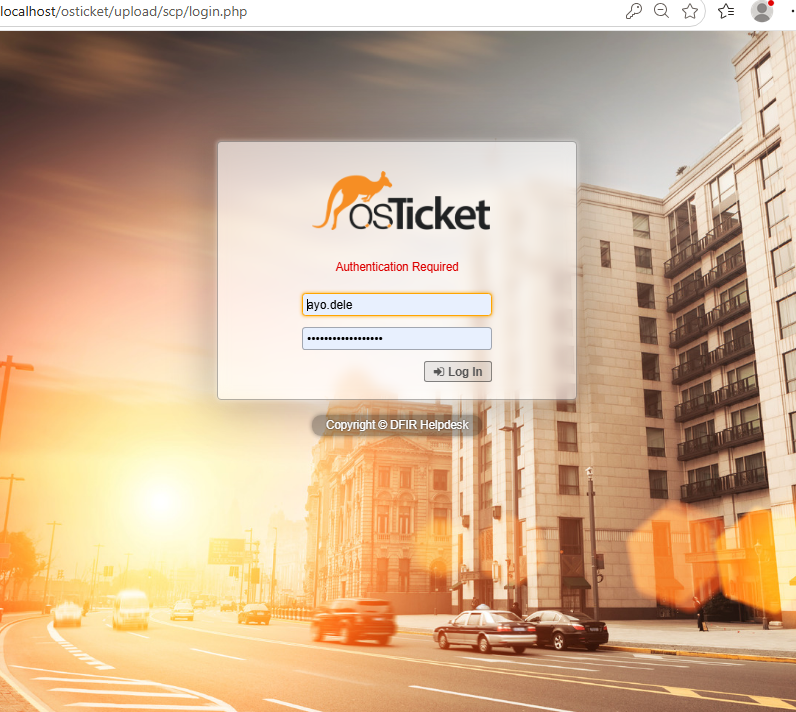

Validated staff/agent portal authentication.

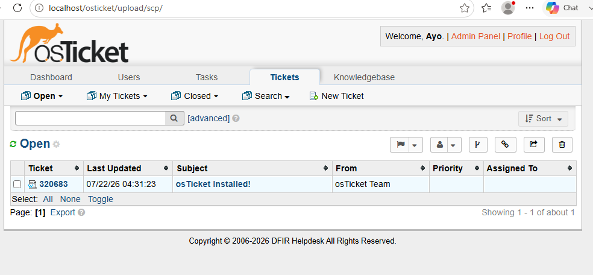

Confirmed administrative access and management functions.

## Challenges & Troubleshooting
- XAMPP installation was blocked by download security verification inside the Windows Server VM. The issue was resolved by accessing the Windows Server VM through RDP from the host machine and downloading the installer directly within the VM.

- XAMPP MariaDB failed due to corruption in the `mysql.db` system table. Restored the MySQL system database from the XAMPP backup directory, recovered MariaDB functionality, and completed the osTicket deployment.

## Summary
- **Investigation Findings:** Evaluated the requirements for deploying an on-prem ticketing platform within the SOC lab environment.
- **Decision Made:** Chose a local VirtualBox deployment using XAMPP, MariaDB, and osTicket to maintain a controlled lab environment.
- **Outcome:** Successfully deployed and configured osTicket as a foundation for future SOC alert-to-ticket automation.

## Impact
Provides a foundation for automating security alert ticket creation, assignment, and incident tracking.

---

## PART 18 — osTicket Elastic Integration

### Objective
Integrate osTicket with Elastic to enable automated security alert ticket creation and incident tracking.

### Skills
- API Integration | Webhook Configuration | SIEM Integration | Incident Management Workflow

### Tools
- Elastic Stack — Created webhook connectors to send alerts to external ticketing systems.
- osTicket — Configured API access for automated ticket creation.
- Windows Server — Hosted osTicket application.
- Ubuntu Server — Hosted ELK and generated alert requests.

### Steps
Configured osTicket API access through: Admin Panel → Manage → API

Created an API key and enabled ticket creation permissions for Elastic integration.

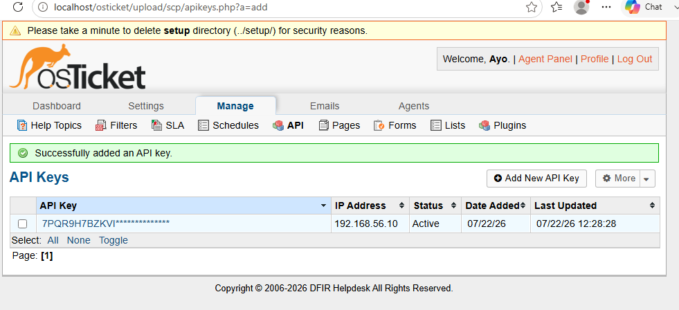

Configured Elastic webhook integration:
- Enabled Elastic 30-day trial license for connector functionality.
- Created an osTicket webhook connector.
- Configured POST request to the osTicket API endpoint.
- Added X-API-Key authentication header.
- Configured XML payload using the osTicket API example format.

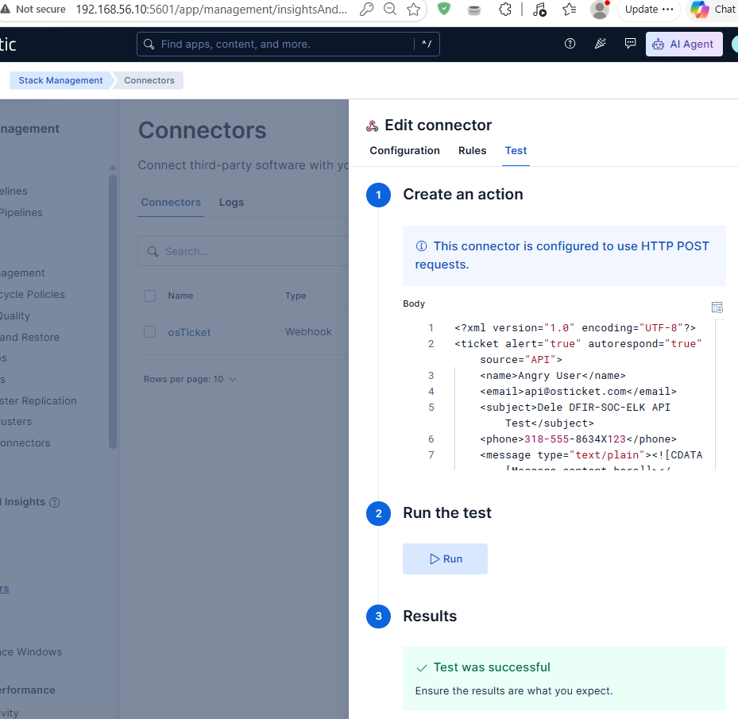

Validated the integration by running the webhook test and confirming automated ticket creation inside the osTicket agent panel.

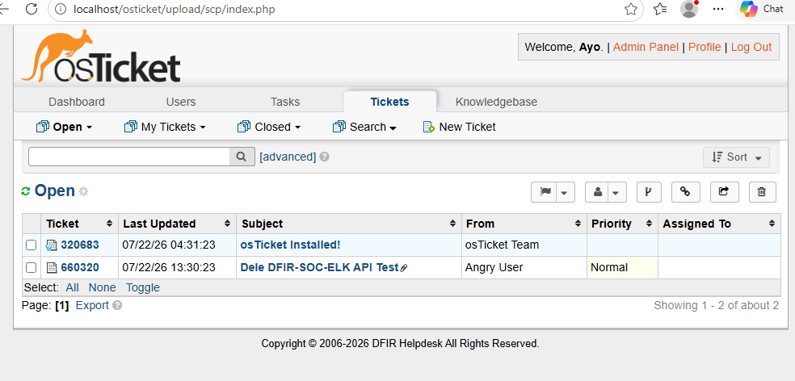

### Challenges & Troubleshooting
Elastic webhook testing initially failed due to a connection timeout between the ELK server and osTicket server.

The issue was traced to on-prem network communication problems, including incorrect internal IP configuration and Windows Firewall restrictions; resolved by correcting the osTicket network adapter configuration, changing the Host-Only adapter profile to Private, and allowing required inbound traffic for successful Elastic-to-osTicket communication.

### Summary

**Investigation Findings:** Validated that Elastic could communicate with osTicket through API-based webhook integration for automated ticket creation.

**Decision Made:** Used the VirtualBox Host-Only network for internal communication because the SOC environment was deployed on-premises.

**Outcome:** Successfully integrated osTicket with Elastic, enabling automated alert ticket generation and incident tracking workflows.

### Operational Impact
Provides SOC teams with automated alert tracking, accountability, and incident records by connecting SIEM detections with a ticket management workflow.

---

# PART 19 —  Investigation Methodology

## Objective
Investigate security alerts using Elastic SIEM by correlating endpoint and authentication telemetry to identify malicious activity and support SOC response decisions.

## Skills
- Security Alert Investigation | Threat Hunting | Incident Response | Log Analysis | MITRE ATT&CK Mapping

## Tools
- Elastic: Alert investigation, Kibana Discover queries, and Timeline analysis.
- Sysmon: Endpoint telemetry for process creation, file activity, network connections, and process access.
- AbuseIPDB / GreyNoise: Source IP reputation analysis.
- osTicket: Incident documentation workflow.

## Steps

### Detection & Investigation Workflow
- Investigated SSH and RDP brute-force alerts from Elastic Security.
- Reviewed authentication events, targeted users, source activity, and login results.
- Used DFIR-Suspicious Activity Dashboard to identify suspicious PowerShell activity.
- Pivoted using destination IP and ProcessGuid correlation to reconstruct activity.

### Mythic C2 Investigation Findings
- Identified PowerShell creating `Dele-ELK-Mythic.exe`.
- Confirmed executable creation and captured SHA256 hash.
- Identified outbound TCP communication to Mythic C2 listener.
- Correlated Sysmon Event IDs:
  - Event ID 11 — File Create
  - Event ID 29 — Executable Detection
  - Event ID 3 — Network Connection
  - Event ID 10 — Process Access

## Challenges & Troubleshooting
The lab was deployed on-premises, so private IP addresses limited external IP reputation and GeoIP enrichment.

osTicket alert automation was not fully captured during the investigation phase, so evidence was collected directly from Elastic telemetry.

## Summary

- **Investigation Findings:** Identified brute-force authentication activity and Mythic C2 execution behavior through Elastic and Sysmon correlation.
- **Decision Made:** Used ProcessGuid correlation and timeline analysis to connect related events and validate suspicious activity.
- **Outcome:** Confirmed endpoint execution, payload creation, C2 communication, and authentication attack indicators.

## Operational Impact
This investigation workflow helps SOC teams improve alert triage by connecting isolated events into a complete attack timeline for faster response.

---

# Part 20 — Elastic Defend EDR Deployment & Malware Prevention

## Objective
Deploy Elastic Defend EDR on a Windows Server endpoint and validate endpoint protection through malware detection, telemetry collection, and response actions.

## Skills
- Endpoint Detection & Response (EDR) | Malware Detection & Prevention | Security Alert Investigation | Endpoint Telemetry Analysis | Incident Response Workflow

## Tools
- Elastic Security — Used as the SIEM and security operations platform for endpoint monitoring, alerting, and investigation.
- Elastic Defend — Deployed as the EDR solution to provide malware prevention, endpoint telemetry, and response capabilities.
- Elastic Fleet — Used for centralized management and deployment of Elastic Agent integrations.
- Windows Server 2022 — Protected endpoint used for EDR testing and telemetry generation.
- EICAR Test File — Used to safely validate Elastic Defend malware prevention capabilities.

## Steps

### Elastic Defend Integration Deployment

Configured the Elastic Defend integration and deployed it to the existing Windows Server Elastic Agent policy through Fleet.

### Endpoint Verification

Verified that the Windows Server endpoint was successfully enrolled and actively reporting Elastic Defend telemetry in Elastic Security.

### Malware Prevention Validation

Executed an EICAR antivirus test file to validate Elastic Defend protection. The endpoint generated a Malware Prevention Alert and automatically quarantined the file.

### Endpoint Telemetry Investigation

Investigated the generated telemetry in Kibana Discover and reviewed important investigation fields including file name, file path, SHA256 hash, event type, and quarantine status.

### Response Validation

Validated the endpoint response workflow and confirmed Elastic Defend response capabilities within the lab environment.

## Challenges & Troubleshooting
For malware prevention validation, I used the EICAR test file to safely verify Elastic Defend detection and response capabilities.

## Summary

**Investigation Findings:** Elastic Defend detected the EICAR test file, generated a Malware Prevention Alert, collected endpoint telemetry, and successfully quarantined the file.
**Decision Made:** Used the EICAR test file to safely validate EDR detection and response capabilities.
**Outcome:** Successfully deployed Elastic Defend EDR and confirmed endpoint protection, telemetry visibility, and malware prevention functionality.

## Operational Impact
Provides SOC analysts with endpoint visibility and automated detection capabilities needed to quickly identify, investigate, and respond to endpoint threats.
