## PART 1 – SOC Architecture Diagram (ELK Lab)

### Objective
Build a logical SOC architecture diagram using draw.io to model an ELK-based monitoring environment.

---

### Skills
- SOC architecture design
- Network segmentation (lab design)

### Tools
- draw.io

### Summary
SOC architecture diagram built in draw.io showing ELK-based monitoring environment.  
Defined private lab network with internal systems, endpoints, and external connectivity via NAT/host adapter.  
Mapped log and communication flows between Windows, Ubuntu, Fleet, Elastic/Kibana, and C2 simulation systems.

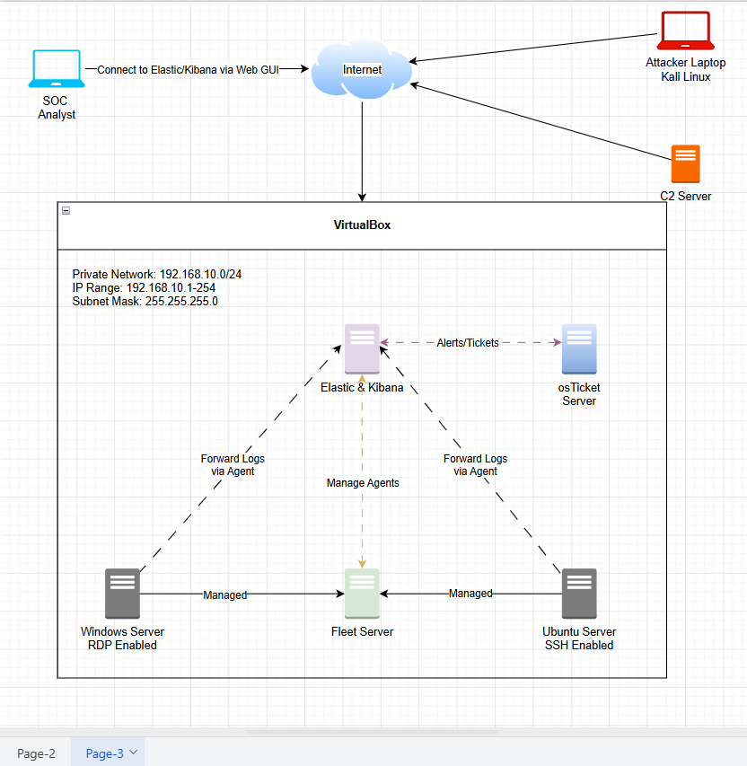

---

# PART 2 – Elasticsearch Deployment

## Objective
Deploy and configure an Elasticsearch instance for centralized log storage.

## Skills
- Linux Administration  
- Elasticsearch Installation  
- Systemd Service Management  
- Network Configuration  
- Basic Security Hardening (firewall rules)

## Tools Used
- Ubuntu Server (VM) | Elasticsearch | PowerShell / SSH  

## Evidence

**Elasticsearch Service Status (Active Running):**
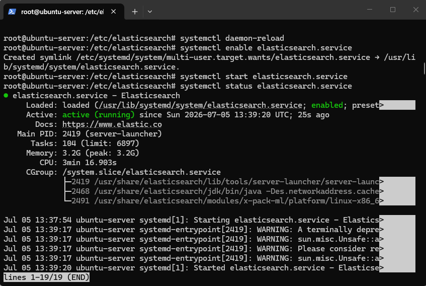

---

## Implementation Steps

### 1. Lab Network Setup
- Configured VirtualBox NAT + Host-Only network for isolated lab communication.
- Ensured all VMs were attached to the same Host-Only subnet for internal connectivity.

### 2. System Access & Preparation
- Connected to Ubuntu server via SSH from analyst/host machine.
- Verified connectivity using: `ip a`
- Updated system packages:

### 3. Elasticsearch Installation
- Selected Linux package: **Deb (x86_64)**
- Downloaded package via terminal using `wget <link>`
- Confirmed package using: `ls`
- Installed Elasticsearch: sudo dpkg -i elasticsearch*.deb
- Captured and stored auto-generated security credentials for authentication.

### 4. Network Configuration
- Edited Elasticsearch configuration:
- Set network.host → Host-Only IP and http.port → `9200` 
- Applied access control via Host-Only networking (lab-isolated access model)

### 5. Service Management (systemd)
- systemctl daemon-reload
- systemctl enable elasticsearch
- systemctl start elasticsearch
- Verify status: active (running)

---

## Conclusion
Successfully deployed and validated Elasticsearch as a centralized log storage engine in a controlled lab environment.

---

# PART 3 – Kibana Setup 

## Objective
Set up Kibana to provide a web-based interface for searching and visualizing data stored in Elasticsearch for security monitoring and detection workflows.

---

## Skills
Linux administration  
Network / firewall configuration  

## Tools
Kibana | UFW | Ubuntu Server | SSH  

## Steps

### Ref 1: Kibana Service Status (Active)
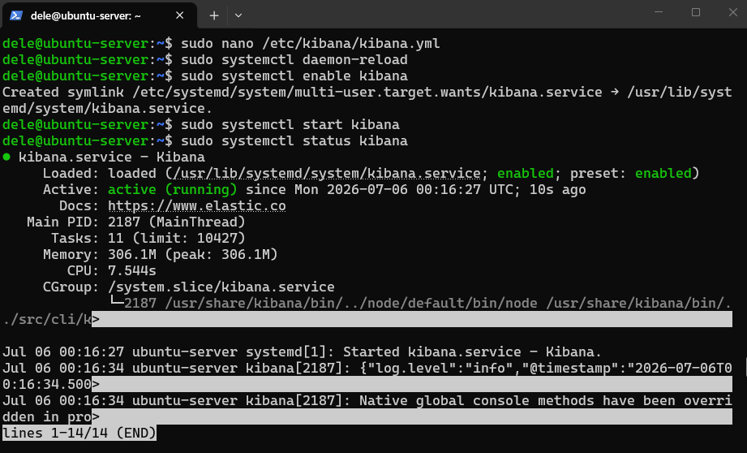

- Verified Kibana service is running and accessible via browser.

### Ref 2: Kibana Enrollment & Access Setup
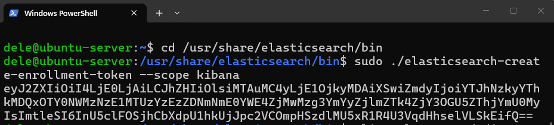

- Installed and linked Kibana with Elasticsearch using enrollment token and verification code.

- Enabled access through firewall (UFW) to allow browser connection.
- Completed authentication using `elastic` credentials and reached Kibana homepage.

### Ref 3: Kibana Alerts / Security Interface
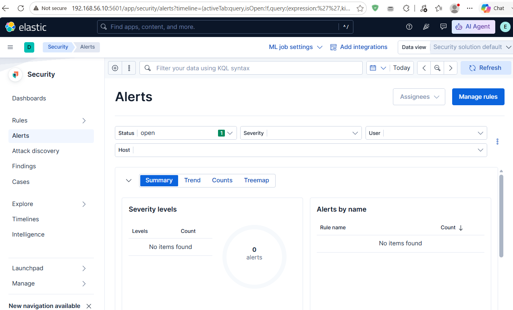

Validated Kibana UI access and security/detection features functionality.

## Conclusion
Kibana successfully installed, configured, and connected to Elasticsearch.

---

# PART 4 – Windows Server Target VM

## Objective
Deploy a local Windows Server VM as a target endpoint for log generation and SOC detection.

---

## Skills
- Virtual machine deployment
- Network segmentation awareness
- Windows Server configuration

## Tools

- VirtualBox | Windows Server 2022 | GitHub

---

## Steps
1. Created Windows Server 2022 VM in VirtualBox
2. Configured initial setup and hostname assignment
3. Applied VirtualBox networking (NAT / Host-Only isolation)
4. Verified system boot and console access

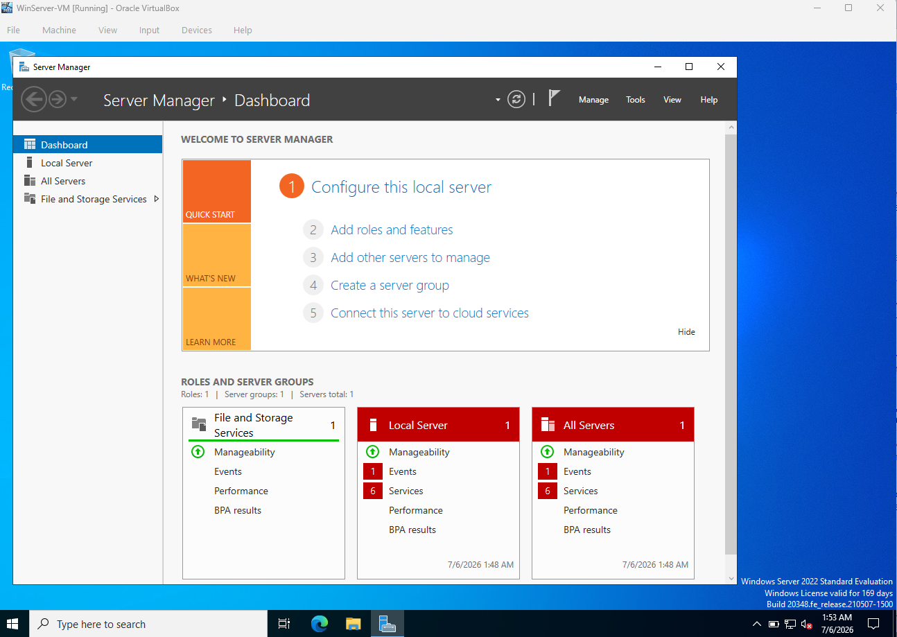

- Windows Server deployed locally as a controlled target system for SOC log generation and attack simulation.

---

## Summary

### Investigation Findings
- Cloud-style VPC segmentation does not apply in VirtualBox.
- Isolation is achieved through VirtualBox NAT/Host-Only networking.
- Segmentation limits the attack blast radius and reduces opportunities for lateral movement.

### Decision Made
- Kept Windows Server isolated from the ELK stack unless intentionally placed on the same internal network.
- Maintained Windows Firewall default configuration and relied on VirtualBox networking for lab isolation.

### Outcome
- Windows Server successfully deployed as an isolated target VM.
- Lab architecture reflects the security principle of network segmentation and blast-radius reduction.
- Environment is ready for log generation, attack simulation, and ELK log ingestion.

---

# PART 5 – Fleet Server for Centralized Agent Management.

## Objective

Deploy Fleet Server and enroll a Windows Server Elastic Agent for centralized log collection and management.

---

## Skills

- Elastic Fleet management
- Agent enrollment and troubleshooting
- TLS/network troubleshooting
- Windows event log ingestion validation

## Tools

- Elastic 9.4.3 | Fleet Server | Elastic Agent | Ubuntu | Windows | Kibana

---

## Steps

### Fleet Server Deployment

- Deployed Fleet Server on Ubuntu ELK instance using HTTPS
- Generated Fleet Server policy and enrollment token from Kibana Fleet management.

- Installed Elastic Agent Fleet Server and verified successful connection in Kibana.

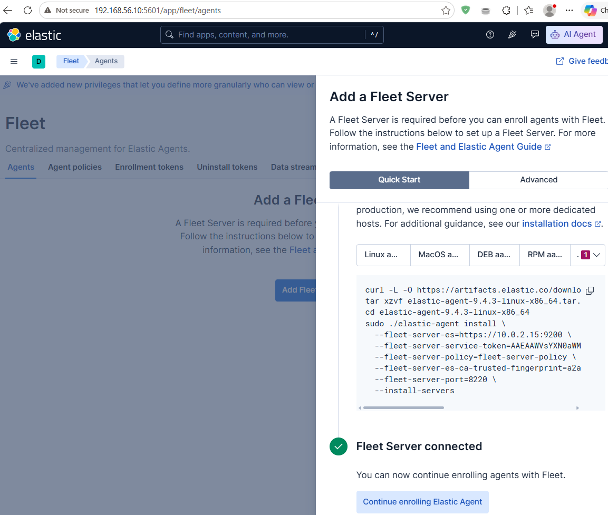

### Windows Elastic Agent Enrollment

- Created Windows agent policy (`DFIR-Windows-policy`) in Fleet.
- Installed Elastic Agent on Windows Server using the Fleet enrollment command.
- Verified network connectivity between Windows Server and Fleet Server.

- Decision:
Used --insecure to bypass self-signed TLS certificate validation in the lab environment.

---

## Detection Summary

### Investigation Findings:
  - Fleet Server enrollment initially failed due to incorrect package architecture, enrollment issues, and TLS certificate validation errors.
  - Windows Agent enrollment failed with `x509: certificate signed by unknown authority`.
  - Network connectivity and port availability were verified successfully.

### Decision Made:
  - Corrected Fleet Server deployment configuration.
  - Used `--insecure` for the lab environment to bypass self-signed certificate validation.

### Outcome:
  - Fleet Server successfully connected.
  - Windows Elastic Agent enrolled and reported Healthy status.
  - Windows Security logs successfully ingested into Kibana Discover.

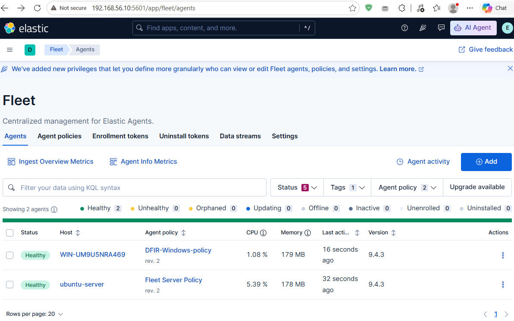

---

### Windows Log Validation (4672)

- Verified Windows Security events in Kibana Discover.
- Confirmed event collection with Windows Event IDs.

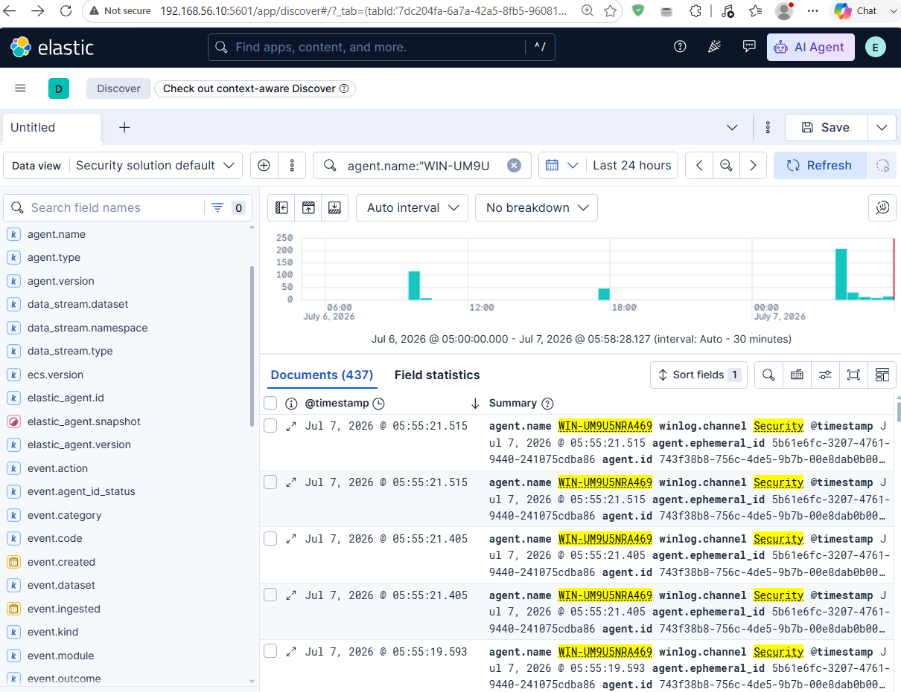

### Outcome:
  - Elastic Agent successfully forwarded Windows security telemetry into the Elastic Stack for monitoring and detection workflows.

---

# PART 6 – Sysmon Installation & Event Monitoring

## Objective

Install and configure Sysmon on the Windows Server, then verify successful deployment and event generation for endpoint monitoring and security analysis.

---

## Skills

- Endpoint monitoring
- Windows event analysis
- Sysmon deployment and configuration
- Security telemetry validation

## Tools

- Windows | Sysmon | Olaf | PowerShell | GitHub

---

## Steps

### 1. Sysmon Installation Preparation

- Downloaded Sysmon from Microsoft Sysinternals.
- Extracted Sysmon binaries on the Windows Server.
- Downloaded Olaf's Sysmon configuration file from GitHub.
- Added the Sysmon configuration file to the Sysmon directory.

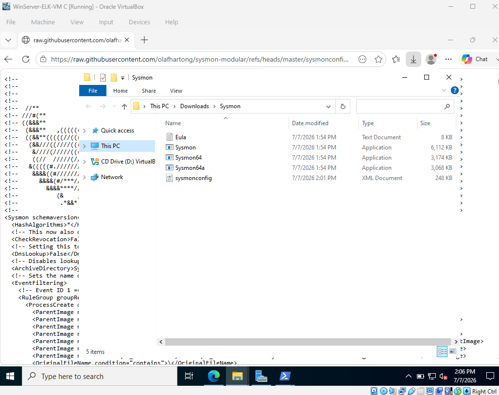

### 2. Sysmon Directory Validation

- Opened PowerShell as Administrator.
- Navigated to the Sysmon installation directory.
- Verified the presence of the Sysmon executable and configuration file.

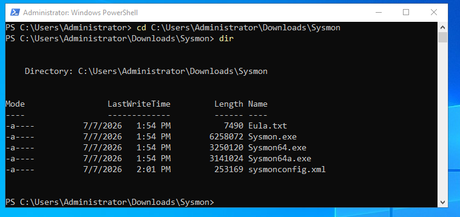

### 3. Sysmon Deployment

- Verified the absence of Sysmon service and logs before installation.
- Installed Sysmon using the configured XML file.
- Accepted the Sysmon license agreement to complete deployment.

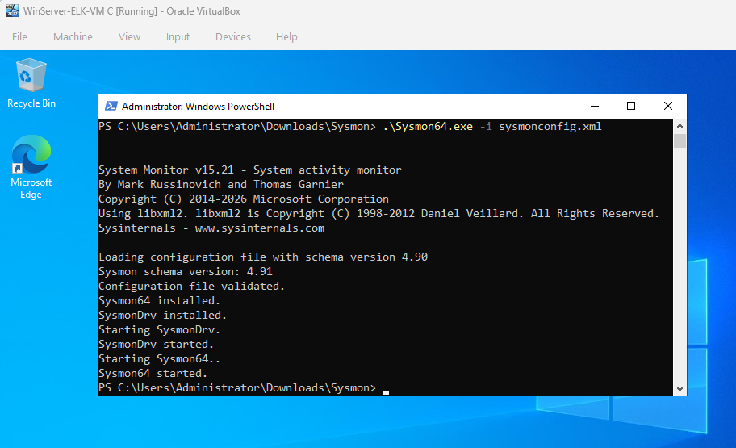

### 4. Service Verification

- Refreshed Windows Services after installation.
- Confirmed the Sysmon64 service was installed and running.

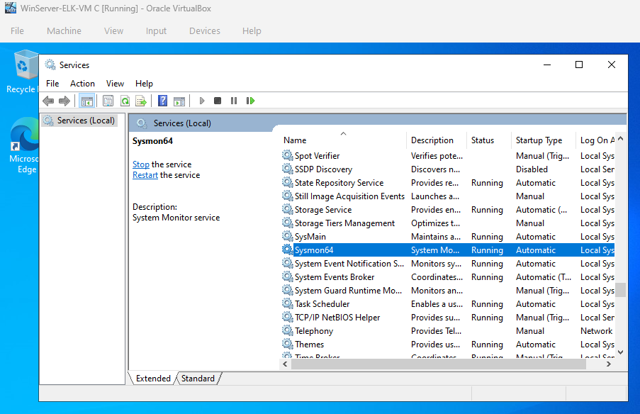

### 5. Event Generation Validation

- Opened Windows Event Viewer.
- Navigated: Applications & Services Logs → Microsoft → Windows → Sysmon → Operational
- Confirmed Sysmon event generation.
- Validated Event ID 11, which records file creation and overwrite activity.

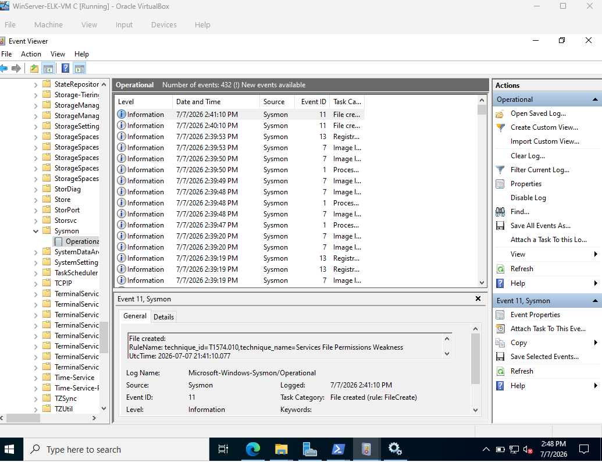

---

## Summary

- Investigation Findings:
  - Sysmon was successfully deployed and generating endpoint telemetry.
  - Event ID 11 confirmed visibility into file creation activity.

- Decision Made:
  - Use Sysmon telemetry as an additional endpoint data source for Elastic Stack monitoring.

- Outcome:
  - Windows Server is now generating Sysmon security events, ready for ingestion into the ELK detection pipeline.

---

## Part 7: Sysmon & Microsoft Defender Log Ingestion

### Objective
Configure Elastic Agent to ingest Sysmon and Microsoft Defender event logs from Windows Server into the on-premises Elastic Search instance.

### Skills
- Elastic Agent integration configuration
- Windows Event Log collection
- Sysmon log ingestion
- Microsoft Defender event monitoring
- SIEM data verification and troubleshooting

### Tools
- Kibana | Elastic | Windows | Sysmon | MS Defender | Event Viewer

### Steps

#### Step 1: Configure Sysmon Windows Event Log Integration

- Created a Custom Windows Event Log integration in Elastic.
- Retrieved the Sysmon Operational channel from Windows Event Viewer:
  - Applications and Services Logs → Microsoft → Windows → Sysmon → Operational
- Added the integration to the existing Windows Agent Policy.
- Saved and deployed the policy changes.

Result:
- DFIR-Win-Sysmon integration successfully added to the Windows Agent Policy.

---

#### Step 2: Configure Microsoft Defender Event Log Integration

- Created a second Custom Windows Event Log integration.
- Configured:
  - Integration Name: `DFIR-Win-Defender`
  - Purpose: Collect Microsoft Defender logs.
- Retrieved the Defender Operational channel from Windows Event Viewer:
  - Applications and Services Logs → Microsoft → Windows → Windows Defender → Operational

Configured monitored Event IDs:

- `1116` - Malware or potentially unwanted software detected.
- `1117` - Action performed to protect the system from malware.
- `5001` - Real-time protection disabled.

Tested Defender monitoring by disabling real-time protection and verifying Event ID 50001 generation.

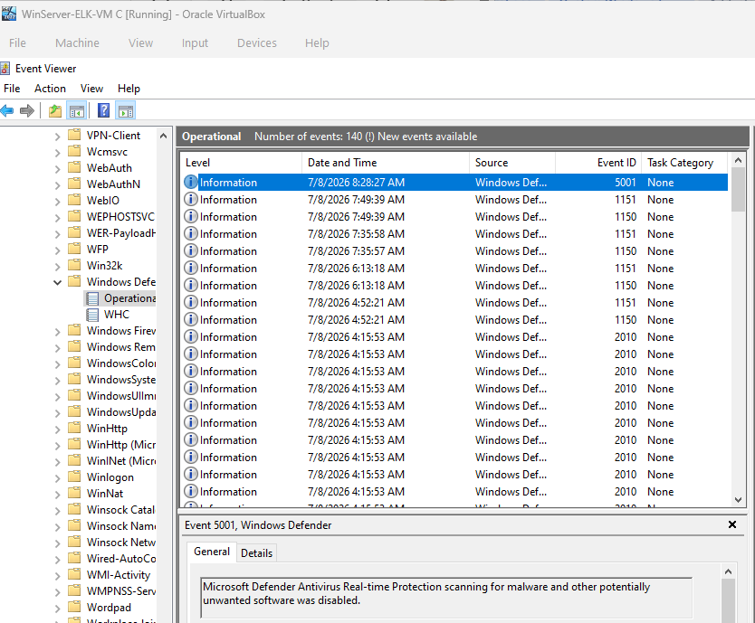

---

#### Step 3: Deploy Microsoft Defender Event Filtering

- Added the Defender channel name into Elastic.
- Configured Advanced Options with required Event IDs: 1116,1117,50001
- Added the integration to the existing Windows Agent Policy.
- Saved and deployed changes.

Result:
- Sysmon and Microsoft Defender logs were configured for ingestion into the on-premises Elastic Search instance.

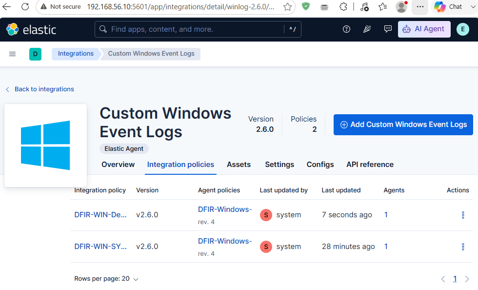

---

#### Step 4: Verify Event Log Ingestion

- Opened Discover in Kibana.
- Verified log availability using: winlog.event_id
- Confirmed Sysmon and Microsoft Defender event datasets were available.
- Validated Elastic Agent health through Fleet.
- Restarted Elastic Agent when required and refreshed log discovery.

Verification:
- `winlog.event_id: 1` confirmed Sysmon events.
- `winlog.event_id: 5001` confirmed Microsoft Defender events.

---

#### Step 5: Validate Event Provider Data

Verified the `event.provider` field to confirm successful ingestion.

Microsoft Defender verification:

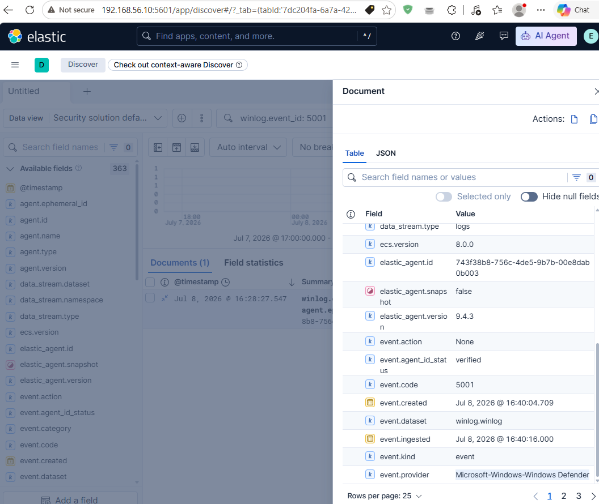

Sysmon verification:

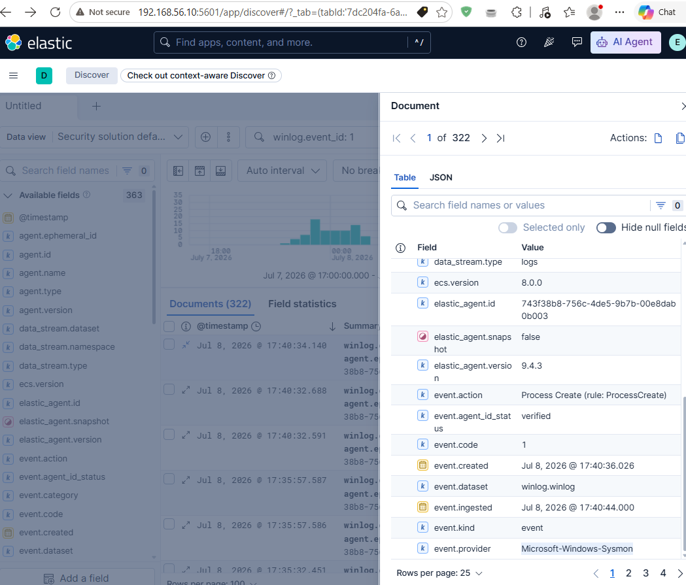

---

### Summary

- Investigation Findings:
  - Elastic Agent successfully collected Windows Event Logs from Sysmon and Microsoft Defender.
  - Event IDs were filtered to focus on security-relevant activity.
  - Event provider fields confirmed correct log source identification.

- Decision Made:
  - Implement targeted Windows Event Log collection instead of ingesting unnecessary informational events.

- Result / Outcome:
  - Sysmon and Microsoft Defender telemetry are now available in Elasticsearch for security monitoring, detection engineering, and future threat investigation workflows.

---

# PART 8 - SSH Authentication Log Analysis

## Objective
- Set up an Ubuntu SSH server on-prem lab environment.
- Review SSH authentication logs in real time from the local server.

---

## Skills
- SSH server administration
- Linux authentication log analysis
- Log filtering with grep
- Log field extraction with cut
- Basic brute-force detection analysis

## Tools
- Ubuntu | SSH | PowerShell

---

## Steps

### 1. SSH Server Setup
- Used the existing Ubuntu Server VM as the SSH server.
- Verified the VM was running and accessible.
- Connected remotely through SSH from the Windows host.
- Updated system repositories and installed package updates.

### 2. Authentication Log Review
- Navigated to `/var/log`.
- Reviewed `auth.log`, which stores SSH authentication events.
- Verified initial authentication activity after starting the server.

### 3. Authentication Log Filtering
- Used `grep -i failed auth.log` to filter failed authentication attempts.
- Applied additional filtering to identify failed attempts targeting specific users.

### 4. Authentication Log Analysis
- Used the `cut` command with space delimiters to extract specific log fields.
- Identified the source IP address field from failed SSH login events.
- Extracted attacker/source IP information for analysis.

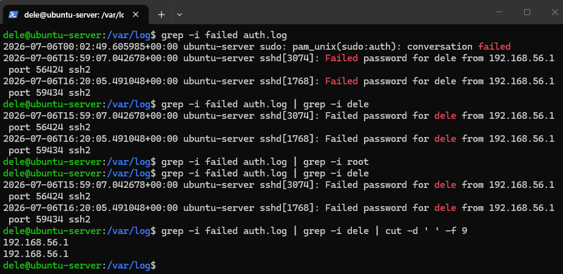

- Screenshot showing failed SSH authentication attempts identified from `auth.log`, including extracted source IP addresses.

---

## Summary

- **Investigation Findings:**
  - Identified failed SSH authentication attempts against the Ubuntu SSH server.
  - Extracted source IP addresses associated with failed login attempts.
  - Observed activity consistent with brute-force authentication attempts.

- **Decision Made:**
  - Prepare the SSH server for centralized log collection using Elastic Agent.

- **Result / Outcome:**
  - Successfully completed local SSH authentication log analysis.

---

# Part 9 — Linux SSH Server Elastic Agent Deployment

## Objective
Deploy Elastic Agent on a Linux SSH server to collect authentication logs and enable security investigation in Elastic.

---

## Skills
- Elastic Fleet Management
- Linux Log Monitoring
- Authentication Event Investigation
- Elastic Discover Analysis

## Tools
- Elastic | Kibana |Ubuntu | SSH

---

## Steps

- Created a dedicated Linux agent policy in Fleet.
- Enrolled Ubuntu SSH server into Fleet using Elastic Agent.
- Resolved self-signed certificate enrollment issue using `--insecure`.
- Verified agent health and incoming telemetry.
- Investigated SSH authentication failures from `/var/log/auth.log`.

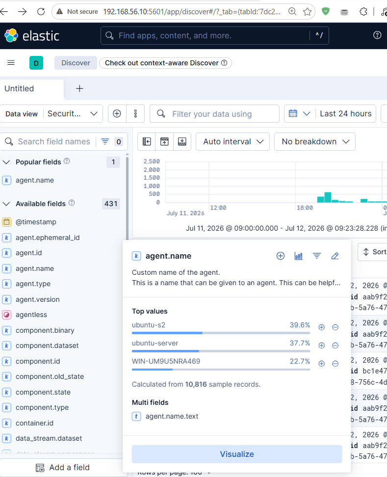

- Confirmed authentication failure events in Elastic Discover.

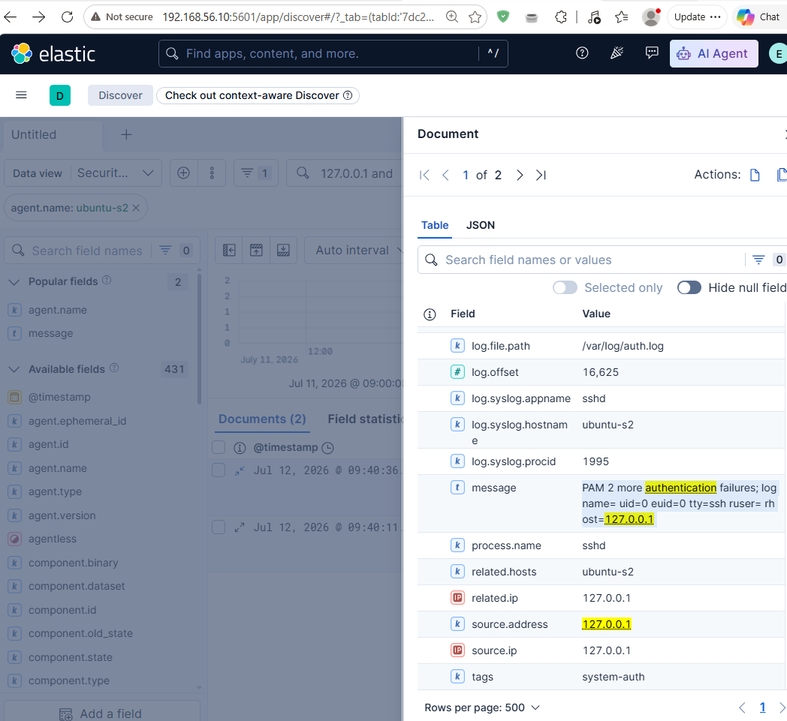

- Added the `message` field as a Discover table column for easier event analysis.

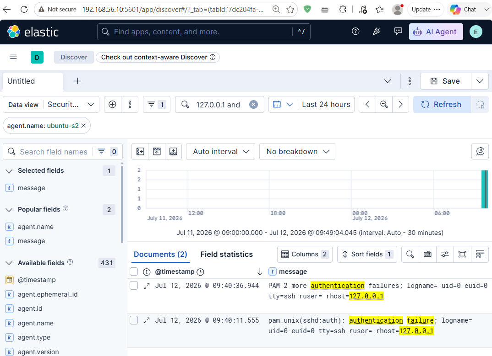

---

## Summary

- Investigation Findings:
  - Linux SSH authentication failures were successfully ingested into Elastic.
  - Events were searchable using authentication failure fields and source IP correlation.

- Decision Made:
  - Kept Fleet Server and Linux endpoint agents separated using dedicated policies.

- Result / Outcome:
  - Ubuntu SSH server successfully enrolled as an Elastic Agent endpoint.
  - Linux authentication monitoring workflow validated in Elastic Discover.

---

# PART 10 – SSH Brute Force Detection Alert & Dashboard

## Objective

Create an SSH Brute Force detection alert and dashboard in the on-prem Elastic Stack to identify failed authentication attempts.

---

## Skills

- Elastic SIEM Detection Engineering
- SSH Authentication Analysis
- KQL Query Filtering
- Alert Rule Creation
- Security Visualization

## Tools

- Elastic | Kibana | Ubuntu SSH Server

---

## Steps

### SSH Authentication Analysis

- Queried SSH authentication logs from the on-prem Ubuntu SSH server using Kibana Discover.
- Identified failed authentication activity using `system.auth.ssh.event`.
- Added investigation fields: user.name ,source.ip

### SSH Brute Force Alert Creation
- Created an Elastic threshold alert rule for repeated SSH failed authentication attempts.

Detection Logic:
`agent.name: ubuntu-s2 AND system.auth.ssh.event: Failed`

### SSH Attack Source Visualization

- Created an Elastic Maps workflow for SSH attack source analysis.
- Attempted geographic visualization using source IP enrichment.

- Identified that the on-prem environment collected source IP data but did not have automatic GeoIP enrichment available.

---

## Summary

### Investigation Findings:
- Detected SSH brute force activity from authentication logs.
- Validated failed login attempts and source IP visibility.

### Decision Made:
- Continued detection workflow using available source IP telemetry without additional GeoIP enrichment.

### Result / Outcome:
- Completed SSH brute force detection workflow:
  - Log collection
  - Authentication analysis
  - Alert creation
  - Dashboard visualization

---

## PART 11 – Windows Authentication Log Analysis & Brute Force Detection

### Objective
Implement Windows authentication monitoring and brute-force detection using the on-prem Elastic Stack.

---

### Skills
- SIEM Detection Engineering
- Windows Log Analysis
- Alert Investigation

### Tools
- Elastic Stack | Windows Server | Kali Linux

### Steps

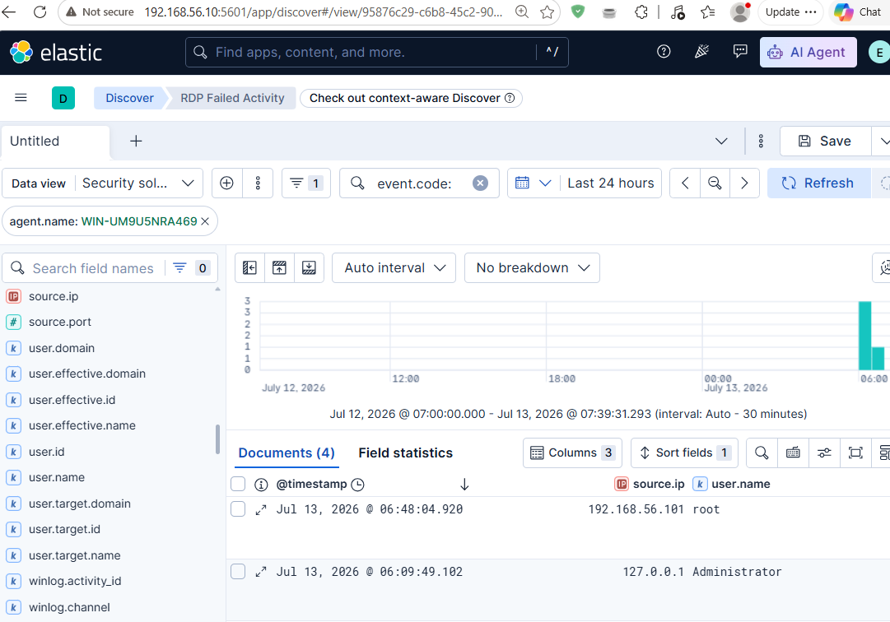

### Windows Authentication Analysis
- Analyzed Windows Security events in Kibana Discover.
- Identified Event ID 4625 for failed authentication attempts.
- Validated authentication activity from Kali Linux.
- Investigated events using: event.code: 4625

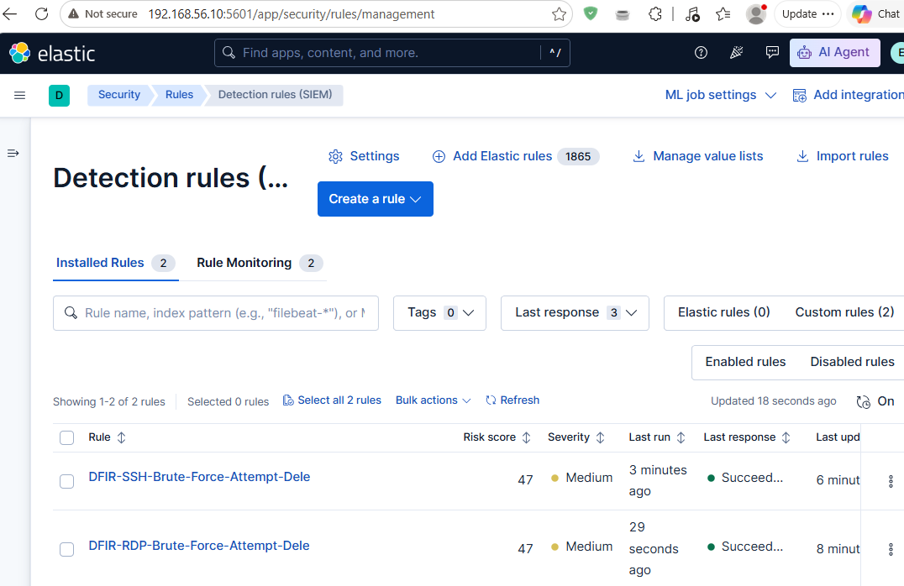

### RDP Brute Force Detection
- Created Elastic Security detection rule for Windows failed authentication.
- Detection criteria: Event ID: 4625 | User: Administrator | Source IP tracking
- Configured threshold-based detection:
- Grouped events by: user.name & source.ip

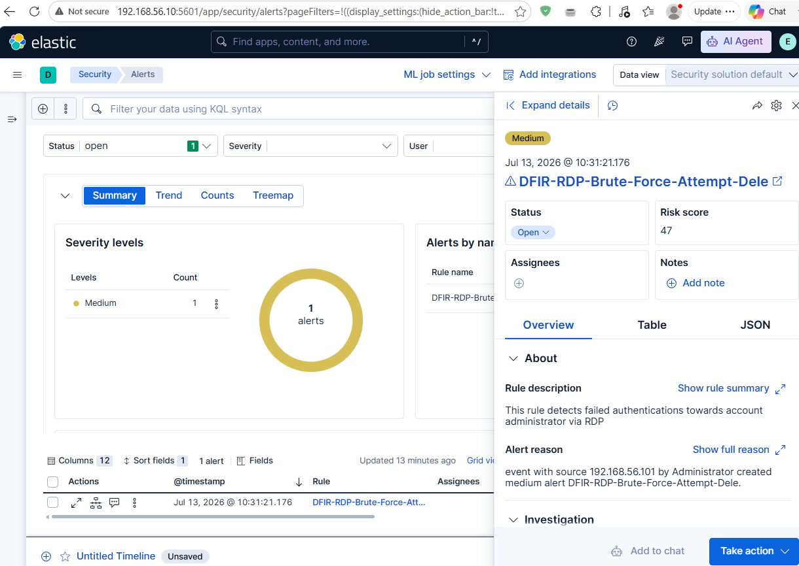

### Alert Validation
- Generated controlled RDP authentication failures from Kali Linux.
- Verified alert generation in Elastic Security.
- Confirmed visibility of source IP and username during investigation.

### Summary

- Investigation Findings:
  - Successfully detected Windows failed authentication activity and generated RDP brute-force alerts.

- Result / Outcome:
  - Completed Windows authentication monitoring and brute-force detection implementation.
  - Environment contains SSH and Windows RDP brute-force detection rules.

### Conclusion
SSH and RDP services require proper access controls.

Security practices:
- Identify exposed services.
- Use strong passwords and MFA.
- Restrict access to authorized systems and users.

---

## Part 12 – RDP Authentication Activity Map & Table

### Objective

Create a Kibana dashboard to monitor Windows Server Remote Desktop Protocol (RDP) authentication activity using Elastic Security events and visualizations.

---

### Skills

- SIEM Dashboard Development
- Windows Authentication Log Analysis
- RDP Detection Querying
- Kibana Visualizations
- Security Event Investigation

### Tools

- Elastic | Kibana | Windows Server

### Steps

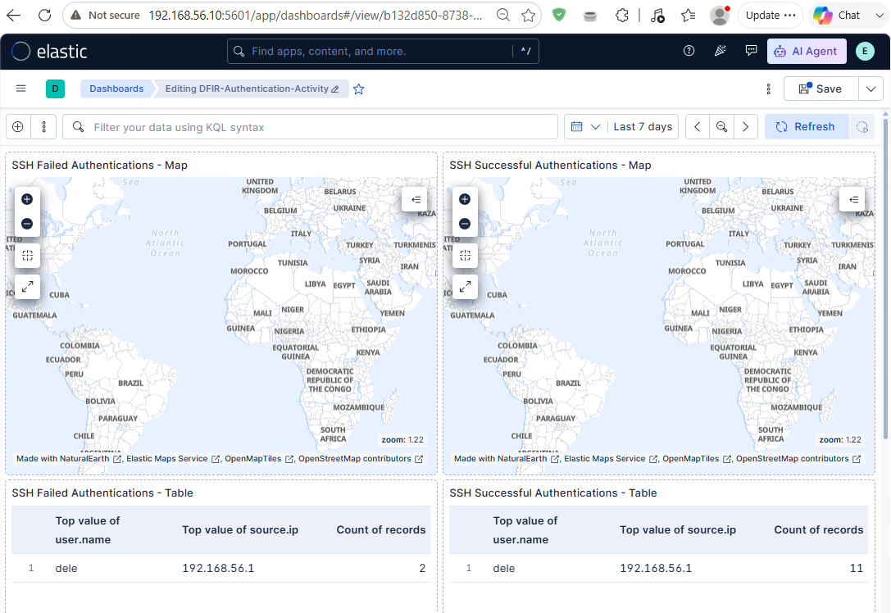

- Created authentication dashboards using Kibana Maps and Tables.
- Built visualizations for failed and successful authentication activity.
- Used Windows Security Event IDs: 4625 (Failed) | 4624 (Successful)
- Filtered RDP activity using Logon Types: 10 (RemoteInteractive) | 7 (Unlock)
- Added dashboard tables displaying: Username | Source IP | Authentication count

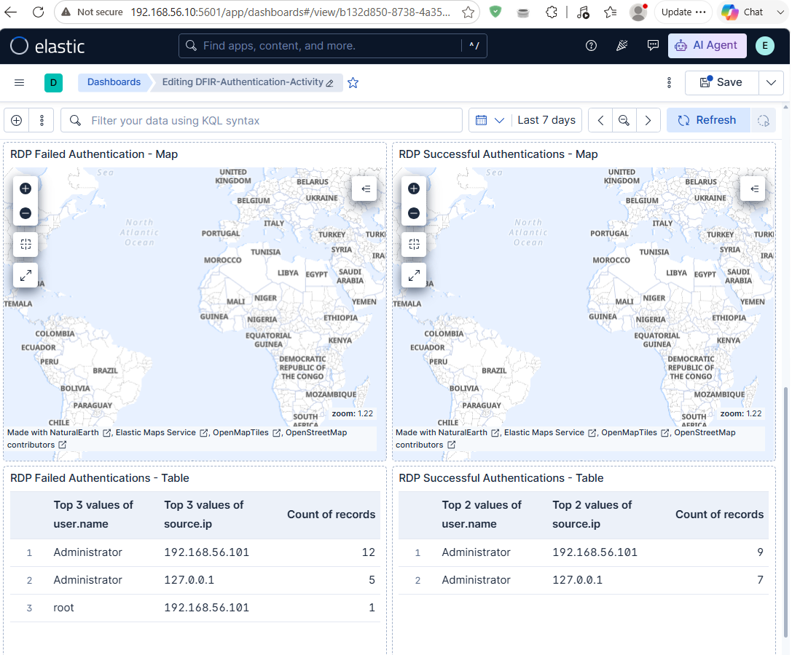

- Created RDP authentication monitoring views by adapting existing SSH authentication dashboards.
- Applied queries to identify Windows Server RDP activity.
- Saved final dashboard for authentication monitoring and investigation workflows.

### Brief Description

Implemented Kibana-based monitoring for SSH and RDP authentication activity, providing SOC analysts with visual dashboards to investigate failed logins, successful access, source information, and authentication patterns.

This implementation was completed in an on-prem VirtualBox environment instead of a cloud-based environment. Due to private lab IP addresses, GeoIP enrichment may not populate because geographic mapping requires public source IP addresses. This highlights the operational differences between cloud and on-prem environments.

In production environments, IP2Location can be used to identify the geographic origin of external authentication attempts.

### Summary

## Investigation Findings:
- Windows Security logs provided visibility into RDP authentication events.
- Event ID analysis identified failed and successful remote access activity.

## Decision Made:
- Used Kibana dashboards and tables to centralize authentication visibility.
- Focused on operational detection and investigation workflows.

## Outcome:
- Successfully created SSH and RDP authentication dashboards (Maps & Tables)
- Improved visibility into remote access activity for SOC monitoring.
- Strengthened Elastic SIEM detection and dashboard development skills.

---

# Day 13: Attack Diagram Creation

## Objective

Create an attack diagram that outlines the planned attack path against the target machine, including the steps required to compromise the system and establish a Command and Control (C2) connection after successful access.

## Skills

- Attack path planning
- Security workflow documentation
- Attack lifecycle mapping

## Tools

- **draw.io** - Used to create the attack diagram and visualize the planned attack flow.

## Steps

Created an attack diagram outlining the attack lifecycle:

- Phase 1: Initial Access through RDP brute force.
- Phase 2: Discovery activities after successful access.
- Phase 3: Defense evasion planning.

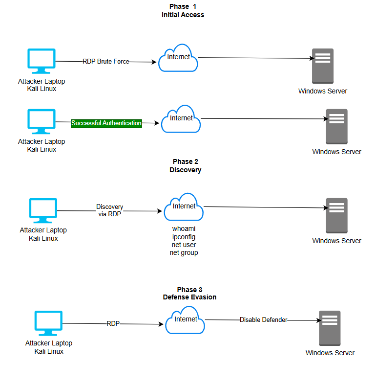

- Phase 4: Execution of the Mythic agent.
- Phase 5: Command and Control communication.
- Phase 6: Simulated exfiltration activity.

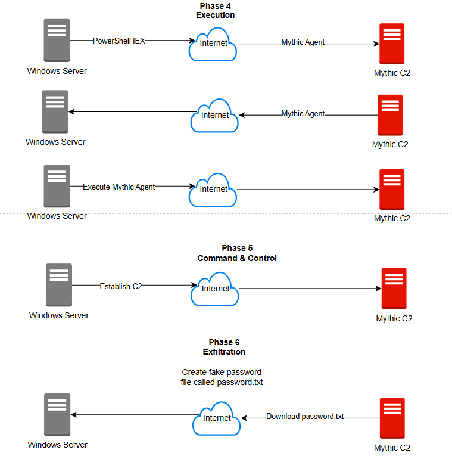

## Summary

- **Investigation Findings:** Attack diagrams help visualize attacker movement and planned activities.
- **Decision Made:** Used a phased approach to clearly map each stage of the attack lifecycle.
- **Outcome:** Created an attack roadmap to guide future lab implementation and detection testing.

## Impact

Helps security teams understand attack paths and identify opportunities for monitoring and detection.

---

# Part 14 – Mythic C2 Setup

## Objective
Deploy an on-prem Mythic C2 server to simulate adversary activity and understand C2 infrastructure used in security testing.

## Skills
- C2 Infrastructure Deployment
- Docker Container Management
- Linux Administration
- Adversary Emulation
- VM Network Management

## Tools
- VirtualBox (On-Prem Lab Environment)
- Ubuntu Server (Mythic C2 Host)
- Kali Linux (Attacker VM)
- Mythic C2 Framework
- Docker / Docker Compose

## Steps

- Prepared a dedicated Ubuntu VM for Mythic C2.
- Installed Mythic dependencies and deployed Mythic using Docker.
- Started Mythic services and accessed the Web UI through the Host-Only network.
- Verified Mythic containers, SSL access, and dashboard availability.

## Challenges & Troubleshooting

- During infrastructure expansion, multiple Ubuntu VMs introduced Host-Only IP management issues. DHCP reassigned IP addresses between cloned VMs, causing SSH connectivity problems and making VM identification unreliable.

- Investigated adapter configurations and discovered that dynamic IP allocation could create conflicts as more systems were added to the lab.

- Resolved the issue by assigning static Host-Only IP addresses to each VM, ensuring predictable identification and reliable communication across the environment.

- Mythic deployment initially failed because Docker permissions and the Docker daemon were not properly configured.

- Added the user to the Docker group, restarted Docker services, and rebuilt Mythic successfully.

## Summary

- **Investigation Findings:** DHCP-based Host-Only networking becomes unreliable as lab infrastructure grows.
- **Decision Made:** Adopt static IP addressing for lab VMs to maintain predictable communication and easier troubleshooting.
- **Outcome:** Successfully deployed a functional Mythic C2 server in an isolated on-prem lab environment.

## Impact
Built a repeatable adversary simulation environment that supports security testing, detection engineering, and blue team investigation workflows.

