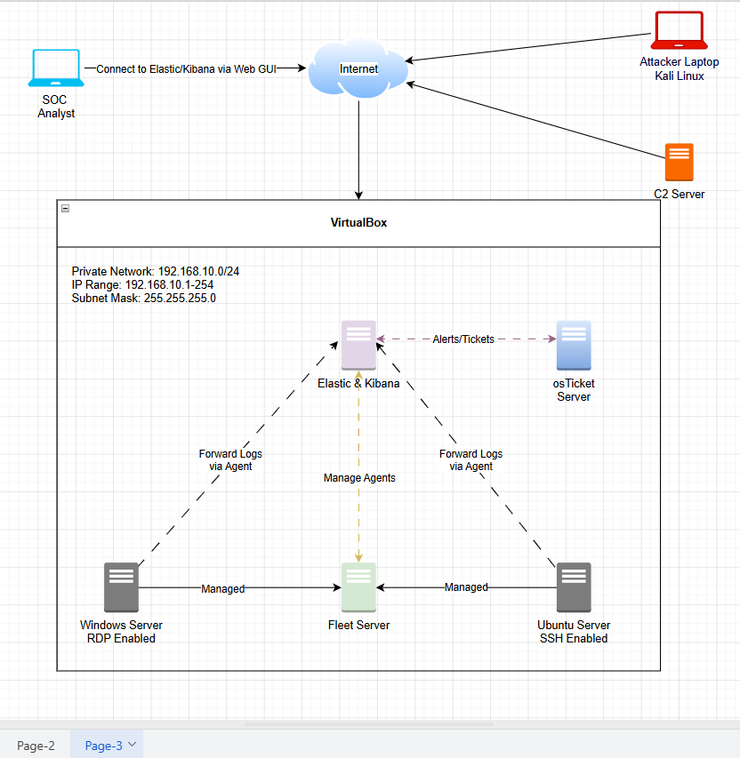
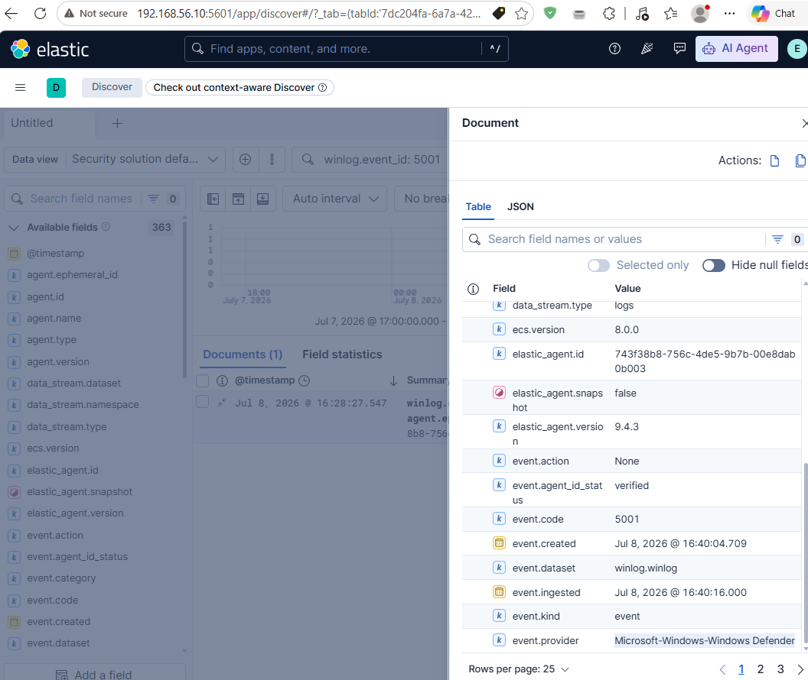
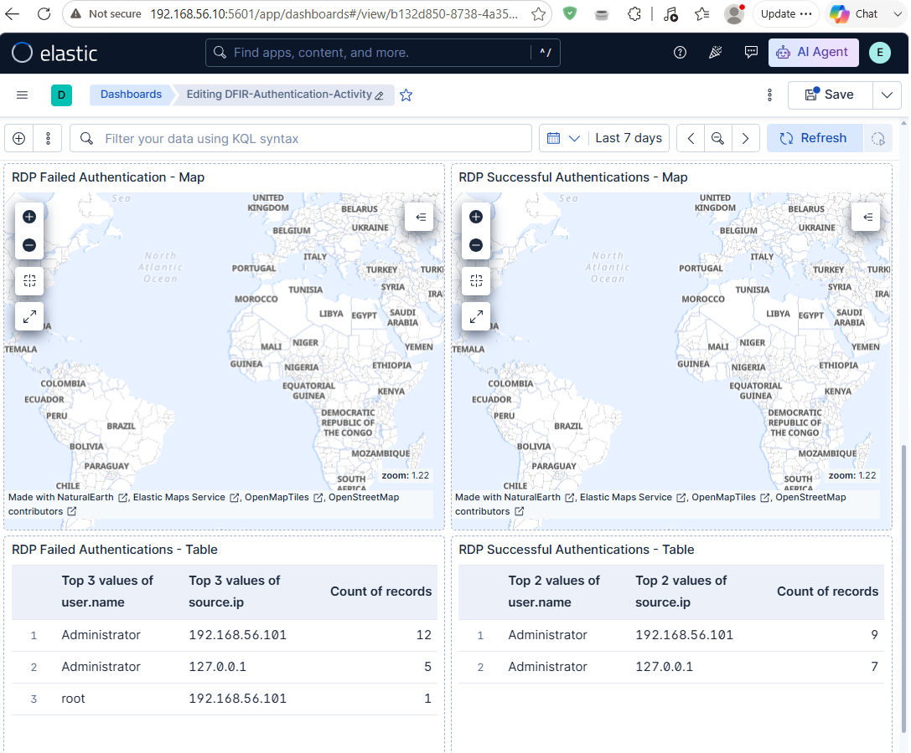
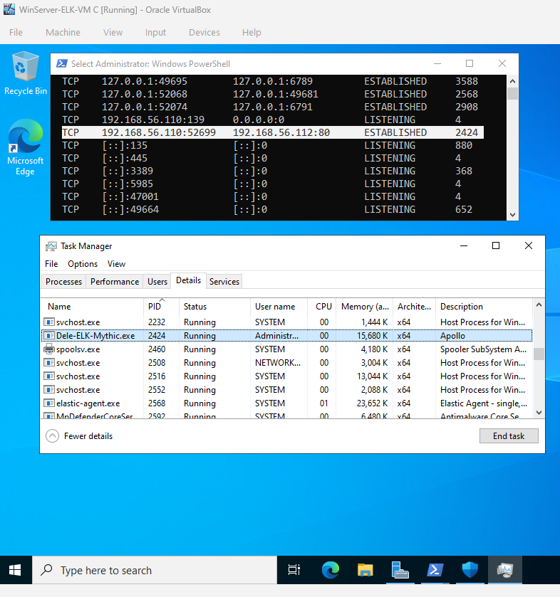
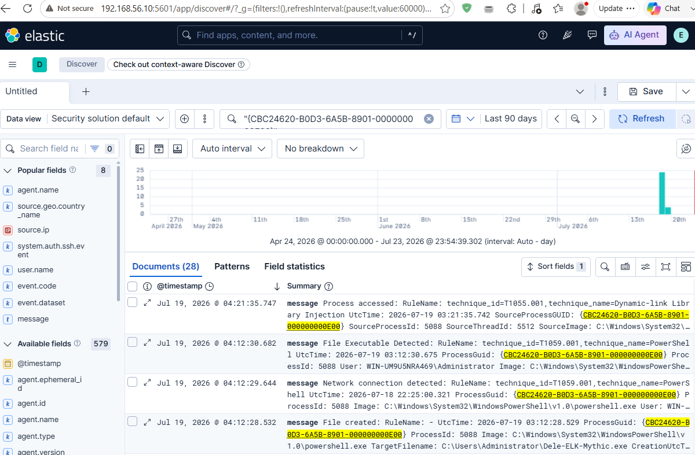

# SOC-ELK Detection Lab — Project Recap

## Objective
Built an on-prem SOC detection and response environment to demonstrate how security teams collect telemetry, detect threats, investigate incidents, and manage security workflows.

## Skills
- SOC Operations & Security Monitoring
- SIEM Deployment and Administration
- Detection Engineering
- KQL Query Development
- Incident Investigation
- Endpoint Telemetry Analysis
- Threat Detection & Response Workflow
- Security Workflow Automation
- Network Segmentation
- Adversary Simulation

## Tools
- Elastic Security — Used for SIEM monitoring, detection rule creation, alert investigation, and security analysis.
- Kibana — Used for log analysis, dashboards, authentication monitoring, and investigation workflows.
- Elastic Agent & Fleet — Used for centralized endpoint telemetry collection and agent management.
- Sysmon — Used to generate detailed Windows endpoint telemetry for detection engineering.
- Microsoft Defender — Used as an endpoint security telemetry source.
- Elastic Defend — Used to validate EDR detection and malware prevention capabilities.
- Mythic C2 Framework — Used to simulate adversary activity and generate attack telemetry.
- osTicket — Used to implement security alert ticketing and incident tracking workflows.
- VirtualBox — Used to host and isolate the complete on-prem SOC lab environment.

## Steps

### SOC Architecture & SIEM Deployment

Designed and deployed an on-prem SOC architecture connecting Elastic Stack, monitored endpoints, attack simulation infrastructure, and ticketing workflow components.

Implemented:
- Elasticsearch and Kibana deployment
- Fleet Server and Elastic Agent management
- Windows and Linux telemetry collection
- SOC monitoring workflow architecture

### Endpoint Monitoring & Telemetry Collection

Configured Windows endpoint monitoring using Elastic Agent, Sysmon, and Microsoft Defender telemetry.

Implemented visibility into:
- Windows authentication events
- Linux SSH authentication activity
- Process activity
- File creation events
- Endpoint security events

### Detection Engineering & Security Dashboards

Developed Elastic detection workflows for authentication attacks and suspicious activity monitoring.

Created:
- SSH brute-force detection
- RDP brute-force detection
- Authentication dashboards
- Security investigation tables
- Attack activity visualizations

### Adversary Simulation & C2 Detection

Simulated attacker activity using Mythic C2 to generate realistic endpoint telemetry for detection development.

Validated:
- Initial access activity
- Discovery commands
- Payload execution
- Command and Control communication
- Controlled file collection

### Incident Investigation Workflow

Performed SOC-style investigations by correlating Elastic and Sysmon telemetry.

Analyzed:
- Authentication activity
- Suspicious PowerShell execution
- File creation events
- Network connections
- C2 communication indicators

### Security Workflow Automation & EDR Validation

Integrated osTicket with Elastic and validated Elastic Defend endpoint protection capabilities.

Implemented:
- Alert-to-ticket workflow foundation
- EDR malware prevention testing
- Endpoint response validation

## Challenges & Troubleshooting

The main challenge was adapting cloud-based SOC workflows to an on-prem VirtualBox environment where private IP addressing limited GeoIP enrichment and inbound traffic visibility, requiring alternative investigation methods using available telemetry fields.

Expanded the lab infrastructure to multiple Ubuntu VMs, which exposed Host-Only DHCP IP conflicts; resolved by assigning static IP addresses to maintain reliable VM identification and communication.

## Summary

### Investigation Findings:
Security telemetry from Elastic, Sysmon, Windows events, and authentication logs provided visibility into attacker behavior including brute-force attempts, endpoint execution, and C2 activity.

### Decision Made:
Used an on-prem Elastic-based architecture with integrated detection, investigation, ticketing, and endpoint monitoring components to replicate realistic SOC operations without cloud dependency.

### Outcome:
Successfully built an end-to-end SOC lab demonstrating SIEM monitoring, detection engineering, incident investigation, security workflow automation, and EDR validation capabilities.

## SOC Impact
Demonstrates how SOC teams can improve threat visibility, accelerate investigations, and build repeatable detection and response workflows.

## Full Project Documentation

For detailed implementation steps, troubleshooting, and technical validation:

[View Full Project Documentation](./PROJECT-RECAP.md)
